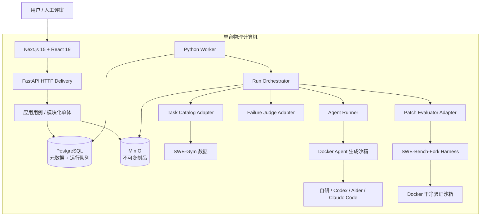
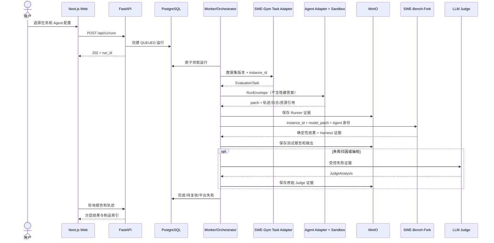

# AI Coding Agent 评测平台总架构

> 文档状态：总体方案已确认，细节持续讨论；尚无业务代码  
> 最后更新：2026-09-02  
> 权威范围：本文件只维护系统全局组成、依赖方向、已确认决定、规划文件树、风险和待讨论队列。字段级契约由第 1 节列出的专题文档维护。

## 1. 从哪里开始读

如果把整个系统理解成“给多个 Coding Agent 发同一张卷子，并保留完整阅卷证据”，文档分工如下：

| 想知道什么 | 唯一维护文档 |
|---|---|
| 项目里的词是什么意思 | [`CONTEXT.md`](../../CONTEXT.md) |
| 系统由什么组成、为什么这样分 | 本文 |
| 项目依赖什么、从哪里取得、固定到哪个版本 | [`DEPENDENCIES.md`](../dependencies/DEPENDENCIES.md) |
| 每个模块做什么、输入输出和错误是什么 | [`MODULE_CONTRACTS.md`](./MODULE_CONTRACTS.md) |
| Agent 怎样统一接题并交 patch | [`RUNNER_PROTOCOL.md`](../interfaces/RUNNER_PROTOCOL.md) |
| Next.js 怎样调用 FastAPI | [`HTTP_API.md`](../interfaces/HTTP_API.md) |
| PostgreSQL/MinIO 保存什么 | [`DATA_MODEL.md`](./DATA_MODEL.md) |
| SWE-Gym、SWE-Bench-Fork 和各 Agent 的真实接口 | [`FRAMEWORK_INTERFACES.md`](../interfaces/FRAMEWORK_INTERFACES.md) |
| 外部事实如何查证 | [`docs/research`](../research/) |
| 每次修改的措施和验证证据 | [`docs/actions`](../actions/) |

状态词：

- **已确认**：用户已经决定，后续实现必须遵守。
- **已核验**：已从上游源码或官方文档查到。
- **候选 v0.1**：已经写成可讨论契约，但尚未实现或最终确认。
- **待确认/待实测**：需要人类决定或真实运行证据。
- **已实现**：代码存在且验证通过；当前没有业务代码，因此不能使用这个标签。

## 2. 项目要做什么

一次完整使用动线：

1. 从已登记列表选择一个固定的 Agent 配置和 SWE-Gym 评测任务。
2. 平台创建评测运行，并在受限 Agent 沙箱中让 Agent 阅读 Issue、修改固定仓库快照。
3. Adapter 保存过程事件、原始输出和资源数据，从 Git 工作区提取最终 patch。
4. SWE-Bench-Fork 在新的干净验证环境中应用 patch，并依据测试生成确定性结果。
5. 页面分别展示确定性结果、过程指标、LLM Judge 失败归因和人工复核。
6. 排行榜按完整的“Agent + 模型 + 关键配置”统计，原始证据能追溯到 `run_id`。

## 3. 已确认决定

| 编号 | 决定 | 直接影响 |
|---|---|---|
| C-01 | 直接使用 SWE-Gym 与配套 SWE-Bench-Fork | 不重写任务语义和判卷核心；固定上游版本并通过 Adapter 调用 |
| C-02 | 只有一台物理计算机 | 不设计多机调度、Kubernetes 或分布式存储 |
| C-03 | 周期约一个月，实际开发力量约 2.5 人 | 优先最小完整闭环，控制并发和功能范围 |
| C-04 | Web 为 Next.js 15 + React 19 | 页面独立，不在前端直接驱动 Docker/Harness |
| C-05 | 后端为 Python + FastAPI，耗时任务由 Python Worker 执行 | 与 Python 版 SWE-Bench-Fork 同语言；HTTP 请求不等待评测完成 |
| C-06 | PostgreSQL 保存元数据并承担首版队列，MinIO 保存制品 | 首版不引入 Redis/Celery；大日志不塞数据库 |
| C-07 | 单机模块化单体 | 代码按边界分模块，但不拆微服务；Web/API/Worker 为进程角色，不是独立业务微服务 |
| C-08 | Docker 负责 Agent 生成与干净验证环境 | 两阶段隔离；最终判卷不能受 Agent 工作区残留影响 |
| C-09 | 全程证据可追溯 | patch、轨迹、原始输出、测试、Judge 和人工复核都关联同一 `run_id` |
| C-10 | 第一版只运行项目组审核、登记并固定版本的 Agent | 不提供任意 GitHub URL 自动下载执行，不接受用户提交任意 shell 命令 |
| C-11 | 排行榜单位是 Agent + 模型 + 关键配置 | 不同模型/关键配置分行统计，不能混为同一 Agent 成绩 |
| C-12 | 第一版目标包含自研 Agent、Codex、Aider、Claude Code | 接入顺序为自研/Mock → Codex → Aider → Claude Code，最终目标不因分阶段减少 |
| C-13 | 确定性测试、Judge 分析、人工复核分层保存 | LLM 或人工解释不能覆盖 SWE-Bench-Fork 原始测试事实 |
| C-14 | 架构、模块、接口、框架事实和行动记录分文档持续维护 | 同一事实只设一个权威来源；实现变化时同任务更新相关文档 |
| C-15 | 采用闭卷主排行榜（`closed_book`）+ 开卷实验榜（`open_book_experimental`） | 两条赛道使用相同确定性判卷，但按网络/工具配置严格分榜，不横向混分 |

## 4. 总体架构



边界规则：

- Web 只走 HTTP API，不直连 PostgreSQL、MinIO 或 Docker。
- FastAPI 负责短请求、校验和查询，不亲自等待 Agent/Harness。
- Worker 原子领取排队运行，再调用一个深的 Run Orchestrator 完成评测。
- Orchestrator 依赖小型 ports；不同 Agent、SWE-Gym、Harness、存储和 Judge 位于外层 Adapters。
- 闭卷 Agent 生成沙箱只允许模型调用所需端点，并禁用 Web 搜索/抓取工具；开卷实验运行允许已登记的联网工具。验证沙箱候选为断网干净环境。代理、端点白名单和工具公平性的精确实现仍待确认。

## 5. 一次运行的输入输出



关键输入输出的字段、错误和保密边界不在本文重复，分别见：

- 内部模块：[`MODULE_CONTRACTS.md`](./MODULE_CONTRACTS.md)
- Runner 进程：[`RUNNER_PROTOCOL.md`](../interfaces/RUNNER_PROTOCOL.md)
- HTTP：[`HTTP_API.md`](../interfaces/HTTP_API.md)
- 依赖来源、固定版本与恢复方式：[`DEPENDENCIES.md`](../dependencies/DEPENDENCIES.md)
- 上游框架/CLI：[`FRAMEWORK_INTERFACES.md`](../interfaces/FRAMEWORK_INTERFACES.md)

## 6. 运行结果怎样理解

| 层 | 回答的问题 | 是否为最终测试事实 |
|---|---|---:|
| Runner 结果 | Agent 是否正常运行、产生了什么 patch/轨迹 | ❌ |
| 确定性验证 | patch 是否应用、规定测试是否通过、`resolved` 是否为真 | ✅ |
| 过程指标 | 调用了哪些可观察工具、耗时/token/资源怎样 | ❌ |
| Judge 分析 | 为什么失败、过程可能有什么问题 | ❌ |
| 人工复核 | 人类是否同意/修正 Judge 解释 | ❌，但属于审计事实 |

必须区分：

- Agent 正常结束但没有修好：运行可以 `COMPLETED`，`resolved=false`。
- Agent/Harness/存储链路没能形成可信结果：运行 `FAILED`，`resolved` 应为空，而不是伪造 false。
- 工具调用次数是可观察过程指标。Aider 当前没有官方结构化工具事件流，因此缺失值不能写 0；是否计分仍待确认。

评测赛道也必须区分：

- **闭卷主排行榜（`closed_book`）**：Agent 使用题目、仓库和本地工具做题；只保留模型服务所需网络，不开放一般 Web 查询。
- **开卷实验榜（`open_book_experimental`）**：允许已登记的 Web/网络工具，更接近真实用户使用，但必须保存工具与访问证据。
- 两条赛道继续使用同一个 SWE-Bench-Fork 结果作为正确性事实；同一 Agent 配置跨赛道的成绩也不能合并。
- “所有 Agent 使用同一套平台 Web 工具”与“允许各自原生搜索工具”仍是待确认的开卷公平标准。

## 7. 为什么选择这个架构

### 7.1 模块化单体，而不是微服务

- 一台机器、一个月、2.5 人不值得承担服务发现、跨服务鉴权、网络重试和分布式一致性。
- 模块仍通过 ports 隔离；以后真有多机需要，可以优先把 Worker 边界外移。
- Web、API、Worker 是不同进程职责，但共享一个后端领域/应用代码库，不把它们误称为三套微服务。

### 7.2 PostgreSQL 队列，而不是 Redis/Celery

- PostgreSQL 已经是题目要求，排队量在单机首版可控。
- 运行状态和领取事务在一个事实源内，减少双写不一致。
- 候选使用短事务和 `FOR UPDATE SKIP LOCKED`；精确 SQL 和崩溃恢复要通过双 Worker 实测。

### 7.3 Adapter，而不是为每个 Agent 改主流程

- Codex、Aider、Claude Code 和自研 Agent 的真实输入/输出不同。
- Adapter 把差异翻译成一个 Runner 契约；Run Orchestrator 永远只理解“任务进去，patch/证据出来”。
- 新增 Agent 时增加 Adapter 和登记配置，不在主流程堆叠条件分支。

### 7.4 两阶段沙箱

- Agent 生成环境允许修改仓库、运行获准工具，并记录轨迹。
- Patch Evaluator 重新从固定任务环境开始，只应用最终 patch，再执行真实测试。
- 这样 Agent 修改测试、留下缓存或声称“我测试通过”都不能替代最终判卷。

## 8. 候选项目文件树

以下是规划，不表示路径已经创建。源代码实施时继续遵守：动态语言单文件默认不超过 200 行、每层默认不超过 8 个文件；确需超过先在行动文档说明并取得确认。

```text
E:\9.1实训\
├─ AGENTS.md
│  # Codex 协作、文档唯一事实源、验证和代码架构规则
├─ CONTEXT.md
│  # 项目领域术语唯一事实源；不记录框架和部署细节
├─ framework\
│  # 本地恢复的第三方上游依赖；不进入 AgentExam 主仓库，来源与版本见依赖文档
│  ├─ swe-gym\
│  │  # 固定提交的 SWE-Gym 数据/实验框架源码
│  └─ swe-bench-fork\
│     # 固定提交的 Docker 环境与确定性 Harness
├─ apps\
│  ├─ backend\
│  │  # FastAPI 与 Worker 共享的 Python 模块化单体
│  │  ├─ pyproject.toml
│  │  │  # Python 依赖、测试、格式和命令入口
│  │  ├─ src\eval_platform\
│  │  │  ├─ domain\
│  │  │  │  # 纯领域规则，不依赖框架/数据库/Docker
│  │  │  │  ├─ task.py       # EvaluationTask 与 Agent 可见/验证视图边界
│  │  │  │  ├─ agent.py      # AgentConfiguration 与配置指纹规则
│  │  │  │  ├─ run.py        # State 模式：运行状态和合法迁移
│  │  │  │  └─ result.py     # 确定性、Judge、人工复核的分层结果
│  │  │  ├─ application\
│  │  │  │  # 用例层，只依赖 domain 与 ports
│  │  │  │  ├─ ports\
│  │  │  │  │  # 外部能力的小接口；Adapter 的替换 seam
│  │  │  │  │  ├─ task_source.py  # Task Catalog port
│  │  │  │  │  ├─ agent_runner.py # Agent Runner port
│  │  │  │  │  ├─ sandbox.py      # Sandbox Controller port
│  │  │  │  │  ├─ evaluator.py    # Patch Evaluator port
│  │  │  │  │  ├─ repositories.py # PostgreSQL Repository ports
│  │  │  │  │  ├─ artifacts.py    # MinIO Artifact Store port
│  │  │  │  │  └─ judge.py        # Failure Judge port
│  │  │  │  ├─ submit_run.py  # 校验并创建 QUEUED 运行
│  │  │  │  ├─ execute_run.py # 深模块：一次完整评测的 Orchestrator
│  │  │  │  └─ review_run.py  # 人工抽检与版本化复核流程
│  │  │  ├─ adapters\
│  │  │  │  # 把真实上游接口翻译为 application ports
│  │  │  │  ├─ tasks\swe_gym.py
│  │  │  │  │  # Adapter：SWE-Gym 字段 → EvaluationTask
│  │  │  │  ├─ agents\
│  │  │  │  │  # Factory/Registry + 四类 Agent Adapter
│  │  │  │  │  ├─ registry.py       # 只从允许列表选择 Adapter/配置
│  │  │  │  │  ├─ custom_process.py # 自研 Agent/Mock 统一进程 Adapter
│  │  │  │  │  ├─ codex.py          # Codex exec JSONL Adapter
│  │  │  │  │  ├─ aider.py          # Aider message-file/Git diff Adapter
│  │  │  │  │  └─ claude_code.py    # Claude stream-json Adapter
│  │  │  │  ├─ sandbox\docker.py
│  │  │  │  │  # Adapter：容器、挂载、资源、网络、终止和清理
│  │  │  │  ├─ evaluation\swe_bench.py
│  │  │  │  │  # Adapter：prediction JSONL → 固定 Fork CLI → 规范化结果
│  │  │  │  ├─ persistence\postgres.py
│  │  │  │  │  # Repository Adapter：状态事务、领取、查询和审计事件
│  │  │  │  ├─ artifacts\minio.py
│  │  │  │  │  # Artifact Adapter：不可变写入、校验和与流式读取
│  │  │  │  └─ judge\llm_judge.py
│  │  │  │     # Judge Adapter：版本化 prompt、结构化输出与原始响应
│  │  │  ├─ delivery\http\
│  │  │  │  # FastAPI 交付层；只做 schema、状态码和用例调用
│  │  │  │  ├─ app.py         # Composition Root：组装 ports/adapters 和生命周期
│  │  │  │  └─ routes\
│  │  │  │     ├─ tasks.py    # Task API
│  │  │  │     ├─ agents.py   # Agent Configuration API
│  │  │  │     ├─ runs.py     # Run API
│  │  │  │     ├─ artifacts.py# Trajectory/Artifact API
│  │  │  │     ├─ reviews.py  # Human Review API
│  │  │  │     └─ reports.py  # Report/Leaderboard API
│  │  │  └─ worker\main.py
│  │  │     # 单机 Worker Shell：领取、心跳、停止和调用 Orchestrator
│  │  └─ tests\
│  │     ├─ unit\         # 领域状态和应用分支的快速测试
│  │     ├─ contract\     # Fake/真实 Adapter 共用的契约测试
│  │     └─ integration\  # PostgreSQL、MinIO、Docker、Harness 集成测试
│  └─ web\
│     # Next.js 15 + React 19 展示应用
│     ├─ package.json      # 固定前端依赖与命令
│     ├─ next.config.ts    # Next.js 构建配置
│     └─ src\
│        ├─ app\
│        │  # App Router 页面/布局，不直接实现后端业务
│        │  ├─ layout.tsx       # 全站布局和导航
│        │  ├─ page.tsx         # 运行概览
│        │  ├─ tasks\           # 任务浏览/发起运行
│        │  ├─ runs\            # 运行、轨迹和证据详情
│        │  ├─ leaderboard\     # Agent 配置排行
│        │  └─ reviews\         # 人工抽检工作台
│        ├─ features\
│        │  # 与路由解耦的视图模型和交互
│        │  ├─ tasks\
│        │  ├─ runs\
│        │  ├─ leaderboard\
│        │  └─ reviews\
│        └─ lib\
│           ├─ api-client.ts # 唯一 FastAPI 客户端
│           └─ contracts.ts  # 从 OpenAPI 生成/同步的前端类型
├─ infra\
│  # 单机部署和无秘密配置
│  ├─ compose.yaml         # Web/API/PostgreSQL/MinIO；Worker 载体待实测
│  ├─ .env.example        # 配置名和说明，不含秘密值
│  └─ containers\
│     ├─ backend.Dockerfile # FastAPI 镜像
│     ├─ worker.Dockerfile  # Worker 镜像候选
│     └─ web.Dockerfile     # Next.js 镜像
├─ tests\e2e\
│  # 从创建运行到报告展示的单机端到端测试
└─ docs\
   ├─ dependencies\
   │  └─ DEPENDENCIES.md       # 依赖来源、固定版本、恢复方式与入库策略的唯一事实源
   ├─ architecture\
   │  ├─ ARCHITECTURE.md      # 本总架构/规划树
   │  ├─ MODULE_CONTRACTS.md  # 内部模块输入输出
   │  └─ DATA_MODEL.md        # PostgreSQL/MinIO
   ├─ interfaces\
   │  ├─ RUNNER_PROTOCOL.md      # 统一 Agent 进程协议
   │  ├─ HTTP_API.md             # Web/API 契约
   │  └─ FRAMEWORK_INTERFACES.md # 真实上游接口映射
   ├─ research\  # 官方资料和相似项目的查证记录
   ├─ actions\   # 每次修改的行动和验证记录
   └─ adr\       # 仅记录难以逆转且已作出的架构决定
```

## 9. 设计模式关系

| 模式 | 参与路径 | 角色关系 | 目的 |
|---|---|---|---|
| Adapter | `application/ports/*.py` + `adapters/**` | port 定义内部小接口；具体 Adapter 翻译 SWE-Gym、Agent CLI、Docker、存储、Judge | 隔离真实上游差异和版本变化 |
| Factory/Registry | `adapters/agents/registry.py` + `adapters/agents/*.py` | Registry 只根据已登记配置构造对应 Adapter | 避免任意命令执行和 Orchestrator 条件分支 |
| Repository | `ports/repositories.py` + `adapters/persistence/postgres.py` | 应用层依赖持久化接口；PostgreSQL 实现事务和领取 | 测试可用 Fake，SQL 不散落 |
| State | `domain/run.py` + PostgreSQL 状态约束 | 统一规定允许的运行迁移；API/Worker/数据库复用 | 防止各层对状态各自解释 |
| Composition Root | `delivery/http/app.py` | 唯一位置组装 ports 与生产 Adapters | 依赖构造不散落在业务逻辑 |

暂不引入装饰器、事件总线、CQRS、微服务或 Kubernetes。若未来出现真实变化点，再通过 ADR 和行动文档讨论。

## 10. 当前风险和控制

| 风险 | 影响 | 当前控制 |
|---|---|---|
| SWE-Gym 是数据、环境和多仓库材料，不是单一应用包 | 初学者容易寻找不存在的一键接口 | [`DEPENDENCIES.md`](../dependencies/DEPENDENCIES.md) 固定来源与版本；[`FRAMEWORK_INTERFACES.md`](../interfaces/FRAMEWORK_INTERFACES.md) 固定真实数据/Harness seam |
| Windows + Docker Desktop 与上游 Linux 代码差异 | Fork 使用 Linux `resource`、Docker 等能力 | Worker 运行载体先做 gold patch 最小实验，不先宣称跑通 |
| 任务镜像占磁盘、构建慢 | 一次加载大题库不可行 | 首月只登记少量任务，显式缓存策略和磁盘证据 |
| 云端 Agent 必须联网，而公开题目的原 PR 也可能在线 | 闭卷可能被运行时查答案，开卷工具能力也可能不等价 | 闭卷仅放行模型端点并禁用 Web 工具；开卷单列实验榜并记录网络/工具配置，精确代理待实测 |
| 不可信仓库和 Agent 代码 | 主机与凭据泄漏 | 固定登记 Agent、双沙箱、最小挂载、秘密脱敏，不接受任意仓库执行 |
| Aider 无结构化工具事件 | 过程指标不能完全同口径 | 缺失标为“不支持/未知”，不伪造 0 |
| Codex/Claude/Aider 外部接口和许可会更新 | Adapter 漂移、费用或认证变化 | 固定版本、官方核验、四层测试、历史配置不覆盖 |
| LLM Judge 随机和有偏 | 归因不可当测试事实 | 保存模型/Prompt/证据/原始响应，人工抽检，分层展示 |
| 范围仍偏大 | 一个月可能闭环不足 | 先一条任务 + Mock/自研 + 真实 Codex，再逐个 Adapter 扩展 |

## 11. 当前验证策略

实现阶段按以下门槛推进：

1. **框架门槛**：一条 SWE-Gym 任务，gold patch 得到通过；空/错误 patch 得到预期未解决。
2. **Runner 门槛**：Mock/自研 Agent 通过 stdin/stdout、错误、超时、轨迹、patch 提取契约。
3. **真实 Agent 门槛**：每个 Adapter 依次通过 Fake 契约、小仓库真实 CLI、SWE-Gym E2E。
4. **隔离门槛**：验证 CPU/内存/PID/超时/网络/挂载/清理和秘密不泄漏。
5. **持久化门槛**：双 Worker 不重复领取，Worker 异常不误报完成，MinIO/数据库故障不产生假报告。
6. **产品门槛**：Web 创建运行后能用同一 `run_id` 查看状态、patch、轨迹、测试、Judge、人工复核和排行。
7. **赛道门槛**：同一结果集按闭卷/开卷、网络策略和工具配置分组；查询与排行榜测试证明不会跨赛道混分。

每次实际实现前使用 `action-document`；实际检查结果必须写回行动文档，不把“计划测试”描述成“已经通过”。

## 12. 下一轮讨论队列

按架构影响排序，一次讨论一个：

1. Judge 是否进入总分，还是只做失败归因。
2. 工具调用、token、耗时只展示，还是形成独立效率分；Aider 缺失口径怎样公平展示。
3. 开卷实验榜采用统一的平台 Web 工具，还是允许各 Agent 的原生搜索工具；前者更公平，后者更贴近真实产品。
4. 选择首批真实 SWE-Gym 数据 revision、split 和 1–3 条小任务。
5. Worker 作为宿主 Python 进程还是挂载 Docker Socket 的容器；先用本机最小实验裁决。
6. 自研 Agent 的版本载体：Git commit/目录快照/预构建镜像。
7. 是否需要学生/教师/管理员登录和权限；题目目前没有明确业务规则。

## 13. 变更记录

- 2026-09-01：创建初版，记录单机、SWE-Gym/SWE-Bench-Fork、双沙箱和候选文件树。
- 2026-09-01：确认固定登记 Agent、排行榜按完整 Agent 配置、四类 Adapter 目标和 Claude Code 黑盒接入边界。
- 2026-09-01：用户接受单机模块化单体总体方案；确认 FastAPI、Python Worker、PostgreSQL 队列和不引入首版微服务/Redis/Celery。
- 2026-09-01：重构为清晰总览；把模块、Runner、HTTP、数据和真实上游接口拆为各自唯一事实源，并更新规划文件树和文档导航。
- 2026-09-02：确认闭卷主排行榜和开卷实验榜；两者使用相同确定性判卷，但按赛道、网络和工具配置严格分开。
- 2026-09-02：新增依赖唯一事实源；确认本地 `framework/` 不进入 AgentExam 主仓库，公开接口证据改用固定提交链接。
