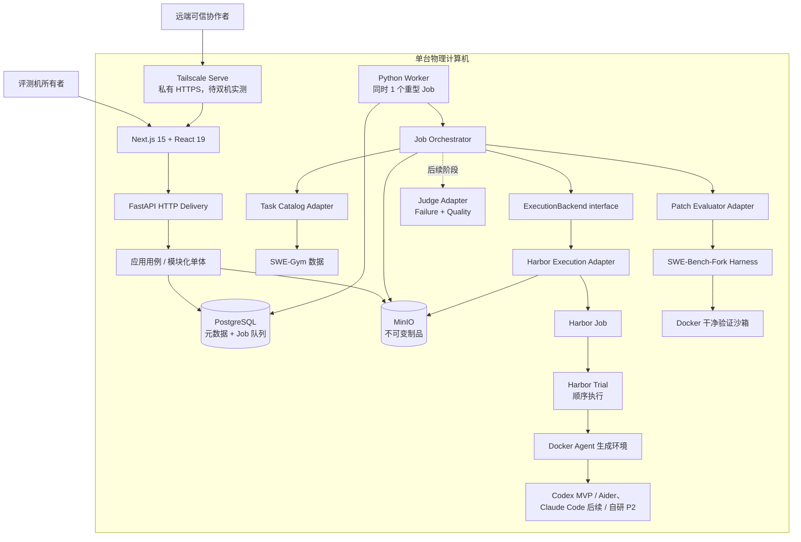
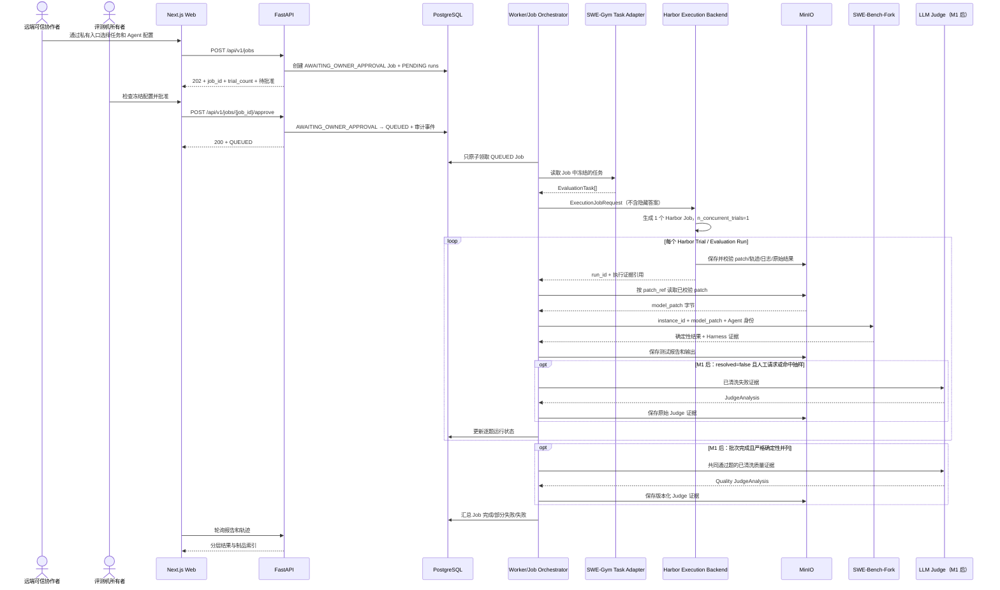

# AI Coding Agent 评测平台总架构

> 文档状态：总体方案已确认；M0 核心闭环通过；M1 任务 01–13 已验收；任务 13 的 `-04` 正式 Job/Run、固定 Fork、持久化、真实页面和双轴终审均通过；M1/MVP 未完成
> 最后更新：2026-09-22（同步扩展任务 03–05 的现实实现、受控提供方策略切片与未完成边界）
> 权威范围：本文件只维护系统全局组成、依赖方向、已确认决定、规划文件树、风险和待讨论队列。字段级契约由第 1 节列出的专题文档维护。

## 1. 从哪里开始读

如果把整个系统理解成“给多个 Coding Agent 发同一张卷子，并保留完整阅卷证据”，文档分工如下：

| 想知道什么 | 唯一维护文档 |
|---|---|
| 想按顺序理解现有代码、架构和进度 | [阅读路线](./READING_GUIDE.md)（导航，不替代专题事实源） |
| 项目里的词是什么意思 | [`CONTEXT.md`](../../CONTEXT.md) |
| 系统由什么组成、为什么这样分 | 本文 |
| 项目依赖什么、从哪里取得、固定到哪个版本 | [`DEPENDENCIES.md`](../dependencies/DEPENDENCIES.md) |
| 每个模块做什么、输入输出和错误是什么 | [`MODULE_CONTRACTS.md`](./MODULE_CONTRACTS.md) |
| 每个模块当前由哪些现实代码组成、怎样依赖、还缺什么 | [当前模块架构索引](./modules/README.md) |
| 自研 Agent 或后备进程怎样接题并交 patch | [`RUNNER_PROTOCOL.md`](../interfaces/RUNNER_PROTOCOL.md) |
| AgentExam 怎样调用 Harbor、怎样取得 Trial 结果 | [`HARBOR_EXECUTION.md`](../interfaces/HARBOR_EXECUTION.md) |
| Next.js 怎样调用 FastAPI | [`HTTP_API.md`](../interfaces/HTTP_API.md) |
| PostgreSQL/MinIO 保存什么 | [`DATA_MODEL.md`](./DATA_MODEL.md) |
| SWE-Gym、SWE-Bench-Fork 和各 Agent 的真实接口 | [`FRAMEWORK_INTERFACES.md`](../interfaces/FRAMEWORK_INTERFACES.md) |
| Codex、自研 Agent 的模型凭据归谁以及协作时怎样隔离秘密 | [`CODEX_AUTHENTICATION.md`](../interfaces/CODEX_AUTHENTICATION.md) |
| 协作者怎样从校园网外提交、VPN 会不会冲突、哪些端口不能开放 | [`REMOTE_TEAM_ACCESS.md`](../operations/REMOTE_TEAM_ACCESS.md) |
| PostgreSQL/MinIO/容器/模型均留在所有者电脑时怎样长期运行 | [所有者单机运行候选](./modules/owner-host-runtime/ARCHITECTURE.md) |
| 外部事实如何查证 | [`docs/research`](../research/) |
| 每次修改的措施和验证证据 | [`docs/actions`](../actions/) |
| 工程技能怎样读写本地规格、任务单与领域文档 | [`docs/agents`](../agents/)（经 `AGENTS.md` 入口按需读取） |

状态词：

- **已确认**：用户已经决定，后续实现必须遵守。
- **已核验**：已从上游源码或官方文档查到。
- **候选 v0.x**：已经写成可讨论契约，但尚未实现或最终确认；具体版本以专题文档为准。
- **待确认/待实测**：需要人类决定或真实运行证据。
- **已实现**：对应代码存在且通过与当前风险相称的验证；只能标注到具体模块，不能由局部通过推导整个 M0/MVP 完成。

## 2. 项目要做什么

实施先后与产品动线必须分开理解：M0 本机真实单题核心闭环已通过，完整验收仍有收尾项；用户已授权按 Spec 分任务推进 M1 本机开发，具体行动和执行权限见 [HANDOFF](../../HANDOFF.md)。以下产品动线不等于已经实现或允许立即使用真实账号。

一次完整 MVP 使用动线：

1. 可信协作者通过私有远程入口，从已登记列表选择一个或多个固定 Agent 配置、一个或多个 SWE-Gym 任务和一个评测赛道。
2. 平台创建 `AWAITING_OWNER_APPROVAL` Job，并预先冻结 Agent×任务组合对应的逐题评测运行；提交本身不启动真实评测。
3. 评测机所有者检查冻结配置并明确批准后，Job 才进入 PostgreSQL 的 `QUEUED` 队列；拒绝则终止，不交给 Worker。
4. 评测机本地的单机 Worker 一次只领取一个已批准 Job；Execution Backend Adapter 把它转换为一个 Harbor Job，并固定 `n_concurrent_trials=1`。
5. Harbor 把 Agent×任务展开为 Trial，运行真实 Agent、管理 Docker 环境并保存过程事件、原始输出和制品。
6. Adapter 为每个 Trial 校验并返回最终 patch；SWE-Bench-Fork 在新的干净验证环境中独立应用 patch 和执行测试。
7. 页面展示 Job 总进度、确定性结果、过程指标与安全证据；分析扩展按第 3.1 节后续启用。
8. 排行榜按完整的“Agent + 模型提供方 + 模型 + 关键配置”统计，原始证据能从 `job_id` 追溯到每个 `run_id`。

## 3. 已确认决定

| 编号 | 决定 | 直接影响 |
|---|---|---|
| C-01 | 直接使用 SWE-Gym 与配套 SWE-Bench-Fork | 不重写任务语义和判卷核心；固定上游版本并通过 Adapter 调用 |
| C-02 | 只有一台物理计算机 | 不设计多机调度、Kubernetes 或分布式存储 |
| C-03 | 周期约一个月，实际开发力量约 2.5 人 | 优先最小完整闭环，控制并发和功能范围 |
| C-04 | Web 为 Next.js 15 + React 19 | 页面独立，不在前端直接驱动 Docker/Harness |
| C-05 | 后端为 Python + FastAPI，耗时任务由 Python Worker 执行 | 与 Python 版 SWE-Bench-Fork 同语言；HTTP 请求不等待评测完成 |
| C-06 | PostgreSQL 保存元数据并承担平台评测 Job 队列，MinIO 保存制品 | 首版不引入 Redis/Celery；不把 Harbor 本地目录当课程数据库；大日志不塞数据库 |
| C-07 | 单机模块化单体 | 代码按边界分模块，但不拆微服务；Web/API/Worker 为进程角色，不是独立业务微服务 |
| C-08 | Harbor 使用 Docker 运行 Agent；固定 SWE-Bench-Fork 使用独立干净验证环境 | 两阶段隔离；最终判卷不能受 Agent 工作区或 Harbor reward 影响 |
| C-09 | 全程证据可追溯 | patch、轨迹、原始输出、测试、Judge 和人工复核都关联同一 `run_id` |
| C-10 | MVP 只运行项目预先登记并固定版本的知名 Agent 配置 | 不提供自研源码提交/审核接口；未登记配置和任意 shell 命令绝不执行 |
| C-11 | 排行榜单位是 Agent + 模型提供方 + 模型 + 关键配置 | 不同提供方、模型或关键配置分行统计，不能混为同一 Agent 成绩 |
| C-12 | 实施顺序为本地 Codex 技术原型 → Codex 平台 MVP → Aider/Claude Code 扩展 → 自研 Agent | 优先复用 Harbor 已有 Agent；自研 Agent 只保留通用 seam，源码审核、进程包装和模型访问均不进入当前 MVP |
| C-13 | 确定性测试、Judge 分析、人工复核分层保存 | LLM 或人工解释不能覆盖 SWE-Bench-Fork 原始测试事实；Judge 不可用不改变确定性结果 |
| C-14 | 架构、模块、接口、框架事实和行动记录分文档持续维护 | 同一事实只设一个权威来源；实现变化时同任务更新相关文档 |
| C-15 | MVP 只实现闭卷主排行榜（`closed_book`） | 保留 `open_book_experimental` 字段/扩展位置但拒绝创建该赛道 Job；以后实现时统一使用平台 Web 工具并继续严格分榜 |
| C-16 | Harbor 是带验收退出条件的正式 Execution Backend | 版本由依赖事实源固定；隐藏在 Adapter 后；原型失败时替换为轻量 Process Adapter，不改上层业务 |
| C-17 | 一个平台评测 Job 映射一个 Harbor Job，一条评测运行映射一个 Harbor Trial | 平台负责业务排队和长期事实；Harbor 负责 Job 内 Trial 执行 |
| C-18 | 单机同时只执行一个重型平台 Job，Harbor `n_concurrent_trials=1` | Job 中 Trial 顺序执行；不以增加并发换取演示速度 |
| C-19 | 一个 Job 可选择多个 Agent 和多个任务，首版每组合尝试一次 | 创建前展示 Trial 总数；当前实现仍为演示 1–3 题、快速 5 题、标准 10–20 题及最多 3 个配置；已批准的新提交规模规划见第 3.2 节，尚未实现 |
| C-20 | 正式展示、报告和排行只接受真实执行证据 | Mock 结果必须隔离为 `internal_test`，不能冒充真实 Agent 或进入正式统计 |
| C-21 | 首个真实端到端原型使用 `SWE-Gym/SWE-Gym-Lite` 的 1～3 道真实任务 | 先验证小而真的闭环；不下载完整 2.4K 任务，也不把 Lite 冒充为最终正式题库范围 |
| C-22 | 首个真实原型 Agent 使用 Codex，并先由本地脚本运行 | 优先复用 Harbor 内置 Codex Adapter；先证明真实 patch 与判卷闭环，再接 Web/数据库/批准流程，随后扩展 Aider 与 Claude Code |
| C-23 | 首个 Codex 原型使用评测机所有者本人通过 ChatGPT Pro 登录产生的 `auth.json` | 认证政策已经确认；执行节点仅临时注入副本，凭据不得共享或提交；源文件所有权、私有绑定及当前容器运行证据见[认证接口](../interfaces/CODEX_AUTHENTICATION.md) |
| C-24 | 当前只有用户这一台笔电是正式真实评测节点 | 协作者可开发并远端提交；只有机器所有者批准后，本机 Worker 才能触发真实 Codex Trial；协作者不得取得所有者凭据 |
| C-25 | P2 自研 Agent 接入时只允许 DeepSeek 或 Kimi，并各自形成独立 Agent Configuration | 这是未来扩展约束，不是 MVP 实现项；同一源码切换提供方必须产生独立配置与运行证据 |
| C-26 | 协作者提交正式真实 Job 后必须等待评测机所有者批准 | 新 Job 初始为 `AWAITING_OWNER_APPROVAL`；只有所有者批准才能进入 `QUEUED`，Worker 不能领取待批准 Job |
| C-27 | 协作者使用平台时，评测机和本机平台必须在线 | 当前不增加云端常驻控制面或第二执行节点；评测机离线时私有远程入口不可用，恢复在线后继续接收请求 |
| C-28 | P2 自研 Agent 的首个接入版本只支持 Python 固定进程 Interface | 当前只保留 `ExecutionBackend` 扩展 seam，不实现 manifest、源码审核或 wrapper；进入 P2 后仍不接受任意 shell 命令 |
| C-29 | Judge 分为 Failure Judge 与 Quality Judge 两种用途 | Failure 只对人工请求或抽样失败运行做诊断且不计分；Quality 只在同一评测条件、逐题确定性结果完全相同、存在共同通过题且清洗证据齐备时打破并列 |
| C-30 | Judge 输入清洗属于现有 Judge Implementation 的职责 | 输入须裁剪、脱敏、去重、限量并保留证据引用；不新增独立顶层 Module，不把完整混杂轨迹/日志/代码或隐藏答案直接交给模型 |
| C-31 | P2 自研 Agent 的 DeepSeek/Kimi Key 只由评测机所有者在本机可信秘密配置中管理 | 当前 MVP 不实现该访问路径；未来真实 Key 仍不得进入被测 Agent 容器、HTTP、PostgreSQL、MinIO、命令行、日志或轨迹 |
| C-32 | 平台只有 `collaborator` 与 `owner` 两种人员角色 | 不开放公共注册；所有者本机建立/恢复账号并邀请协作者，同时兼任管理员和人工复核者；私有网络身份不替代应用登录 |
| C-33 | Quality Judge 使用匿名、双次反序的补丁两两比较 | 四个维度为切题且最小、可读/可维护、健壮性、副作用风险；两次结论不一致则该对保持并列；多 Agent 按胜 1、平 0.5、负 0 循环聚合 |
| C-34 | 过程指标第一版只展示，不参与排名 | 工具调用、token、耗时缺失时标记未知，不能写成 0；当前不建立效率分 |
| C-35 | PostgreSQL 保存标准任务字段，MinIO 保存内容哈希固定的原始任务 JSON | 原始快照用于复现和审计；Agent 可见视图仍排除隐藏测试与参考答案 |
| C-36 | 取消不强杀当前 Trial，崩溃不自动续跑/重试 | 待批准/排队 Job 可直接取消；执行中只停止后续 Trial，当前 Trial 至多到冻结超时；中断记基础设施错误，所有者另建新尝试 |
| C-37 | 核心结果长期保留，大型原始制品默认 30 天后可清理 | 只有所有者可通过本地维护入口清理；当前不新增定时服务，删除后保留哈希、大小、产生时间与删除审计 |
| C-38 | 第一版只接受文本 patch，并采用分级大小限制 | 超过 256 KiB 警告但继续；超过 1 MiB 以 `PATCH_TOO_LARGE` 作为无效输出且不截断；单原始制品 50 MiB、单运行原始制品合计 200 MiB |
| C-39 | 远端私有入口采用 Tailscale Serve，FlClash 优先保持系统代理开启、TUN 关闭 | 不申请校园网入站端口、不用 Funnel；只暴露 Web，应用登录与 tailnet 身份分层；VPN 开/关均须双机验收 |
| C-40 | M1 交付范围按第 3.1 节执行 | 后续分析的概念契约保留，不成为当前 M1 实现或验收的隐含依赖 |

### 3.1 M1 交付边界（2026-09-09 已确认）

M1 交付小范围真实可用的 Codex 评测平台：两角色登录与邀请、任务/配置选择、所有者批准、单机队列与执行、阶段和错误说明、取消与中断收束、PostgreSQL/MinIO、报告/安全证据查看、按确定性结果统计的基础排行榜，以及私有远程协作验收。

用户已确认将 **Failure Judge、Quality Judge，以及针对 Judge 结论的 Human Review 移到 M1 之后的下一阶段**。保留现有模块边界和后续契约，不在 M1 预建它们的专用服务、表、路由或工作台。后续分析与 Aider/Claude Code 扩展的具体先后另定，不自动把分析归入自研 Agent 的 P2。

Owner Approval 是运行前授权，仍是 M1 必须能力；用户直接查看补丁、测试摘要和安全过程证据也保留。M1 不调用 Judge、不做模型质量加分，同等确定性成绩保持并列；后续分析仍须遵守 C-13/C-29/C-30/C-33 的既有规则。

此次延期不降低凭据隔离、对外内容保护、资源限制、精确清理、真实结果和证据追溯要求，也不等于 M0 剩余风险被接受。决定来源与本次同步记录见[独立行动文档](../actions/2026-09-09-m1-judge-deferral.md)。

2026-09-11 已批准并进入任务 01 的身份切片：在既有后端分层内补齐账号/会话用例、两张 PostgreSQL 身份表、本机 owner 维护和最小 Web/HTTP。现有任务/执行/判卷职责不能保存应用登录秘密或承担会话生命周期，因此新增有界身份能力，而不拆微服务、不让 Harbor 管理应用用户、不复用 Codex 凭据。依赖方向仍为 Web/CLI → 应用用例 → 领域/ports ← Adapter。精确契约在[模块文档](MODULE_CONTRACTS.md#611-身份用例与存储-interface2026-09-11)、[HTTP](../interfaces/HTTP_API.md#32-任务-01-身份-http-切片)和[数据模型](DATA_MODEL.md#40-身份表accounts-与-sessions)单处维护。

替代方案评估：借用评测表会混淆秘密与评测数据生命周期；仅内存账号无法满足恢复和重启持久化；独立认证服务增加本机部署和接口负担，当前不采用。当前已做专属真实数据库验证，但单进程登录预算与回环开发模式不能当作远程部署保证；数据库证据见[身份行动](../actions/2026-09-11-m1-owner-identity.md)，评审修复及最新验证见[独立修复行动](../actions/2026-09-11-m1-identity-review-fixes.md)，M1 尚未完成。

任务 02 已获准在上述身份分层内补齐邀请/成员用例、invitations 表和必要 HTTP 接口；accounts/sessions 不表示尚未加入的邀请，因此不能复用为邀请记录。没有新增顶层服务或角色体系，也未修改 M0 执行/判卷边界。HTTP/浏览器、真实 PostgreSQL 验收及评审问题处理已完成；精确语义见[成员 HTTP](../interfaces/HTTP_API.md#33-任务-02-邀请与成员-http-切片)、[数据表](DATA_MODEL.md#401-邀请表invitations)，证据见[独立成员行动](../actions/2026-09-11-m1-collaborator-invitations.md)。新增 membership 测试子目录已获准，因为既有 identity 测试目录已达 8 文件；生产内部仍沿用既有目录。

任务 03 开工核对后，用户明确决定继续采用 MinIO，不更换其他对象存储产品；本文 C-06/C-35 和下方图示继续适用。Task Catalog / Agent Registry / Artifact Store 的分层职责不变；该确认不表示已部署正式服务；已固定隔离测试构建，上游维护事实和适用范围仍见[依赖总表第 2.3 节](../dependencies/DEPENDENCIES.md#23-任务-03-对象存储依赖复核)，实施状态见[任务 03 独立行动](../actions/2026-09-12-m1-task-agent-catalog.md)。

2026-09-12 用户已批准任务 03 三张规划内表、四个输入/存储 Interface、必要实现/测试子目录及不发布端口的 MinIO 隔离合成验证。账号与邀请无法承载固定题目和证据索引，因此在原分层内深化目录，不新增顶层业务 Module。Task Catalog 协调“校验源 → 不可变对象 → 短事务发布任务和索引”，Agent Registry 管理固定配置及禁用历史；Web 只接 HTTP。先由合成外部 Adapter 验证用例，再以真实 PG/MinIO 验证持久化，前者不替代后者。配置默认限制引用在任务 04 确认前为空；不注册模拟正式题目、不创建 Job 或执行模型。

任务 04 的[最小方案](../actions/2026-09-12-m1-job-submission.md#已确认的最小方案)已落地 Job Submission、四张提交子集表、最小 JobRepository、提交/查询/选项 HTTP 及 Web，并通过 HTTP、隔离真实 PG、浏览器和固定基准双轴评审，评审问题已修复复核，九项验收完成。工作只深化既有职责，不拆服务，不改 M0 ExecutionBackend/PatchEvaluator，也不实现任务 05 的批准/领取/执行。

任务 04 实际增量树（完整文件职责和验证见行动）：

```text
apps/backend/src/eval_platform/domain/jobs/              # 不可变批次值与受控提交策略
apps/backend/src/eval_platform/application/job_submission.py # 校验、提交和查询用例
apps/backend/src/eval_platform/application/ports/repositories.py # 增加批次原子存取抽象
apps/backend/src/eval_platform/adapters/persistence/jobs/ # Repository Adapter：四表、快照与事务
apps/backend/src/eval_platform/delivery/jobs.py / job_presets.py # 显式升级、组装及可信预置
apps/backend/src/eval_platform/delivery/http/routes/jobs/ # HTTP 翻译/DTO，避免 HTTP 根目录越限
apps/backend/tests/jobs/                                 # 独立 HTTP/真实 PG 验收与精确清理辅助
apps/web/src/features/jobs/                              # 选择、组合数、提交及刷新待批准状态
```

任务 05 在同一边界内新增 `OwnerApproval` 用例，并把既有 `JobRepository` 深化为一个原子 `decide` 操作：可信 owner 可把待批 Job 批准为 `QUEUED`，或拒绝为 `REJECTED` 并取消其全部 `PENDING` Run；决定者、时间、可选说明和 sequence 2 事件一起提交。HTTP 请求不连接 ExecutionBackend、PatchEvaluator、Harbor 或凭据提供方。四张既有表只增加决定字段、任务 05 状态/事件约束和队列索引，没有新增表；HTTP、浏览器、真实临时 PostgreSQL、完整回归和固定基准双轴评审均已完成，证据见[任务 05 行动](../actions/2026-09-12-m1-owner-approval.md)。

任务 05 实际增量树：

```text
apps/backend/src/eval_platform/domain/jobs/decisions.py       # 决定值、说明规范化与安全冲突
apps/backend/src/eval_platform/application/owner_approval.py  # owner 授权、幂等正文与立即决定
apps/backend/src/eval_platform/application/ports/repositories.py # JobRepository 增加原子 decide
apps/backend/src/eval_platform/adapters/persistence/jobs/     # 既有四表扩展、行锁决定与完整恢复
apps/backend/src/eval_platform/delivery/http/routes/jobs/     # approve/reject DTO 与安全响应
apps/backend/tests/jobs/                                      # HTTP、回滚、并发与真实 PG 验收
apps/web/src/features/jobs/approval.tsx                       # 仅 owner/待批状态显示的决定控件
apps/web/src/lib/job-client.ts                                # Job HTTP 请求，不承担响应结构细节
apps/web/src/lib/job-shapes.ts                                # 冻结 Job 与决定状态的运行时校验
apps/web/tests/jobs.spec.ts                                   # 批准、拒绝、权限和陈旧页冲突刷新
```

任务 06 已验收并完成双轴评审，接通单 Run 的首个完整平台链路：本机 Worker 只领取已批准且恰好一个 Run 的 Job，通过同一 `ExecutionBackend` 与 `PatchEvaluator` port 取得并独立判定 patch；受限本地证据读取器把既有 Harbor/Fork 的路径引用规范化为长期 MinIO 对象，MinIO 先不可变写入并回读，PostgreSQL 再以一个结果事务发布制品索引、确定性结果和终态。Reporting 在授权后还会重新读取并校验这些对象，正文缺失或损坏时不返回完整成绩。多组合 Job 在任务 07 前保持 `QUEUED`，不会被部分领取。当前验收使用 `internal_test` 执行/判卷 Adapter 与隔离临时 PG/MinIO，不等于已重新运行真实 Codex/Harbor；Judge/Review 仍未实现或调用。实现、失败史和评审证据见[任务 06 行动](../actions/2026-09-12-m1-single-run-report.md)。

任务 06 实际增量树：

```text
apps/backend/src/eval_platform/
├─ domain/jobs/{execution,factory,models,snapshots}.py # 冻结值、租约、结果/报告与构造
├─ application/execute_job.py                         # 单 Run 深编排：执行→校验→判卷→收束
├─ application/execution/evidence.py                 # 本地 M0 引用→长期 M1 证据的规范化发布
├─ application/reporting/service.py                  # 授权、正文可用性复核与报告组合
├─ application/ports/{execution,repositories}.py      # 单次执行 DTO 与领取/报告 Repository Interface
├─ adapters/persistence/jobs/
│  ├─ schema.sql / repository.py / records.py         # 状态、结果表、统一 Adapter 与恢复
│  └─ execution/{claims,common,results,reports}.py     # 短事务领取、推进、发布和查询
├─ adapters/artifacts/{local,minio}.py                # 受限本地证据读取、长期对象写入/校验
├─ delivery/worker/main.py                            # 只领取一次并委托 Orchestrator 的薄 Shell
└─ delivery/http/routes/jobs/{report_routes,report_schemas}.py # 受保护报告路由/DTO
apps/backend/tests/jobs/execution/                    # Fake、HTTP、真实 PG+MinIO 与失败语义
apps/web/src/features/jobs/report.tsx                 # 确定性结果、指标和安全证据索引
apps/web/src/lib/report-shapes.ts                     # 报告响应失败关闭解析
apps/web/tests/jobs.spec.ts                           # 提交→批准→合成 Worker→报告浏览器动线
```

任务 07 已把上述单 Run 子集深化为完整冻结矩阵：一个平台 Job 仍只调用一个 Harbor Job，任务与配置按稳定的“任务 ID → 配置 ID”顺序展开，Harbor `n_concurrent_trials=1`。`ExecutionBackend` 增加只通知冻结 `run_id` 开始/结束的 Observer；完整结果仍由原返回值交给 Orchestrator。Repository 在短事务中保存逐 Run 状态与事件，单项失败不阻断后续组合；有可信结果的部分错误收束为 `COMPLETED_WITH_ERRORS`，完全不可汇总才是 `FAILED`。租约预算覆盖整批顺序执行、逐项判卷与最终化，并在受控阶段事务刷新；Harbor 汇总缺失时仍保留可信逐 Trial 结果，协议警告阻止误报全成功。生产 Reporting 只发布 `official`，内部测试报告必须由门控测试装配显式启用；后端引用使用安全不透明标识，不泄漏宿主路径。页面读取持久化矩阵并进入既有单 Run 报告，不读取 Harbor 日志推断状态；Judge/Review 保持未接通。

任务 07 当前增量树（最终验收与评审仍以[行动记录](../actions/2026-09-12-m1-batch-progress.md)为准）：

```text
apps/backend/src/eval_platform/
├─ application/execution/{batch,completion}.py       # 逐 Trial 通知、独立判卷与证据完成门禁
├─ application/reporting/service.py                  # 生产 official 范围门禁与证据复核
├─ application/ports/{execution,repositories}.py     # Observer 与逐 Run 短事务 Interface
├─ domain/jobs/policy.py / domain/result.py           # 整批租约预算与安全后端引用
├─ adapters/execution/harbor/lifecycle/              # 可信 Trial 文件观察、进程等待和精确清理
├─ adapters/execution/harbor/{adapter,result_mapper}.py # 异常清理、逐 Trial 保留与协议闭合
├─ adapters/persistence/jobs/execution/              # 领取、逐 Run、结果、最终化事务
└─ delivery/http/routes/jobs/batch_schemas.py         # 安全阶段与批次矩阵 DTO
apps/backend/tests/jobs/execution/batch/              # 矩阵、租约、清理、存储失败、HTTP 与真实 PG
apps/web/src/features/jobs/batch-report.tsx           # 批次计数、逐项状态与报告入口
apps/web/src/lib/batch-report-shapes.ts               # 失败关闭的 Job 报告解析
apps/web/tests/job-batch.spec.ts                      # 刷新恢复与逐项导航
```

任务 08 沿既有 Artifact Store、Job Repository 与 Reporting 深化安全外发边界，没有新增表、顶层 Module 或存储 Interface。执行完成时先保存原始受限证据，再派生只含确定性计数的 `public_test_summary` 和去除消息正文/工具参数的 `public_trajectory`；最终 patch 命中凭据、宿主私有路径或参考答案标记时整份拒绝。HTTP 的报告、索引、轨迹与下载复用同一 official 范围和资源归属授权，并在读取时复核类型、大小、SHA-256 与正文安全；原始 Harness 对象仍受限。页面只展示公开三类证据，Judge/Review、删除/410 和长期部署均未启用。证据见[任务 08 行动](../actions/2026-09-12-m1-safe-evidence.md)。

任务 09 继续深化既有 Job lifecycle、Job Repository、Job Orchestrator 与 Harbor Adapter，没有新增表、顶层 Module 或执行后端。可信会话中的提交者只能取消自己的 Job，owner 可取消任意 Job；待批、排队和未启动 Trial 的准备态在一个短事务内直接收束为 `CANCELED`，执行态只写 `CANCEL_REQUESTED`。既有 `ExecutionProgressObserver.trial_started(run_id)` 以最小布尔返回值承担下一 Trial 的准入 Interface：当前 Trial 不强杀并保存真实结果，取消事务胜出后其余 Run 不再进入 `RUNNING_AGENT`，最终经 `FINALIZING` 收束为 `CANCELED`。固定 Harbor 没有公开的“只停止后续 Trial”入口，因此 Adapter 仅对已固定 revision 安装私有 ready/permit/stop 协作协议；入口严格校验控制目录，协议异常失败关闭。真实临时 PostgreSQL、合成浏览器和完整回归已通过，最终双轴评审仍以[任务 09 行动](../actions/2026-09-13-m1-job-cancellation.md)为准。

任务 09 实际增量树：

```text
apps/backend/src/eval_platform/
├─ domain/jobs/cancellation.py                         # 取消说明与幂等正文值
├─ application/job_lifecycle/cancellation.py           # 可信身份授权与取消用例
├─ application/ports/{repositories,execution}.py       # 原子取消与 Trial 准入 Interface
├─ adapters/persistence/jobs/                          # 同表审计、状态/Run 事件与竞争事务
├─ adapters/execution/harbor/lifecycle/control.py      # 固定 Harbor 的私有协作式准入协议
└─ delivery/http/routes/jobs/                          # 取消请求、202 响应与实际状态
apps/backend/tests/jobs/{cancellation,execution}/      # HTTP、真实 PG 竞争与受控执行
apps/web/src/features/jobs/cancellation.tsx            # 请求态/终态文案和取消控件
apps/web/tests/jobs.spec.ts                            # 请求到最终收束的合成用户动线
```

任务 10 在同一 Job lifecycle 内增加显式、仅 owner 可调用的中断收束与新建重试。`JobRepository.recover(RecoveryRequest)` 只锁定租约已过期的活跃 Job：完成 Run 必须同时具备匹配的摘要、冻结 Harness revision 和自洽布尔结果，活跃 Run 写为 `INFRASTRUCTURE_INTERRUPTED`，未开始 Run 取消，然后一次提交 Job/Run/事件；任何错配整笔回滚，重复收束只读回同一记录。取消意图读取持久化字段，进入 `FINALIZING` 后仍不会丢失。它不扫描、不重新排队，也不调用 ExecutionBackend、PatchEvaluator、Harbor 或模型。需要重试时，`JobRecovery` 复用 `JobSubmission` 创建全新 Job/Run，重新读取当前启用目录并冻结快照，通过 `rerun_of_job_id` 关联旧 Job，保留原提交者访问范围，并再次停在 `AWAITING_OWNER_APPROVAL`。实现、分层验证及以 `2137e08` 为固定基准的 Standards/Spec 终审均已通过，证据见[任务 10 行动](../actions/2026-09-13-m1-interruption-recovery.md)。

任务 10 当前增量树：

```text
apps/backend/src/eval_platform/
├─ domain/jobs/{execution,models,policy,factory}.py       # 恢复请求、重试关联、共享恢复判定和请求身份
├─ application/job_lifecycle/recovery.py                  # owner-only 收束与新建重试用例
├─ application/{job_submission,ports/repositories}.py     # 复用冻结流程并深化 recover Interface
├─ adapters/persistence/jobs/
│  ├─ recovery/{__init__,actions}.py                      # 行锁内的证据核对和幂等收束
│  └─ {schema,publication,records,repository}.py          # 自引用、写入/读回及 Adapter 委托
└─ delivery/http/routes/jobs/lifecycle/                   # 空正文 recover/retry 路由
apps/backend/tests/jobs/recovery/                         # HTTP、状态、PG 竞争和损坏回滚
apps/web/src/features/jobs/lifecycle/recovery.tsx         # 中断说明、显式收束及新建重试
apps/web/tests/jobs/interruption-recovery.spec.ts         # 真实 HTTP 浏览器动线
```

任务 11 在既有 Reporting 内增加基础排行榜只读投影，不增加表或写路径。`LeaderboardRepository` 只读取已冻结的正式终态 Job、Run、确定性结果和过程指标；生产 SQL 在解析快照前固定排除 `internal_test`，以目录 Task/源 Artifact 筛选后核对完整冻结 Task、Run 配置外键及 Agent 目录全字段、Agent/策略/限制快照和 Harbor 执行身份，任一损坏整次失败关闭。领域策略只让 `started_at` 非空的正式尝试产生参赛配置，再按完整 Agent 身份与完整冻结比较范围分组；对每题保留最早可信确定性结果，后续重复或关联重试只能填补空缺；没有确定性结果时使用最新已开始终态 Run，把失败单列为基础设施错误，取消或未尝试列为未知。分母仍是范围内全部目录题目，未开始的题留作 unknown，但不产生参赛者、来源或过程指标。确定性同分保持并列，稳定游标不参与名次。过程指标仅展示，任一选中 Run 缺值时聚合值为 `null` 并返回覆盖数。所有已登录成员可读正式汇总；页面显示冻结策略实际值，来源只返回 Job/Run ID 并进入既有授权报告接口。Judge/Review 仍未创建或调用。实现与验证证据见[任务 11 行动](../actions/2026-09-13-m1-base-leaderboard.md)。

任务 11 当前增量树：

```text
apps/backend/src/eval_platform/
├─ domain/leaderboard/{models,policy,query}.py             # 完整身份/范围、选择统计、游标分页
├─ application/{reporting/leaderboard,ports/leaderboard}.py # 认证只读用例与窄 Repository Interface
├─ adapters/persistence/jobs/reporting/{leaderboard,rows,validation}.py # official SQL、行解析与冻结证据校验
└─ delivery/http/routes/leaderboard/{routes,schemas}.py   # GET 查询和安全公开响应
apps/backend/tests/leaderboard/                           # 领域、HTTP、真实 PG 与浏览器门控 Adapter
apps/web/src/features/leaderboard/                       # 筛选、并列/unknown/来源及完整条件展示
apps/web/src/lib/leaderboard/                            # 排行榜调用和响应校验
apps/web/src/lib/jobs/snapshots.ts                       # Job/排行榜共享冻结策略快照解析
apps/web/src/lib/job-shapes.ts                           # 既有 Job 响应复用共享解析器
apps/web/tests/leaderboard/base.spec.ts                   # 主流程、空结果和安全错误浏览器验证
```

任务 12 继续深化既有 Artifact Store、Job Repository、Reporting 与本机 Job 维护入口，没有新增业务表、顶层 Module、定时器或 HTTP 删除路由。执行证据发布按单文件 50 MiB 和单 Run 200 MiB 保留受限制原始制品，越界正文使用带可见标记的头尾版本，哈希与大小只描述实际保留字节；超大原始轨迹不再阻断核心结果，而是记录公开轨迹未发布警告。补丁仍独立遵守 256 KiB 警告、1 MiB 拒绝且绝不截断。`raw_30d` 只有在创建满 30 天后，才可由可信 owner 在交互式本机命令中逐对象清理；PostgreSQL 先持久化清理意图，对象身份、大小和哈希校验后再确认意图并删除，最后写删除审计。若最终审计失败，重复命令只会凭已确认意图收束；没有确认意图的意外缺失对象保持显式失败，不能冒记为所有者清理。配置快照、确定性结果、最终 patch 和公开测试摘要长期保留。HTTP 与页面可查询授权范围内的安全元数据，并明确区分正文完整、受限未就绪、已删除和资源缺失；受限制原始正文不开放下载。实现与验证证据见[任务 12 行动](../actions/2026-09-13-m1-artifact-retention.md)。

任务 12 当前增量树：

```text
apps/backend/src/eval_platform/
├─ domain/{artifacts,result}.py                          # 闭合制品词汇及保留/截断/删除不变量
├─ application/ports/{artifacts,repositories}.py         # 有界读取、精确删除和到期候选 Interface
├─ application/execution/{evidence,raw_evidence}.py      # 核心/原始证据发布与两级限额
├─ application/job_lifecycle/retention.py                # owner-only 跨存储清理编排
├─ adapters/artifacts/{bounded,policy,minio}.py           # 头尾截断、闭合身份和精确对象操作
├─ adapters/persistence/jobs/retention/                  # 到期候选、持久意图与幂等删除审计
├─ adapters/persistence/jobs/reporting/                  # 完整保留元数据只读投影
├─ delivery/jobs.py                                      # 交互式本机 cleanup-artifacts
└─ delivery/http/routes/artifact_schemas.py              # 共享安全元数据和内容状态 DTO
apps/backend/tests/jobs/artifacts/                       # 限额、HTTP、PG/MinIO 与故障恢复
apps/web/src/lib/reporting/artifact-shape.ts             # 失败关闭的保留/删除元数据解析
apps/web/tests/artifact-retention/                       # 已删除状态浏览器验收
```

任务 13 没有建立平行执行链。它在既有 Worker Shell 后增加 owner-local Composition Root：从显式私有进程配置组装 PostgreSQL Repository、MinIO Artifact Store、固定 SWE-Gym Source、Harbor Execution Adapter、SWE-Bench Evaluator，并以 `LocalArtifactReader` 读取 Harbor/Fork 在专属证据根下生成的受信本地引用，再由 MinIO 保存规范化长期对象，最后仍只调用 `run_once(worker_id)`。reader 把允许读取的专属证据根与 Fork 项目相对对象键的解释基准分开；Harbor 的绝对引用和 Fork 的相对引用最终都必须解析到专属证据根内。目录使用的业务提供方身份 `openai_chatgpt` 只在 Harbor Adapter 内映射成固定运行时名称 `openai`；冻结 Agent 指纹、HTTP 字段和数据库值不变。首次真实 Run 暴露 composition root 漏传本地 reader；`10f0c53` 补回 reader，`3d66230` 补齐两种引用语义。第二次真实 Run 的平台 Job/Run 均以 `COMPLETED` 收束，固定 Fork `resolved=true`，随后只因忽略态验收器误读 Trial 配置而在页面前退出。该验收器按源 Job、落盘 Job、Trial 三层修复，并在 `-04` 由同一生产链完成真实 Job/Run、固定 Fork、PostgreSQL/MinIO 读回及浏览器报告，最终 `status=passed/phase=complete/cleanup=verified`。完整证据见[任务 13 行动](../actions/2026-09-13-m1-local-real-acceptance.md)。

```text
apps/backend/
├─ pyproject.toml                                      # agentexam-worker 一次领取命令
├─ src/eval_platform/adapters/artifacts/
│  └─ local.py                                        # Harbor/Fork 绝对或项目相对证据的受限 source reader
├─ src/eval_platform/adapters/execution/harbor/
│  └─ config_mapper.py                                # 业务提供方名到固定 Harbor 名的窄映射
├─ src/eval_platform/delivery/worker/
│  ├─ main.py                                         # 既有 run_once Interface
│  ├─ bindings.py                                     # 冻结 Run 身份/profile 选择与未就绪代理失败关闭
│  └─ runtime.py                                      # owner-local Composition Root；ChatGPT 绑定按需预检
└─ tests/
   ├─ unit/test_harbor_config_mapper.py               # 正式目录配置→固定 Harbor 契约
   ├─ jobs/execution/test_evidence_publication.py     # 本地 source→规范化 MinIO destination 行为
   ├─ jobs/runtime/test_worker_runtime.py             # 私有配置脱敏与 ChatGPT 绑定校验
   └─ jobs/runtime/test_worker_bindings.py            # 逐 Run 身份/profile 选择与代理失败关闭
runtime/acceptance/m1-task13-20260913-01/              # 首次一次性真实编排与私有证据，保持不改
runtime/acceptance/m1-task13-20260913-02/              # 第二次及后置验收修复的忽略态专属作用域
├─ platform_harbor.py                                 # 源 Job、落盘 Job、唯一 Trial 分层核验
├─ platform_verify.py                                 # HTTP/制品/排行/配置/结果的后置验收编排
└─ tests/
   ├─ harbor_evidence_fixture.py                       # 配置/路径测试共享的合成 Harbor 目录构造器
   ├─ test_acceptance_harness.py                       # 摘要、清理、哈希与报告引用回归
   ├─ test_harbor_evidence.py                          # 配置层级、固定身份/安全与错误归一回归
   └─ test_harbor_path_safety.py                       # 固定任务入口解析前的链接拒绝回归
runtime/acceptance/m1-task13-20260914-03/              # 第三次专属作用域，排除全部旧证据后复制验收源码
├─ platform_acceptance.py                              # 在存储/Job/模型前执行全部本机依赖门禁
├─ runtime_support.py                                  # 固定 Playwright 1243 缓存的进程级绑定
├─ runtime_parts/storage.py                            # 容器内和 Windows 主机 DSN 双重 PostgreSQL 就绪门禁
├─ verify-browser.mjs                                  # 真实详情、进度、报告与秘密缺席页面核对
├─ results/                                            # 摘要、Web 日志和页面截图，与 7 个源码文件分层
└─ tests/
   ├─ test_browser_runtime.py                          # 缺失、链接/junction 与项目外缓存失败关闭
   └─ test_storage_readiness.py                        # 主机端口转发延迟的受控合成回归
runtime/acceptance/m1-task13-20260914-04/              # 与 -03 源码等价的最终成功隔离作用域
├─ evidence/                                           # 私有 Harbor/Fork 原始材料，不进入 Git/公开接口
└─ results/                                            # 安全摘要、Web 日志与真实页面截图
```

### 3.2 UI、题库与 Codex 提供方扩展（2026-09-22 实现中）

用户当前优先要求角色化 UI/HTML 原型、至少五道新题，以及 Codex 接入 DeepSeek/Kimi API 的详细计划；业务正文见[扩展规格](../../.scratch/ui-catalog-providers/spec.md)，阶段与停点见[执行计划](../../.scratch/ui-catalog-providers/plan.md)，确认历史见[独立规划行动](../actions/2026-09-17-ui-catalog-provider-planning.md#已确认的产品决定)。用户随后已确认将长期持久化和端口隔离前移为 HTML 原型之后、正式组内使用和真实模型 API 之前的独立 P 阶段，备份恢复后来明确移出课设范围；范围见[持久化规格](../../.scratch/persistence-deferred/spec.md)，当前准备度见[所有者单机模块第 10 节](modules/owner-host-runtime/ARCHITECTURE.md#10-当前代码准备度2026-09-18-实际核对)。任务 14 未完项仍按原行动验收，不能由本次持久化进展视为通过。

展示层调整已复用现有 Web、Job 列表/报告 HTTP 与两角色权限，没有新增 Worker 健康接口。六题目录、`continuous(1–20)` 和跨批次对比已经落地。提供方部分已在现有 Execution Adapter 内形成 S3–S8 纯策略切片：私有配置读取、Run 令牌绑定、预算账本、请求白名单、受控出站构造、失败归一和测试专用假上游；它不新增业务队列、公开 Interface 或数据库表。S2 `provider_config`、`service.py`、S9–S11、T2 及 Worker/Harbor 正式接线仍未实现，秘密生命周期与未完成边界由[认证文档第 4.1 节](../interfaces/CODEX_AUTHENTICATION.md#41-codex-第三方-api-扩展规划2026-09-17)维护。

C-19 的新提交规模现已由 `continuous(1–20)` 实现；旧 Job 冻结内容和旧预设语义保持原值。本次 Codex + 第三方 API 与 C-25/C-28/C-31 的 P2 自研 Python Agent 是不同路径。当前领域和数据库只允许生产 `openai_chatgpt/chatgpt_auth_json` 与显式测试装配的 `internal_test_fake/provider_run_token`；DeepSeek/Kimi 仍属于后续任务 06/07，不能提前登记或真实调用。固定 Codex 的假接口配置请求已有[限定探针证据](../research/2026-09-17-codex-provider-config-and-budget.md#61-固定-cli-配置探针)，真实工具循环与完整代理生命周期仍未验证。

已确认的设计变更在同一任务内同步数据模型、模块/HTTP/执行/认证接口和依赖文档；仅有意向而未定方案时保留候选标记。当前没有新增产品 Module、公开 Interface 或数据库表；下列现有职责中的源码子目录已经按任务切片深化，候选接线仍明确标注：

```text
apps/web/src/features/workbench/                 # 已实现：角色首页与导航，复用 HTTP
apps/web/src/features/jobs/                      # 已实现：向导、列表、报告与跨批次对比
apps/backend/src/eval_platform/adapters/tasks/   # 已深化：六题固定集合与公开/隐藏分离
apps/backend/src/eval_platform/delivery/         # 已深化：受控目录、连续规模及显式迁移入口
apps/backend/src/eval_platform/adapters/execution/
├─ codex/                                       # 现有：固定 ChatGPT/Codex 运行保护
├─ provider_access/                             # 已实现策略切片：私有配置、令牌、预算、请求与失败
└─ harbor/                                      # 深化：现有Adapter和生命周期，不新增第二后端
apps/backend/tests/providers/                   # 已实现：纯策略与 T1 假上游/拓扑门禁
apps/web/tests/                                 # 已实现：角色、向导、报告及浏览器回归
```

模式仍为 Adapter：当前生产 Worker 组合根→既有 ExecutionBackend→Harbor Adapter→固定 Codex；PatchEvaluator 独立判卷。`provider_access` 是该 Adapter 内部未来代理的策略 Implementation，并未接入上述生产数据流。选择 B 是为了让长期 Key 不进入做题容器；协议桥和新执行链不在范围。未知计量、alias 漂移、瞬时令牌滥用、崩溃残留和 T2 网络隔离仍是必测风险，未验证时不放行真实矩阵。

## 4. 总体架构



边界规则：

- 私有远程入口只把 Next.js Web 暴露给获准成员；FastAPI 绑定本机回环地址并由 Web 同源转发。PostgreSQL、MinIO、Docker、Worker 和宿主凭据路径不得成为远程入口。
- 应用只识别 `collaborator` 与唯一 `owner` 两种角色；不开公共注册。网络成员身份只决定能否到达 Web，应用会话仍决定提交、批准、清理和复核权限。
- Web 只走 HTTP API，不直连 PostgreSQL、MinIO 或 Docker。
- FastAPI 负责短请求、校验和查询，不亲自等待 Agent/Harness。
- Job Submission 只创建 `AWAITING_OWNER_APPROVAL` Job；Owner Approval 以可信会话中的所有者身份批准或拒绝。只有批准事务写成 `QUEUED` 后，Worker 才能领取。
- Job Cancellation 只登记可信取消：待批/排队/未启动准备态直接取消；执行态先进入 `CANCEL_REQUESTED`，保留当前 Trial 的真实结果并阻止后续 Trial。相同幂等请求返回首次受理状态，不用后续终态改写历史响应。
- Artifact Retention 只处理 PostgreSQL 已发布且到期的 `raw_30d` 精确对象；HTTP/页面只读，不提供删除入口。数据库意图、完整对象校验、意图确认、精确删除和最终审计按顺序执行；只有已确认意图能在对象已不存在时收束，避免把任意缺失冒记为清理，同时不伪造跨 PostgreSQL/MinIO 原子事务。
- Worker 只在正式评测机本地运行，原子领取 `QUEUED` Job，再调用一个深的 Job Orchestrator；Job 内的逐题运行由 Harbor Trial 顺序执行。
- Orchestrator 只依赖小型 `ExecutionBackend` interface，不直接理解 Harbor `JobConfig`、Trial 目录或异常。
- Harbor 负责 Agent 环境，不替代 PostgreSQL 业务队列、MinIO 长期制品、SWE-Bench-Fork 判卷、Judge 或人工复核。
- Web、公开 Job 请求、FastAPI、PostgreSQL 和 MinIO 不接收 `auth.json`、DeepSeek/Kimi Key 内容或真实宿主路径；只保存非秘密的认证类型和逻辑配置身份。执行节点仅在运行时从本机秘密配置解析凭据引用。Codex 的 `auth.json` 使用方式与自研 Agent 的受控模型访问方式不同，完整约束见 [`CODEX_AUTHENTICATION.md`](../interfaces/CODEX_AUTHENTICATION.md)。
- 闭卷 Agent 生成沙箱只允许平台登记的模型访问路径及其必需端点，并禁用 Web 搜索/抓取工具；MVP 不创建开卷运行，未来开卷只允许平台统一 Web 工具。现有 Execution Adapter 清空主容器代理变量并接入固定 Harbor 原生受控侧车，固定 Fork 使用独立断网验证容器；第四场实际模型路径和判卷已通过。完整网络与凭据验收仍未完成，具体配置、DNS/ICMP 与剩余边界见 [Harbor 验收对账](../interfaces/HARBOR_EXECUTION.md#暂停后的验收对账2026-09-08)及[认证接口](../interfaces/CODEX_AUTHENTICATION.md)。单题运行许可不等于全面风险豁免。

任务 09 的 `application/job_lifecycle/` 与 `web/src/lib/jobs/` 是必要子目录，不是未来功能占位：创建时两个父目录都已达到 8 个直属文件，继续扁平化会违反项目目录指标。前者隔离可信 Job 生命周期命令，后者隔离 Job HTTP 解析；新增同类职责优先在这两个既有边界内深化。

## 5. 一次运行的输入输出



图中没有画出 `auth.json`，因为它不是 Job 输入或业务制品：只有执行节点能从本机秘密配置中解析它，并在受控 Codex Trial 的最小生命周期内临时使用。远端协作者只提交冻结的公开评测选择，批准接口也不能读取或返回凭据。

关键输入输出的字段、错误和保密边界不在本文重复，分别见：

- 内部模块：[`MODULE_CONTRACTS.md`](./MODULE_CONTRACTS.md)
- Runner 进程：[`RUNNER_PROTOCOL.md`](../interfaces/RUNNER_PROTOCOL.md)
- Harbor 执行：[`HARBOR_EXECUTION.md`](../interfaces/HARBOR_EXECUTION.md)
- HTTP：[`HTTP_API.md`](../interfaces/HTTP_API.md)
- 依赖来源、固定版本与恢复方式：[`DEPENDENCIES.md`](../dependencies/DEPENDENCIES.md)
- 上游框架/CLI：[`FRAMEWORK_INTERFACES.md`](../interfaces/FRAMEWORK_INTERFACES.md)

## 6. 运行结果怎样理解

下表包含完整目标模型；M1 只启用执行结果、确定性验证和过程指标，分析/复核按第 3.1 节延期。下方 Quality/Failure 触发规则是后续启用时的约束。

| 层 | 回答的问题 | 是否为最终测试事实 |
|---|---|---:|
| Execution Backend 结果 | Agent 是否正常运行、产生了什么 patch/轨迹 | ❌ |
| 确定性验证 | patch 是否应用、规定测试是否通过、`resolved` 是否为真 | ✅ |
| 过程指标 | 调用了哪些可观察工具、耗时/token/资源怎样 | ❌ |
| Failure Judge | 被人工请求或抽样的失败运行可能为什么失败 | ❌，不参与排名 |
| Quality Judge | 严格确定性并列时，合格补丁的质量比较结果 | ❌，只作为并列次序 |
| 人工复核 | 所有者是否确认/作废 Judge 分析 | ❌，但属于审计事实；Quality 只能作废并恢复并列，不能人工指定赢家 |

必须区分：

- Agent 正常结束但没有修好：运行可以 `COMPLETED`，`resolved=false`。
- Agent/Harness/存储链路没能形成可信结果：运行 `FAILED`，`resolved` 应为空，而不是伪造 false。
- Quality Judge 只有在数据集/版本、题目集合、赛道、Harness、尝试数和限制一致，候选者逐题 `resolved` 向量完全相同且存在共同通过题时才运行；共同通过题的补丁匿名两两比较“切题且最小、可读/可维护、健壮性、副作用风险”，交换 A/B 顺序运行两次，只有两次一致才产生胜负，否则该对保持并列。多 Agent 按胜 1、平 0.5、负 0 循环聚合。
- Failure Judge 只按人工请求或固定抽样策略运行；两种 Judge 的输入都必须在现有 Judge Implementation 内先清洗，不能直接读取完整混杂轨迹。
- 工具调用次数、token、耗时是只展示的过程指标，不参与正确性排名。Aider 当前没有官方结构化工具事件流，因此缺失值显示“不支持/未知”，不能写 0。

评测赛道也必须区分：

- **闭卷主排行榜（`closed_book`）**：Agent 使用题目、仓库和本地工具做题；只保留模型服务所需网络，不开放一般 Web 查询。
- **开卷实验榜（`open_book_experimental`）**：MVP 只保留字段与扩展位置，不接受创建该赛道 Job；以后启用时统一使用平台提供的 Web 工具，并保存工具与访问证据。
- 未来两条赛道仍使用同一个 SWE-Bench-Fork 结果作为正确性事实；同一 Agent 配置跨赛道的成绩不能合并。

## 7. 为什么选择这个架构

### 7.1 模块化单体，而不是微服务

- 一台机器、一个月、2.5 人不值得承担服务发现、跨服务鉴权、网络重试和分布式一致性。
- 模块仍通过 ports 隔离；以后真有多机需要，可以优先把 Worker 边界外移。
- Web、API、Worker 是不同进程职责，但共享一个后端领域/应用代码库，不把它们误称为三套微服务。

### 7.2 PostgreSQL 管平台 Job 队列，而不是让 Harbor 代替业务数据库

- PostgreSQL 已经是题目要求，可信用户、审核、排队、取消、报告和长期状态必须有业务事实源。
- Harbor Job 目录是执行产物，不负责课程用户、权限和长期查询；PostgreSQL 只领取平台 Job，不逐条与 Harbor 抢调度权。
- 候选使用短事务和 `FOR UPDATE SKIP LOCKED`，并额外保证只有一个重型 Job 活跃；精确 SQL 和崩溃恢复要通过双 Worker 实测。

### 7.3 深的 Execution Backend，而不是把 Harbor 类型传播到全项目

- Harbor 已经处理多种 Agent、Docker 环境、Job/Trial 和轨迹；重复自研会增加一个月项目的风险。
- `HarborExecutionAdapter` 把差异翻译成一个项目 interface；Job Orchestrator 永远只理解“批次进去，逐题 patch/证据出来”。
- Harbor 原型若失败，只新增后备 `ProcessExecutionAdapter`；调用方、数据库和 HTTP 不跟着重写。

### 7.4 两阶段沙箱

- Agent 生成环境允许修改仓库、运行获准工具，并记录轨迹。
- Patch Evaluator 重新从固定任务环境开始，只应用最终 patch，再执行真实测试。
- 这样 Agent 修改测试、留下缓存或声称“我测试通过”都不能替代最终判卷。

### 7.5 Harbor Job 不是最终判卷

- 固定提交允许 `verifier.disable=true`；Harbor 仍先同步 Agent 日志并收集 artifacts。
- Harbor `TrialResult` 没有标准 `model_patch` 字段，补丁出口必须通过真实原型验收。
- 只有固定 SWE-Bench-Fork 的完整报告能写入 `DeterministicResult.resolved`；Harbor reward 只可作为调试证据或直接禁用。

## 8. 候选项目文件树

任务 03 精确实施子树如下，已完成目录 HTTP/Web、真实 PG/MinIO 隔离集成、默认回归和独立双轴评审；P2 读取摘要不一致问题已修复并复核。证据与跳过项见本行动，不是长期部署或整个 M1 完成。

```text
apps/backend/src/eval_platform/
├─ domain/catalog.py                         # 已新增：目录记录、安全错误，复用 task/agent/result
├─ application/
│  ├─ task_catalog.py                        # 已新增：任务登记/读取与双存储发布顺序
│  ├─ agent_registry.py                      # 已新增：固定配置和禁用历史
│  └─ ports/
│     ├─ task_source.py                      # 已新增：复用 SWEGymTaskSource.load，不重写字段映射
│     ├─ repositories.py                     # 已新增：TaskRepository/AgentConfigurationRepository
│     └─ artifacts.py                        # 已新增：不可变写入和校验读取 Interface
├─ adapters/
│  ├─ persistence/catalog/                  # 已新增：__init__.py/schema.sql/tasks.py/agents.py
│  │                                        # 显式建三表、短事务、分页；不替代身份存储
│  └─ artifacts/                            # 已新增：__init__.py/config.py/minio.py
│                                           # 私有连接配置与 MinIO S3 Adapter
└─ delivery/
   ├─ catalog.py / catalog_presets.py         # 已新增：本机升级和受控服务端种子
   └─ http/
      ├─ app.py / errors.py                  # 已修改：依赖注入和目录安全错误
      ├─ catalog_schemas.py                  # 已新增：明确的公开字段白名单
      └─ routes/catalog.py                   # 已新增：任务/配置路由，不另建 tasks/agents.py
apps/backend/tests/catalog/                  # 已新增：HTTP 主验收与合成外部 Adapter；最多 8 直接文件
└─ runtime/                                 # 已新增：Dockerfile.minio/Dockerfile.tests/verify.ps1
                                            # 固定构建、无发布端口集成和精确清理
apps/web/src/features/catalog/               # 已新增：tasks.tsx/agents.tsx，目录页面
apps/web/src/lib/catalog-client.ts           # 已新增：复用现有唯一 HTTP 请求入口
apps/web/tests/catalog.spec.ts               # 已新增：目录浏览器验收
apps/web/tests/run-browser-tests.mjs         # 已新增：逐测试文件启动独立合成后端，保留生产登录限流
apps/web/package.json                        # 已修改：默认浏览器命令使用上述隔离编排
apps/backend/.dockerignore                   # 已新增：仅发送源码/测试/锁到构建，不发送宿主配置或私有证据
```

这里覆盖总规划中目录对应的旧候选路径；其余未来文件添加前仍须重新检查目录计数。设计模式沿用 ports/Adapter、Repository 与 Composition Root：应用持有抽象接口，生产/合成适配各自实现，交付层组装，不让 SQL/S3 类型进入领域对象。任务 Repository 负责读出标准正文的摘要一致性，ArtifactStore 负责原始快照实际字节完整性；二者不能互相替代。初始化只由显式本机命令执行；服务启动不迁移。字段与错误分别以数据模型和模块/HTTP 契约为准，不在文件树重复维护。

以下是目标规划树，不表示每条路径都已经创建。M0 已实现的具体子集与验证状态以当前行动记录为准；源代码实施时继续遵守：动态语言单文件默认不超过 200 行、每层默认不超过 8 个文件；确需超过先在行动文档说明并取得确认。

```text
E:\9.1agent_exam\
├─ AGENTS.md
│  # Codex 协作、文档唯一事实源、验证和代码架构规则
├─ CONTEXT.md
│  # 项目领域术语唯一事实源；不记录框架和部署细节
├─ .scratch\
│  # 已批准的本地规格/任务目录；首次发布规格时创建，不存凭据或真实运行输出
│  └─ <feature-slug>\       # 每个功能独立归档
│     ├─ spec.md           # 功能交付与验收规格
│     └─ issues\           # 每个任务独立文件，编号及读写规则见 docs/agents/issue-tracker.md
├─ framework\
│  # 本地恢复的第三方上游依赖；不进入 AgentExam 主仓库，来源与版本见依赖文档
│  ├─ swe-gym\
│  │  # 固定提交的 SWE-Gym 数据/实验框架源码
│  ├─ swe-bench-fork\
│  │  # 固定提交的 Docker 环境与确定性 Harness
│  └─ harbor\
│     # 已按依赖文档恢复的 Harbor 固定源码与隔离环境；不进入主仓库
├─ apps\
│  ├─ backend\
│  │  # FastAPI 与 Worker 共享的 Python 模块化单体
│  │  ├─ pyproject.toml
│  │  │  # Python 依赖、测试、格式和命令入口
│  │  ├─ swebench-requirements.in / swebench-requirements.txt
│  │  │  # 固定 Fork 的独立 Linux/Python 3.12 直接依赖与 63 包哈希锁
│  │  ├─ prototype_codex_harbor_e2e.py
│  │  │  # M0 ports 编排、原型证据、--check / --check-network；codex 类型仍需调用方显式私有绑定
│  │  ├─ src\eval_platform\
│  │  │  ├─ domain\
│  │  │  │  # 纯领域规则，不依赖框架/数据库/Docker
│  │  │  │  ├─ task.py       # EvaluationTask 与 Agent 可见/验证视图边界
│  │  │  │  ├─ agent.py      # AgentConfiguration 与配置指纹规则
│  │  │  │  ├─ identity.py   # 已新增：可信应用身份、账号/会话对象与错误，不含外部库
│  │  │  │  ├─ membership.py # 已新增：邀请生命周期、成员视图与领域错误
│  │  │  │  ├─ job.py        # EvaluationJob、组合规模和 Job 状态规则
│  │  │  │  ├─ run.py        # EvaluationRun：逐 Trial 状态和合法迁移
│  │  │  │  └─ result.py     # M1 确定性/执行结果；后续扩展 Judge 与复核结果
│  │  │  ├─ application\
│  │  │  │  # 用例层，只依赖 domain 与 ports
│  │  │  │  ├─ ports\
│  │  │  │  │  # 外部能力的小接口；Adapter 的替换 seam
│  │  │  │  │  ├─ task_source.py  # Task Catalog port
│  │  │  │  │  ├─ execution.py    # 深 ExecutionBackend port；隐藏 Harbor 类型
│  │  │  │  │  ├─ evaluator.py    # Patch Evaluator port
│  │  │  │  │  ├─ identity.py     # 已新增：Identity/Membership Repository 与 Passwords Interface
│  │  │  │  │  ├─ repositories.py # PostgreSQL Repository ports
│  │  │  │  │  ├─ artifacts.py    # MinIO Artifact Store port
│  │  │  │  │  └─ judge.py        # M1 后：Failure/Quality Judge 共用 port
│  │  │  │  ├─ submit_job.py  # 校验矩阵并创建待所有者批准 Job + PENDING runs
│  │  │  │  ├─ approve_job.py # 所有者批准/拒绝待审 Job；批准后才进入 QUEUED
│  │  │  │  ├─ identity.py   # 已新增：owner 引导/恢复、登录/退出和可信身份用例
│  │  │  │  ├─ membership.py # 已新增：受控邀请、兑换、分页及停用用例
│  │  │  │  ├─ execute_job.py # 深模块：Harbor 执行、逐题判卷和 Job 汇总
│  │  │  │  └─ review_run.py  # M1 后：Judge 结论的版本化复核流程
│  │  │  ├─ adapters\
│  │  │  │  # 把真实上游接口翻译为 application ports
│  │  │  │  ├─ tasks\swe_gym.py
│  │  │  │  │  # Adapter：SWE-Gym 字段 → EvaluationTask；生成公开 Task 与受限 Compose
│  │  │  │  ├─ agents\
│  │  │  │  │  # MVP 只转换项目预登记知名 Agent；自研提交 manifest 属于 P2
│  │  │  │  │  ├─ registry.py # 已登记配置 → Harbor AgentConfig；不接收任意命令
│  │  │  │  │  └─ manifest.py # P2 延后：静态解析 Python 自研 Agent manifest；审核前不执行代码
│  │  │  │  ├─ execution\
│  │  │  │  │  ├─ codex\ # 已批准并完成内部归拢；仍属于 Execution Adapter，不是新业务模块
│  │  │  │  │  │  ├─ __init__.py # 内部包边界，无公共业务导出
│  │  │  │  │  │  ├─ install.py # 固定离线包校验/准备；不读取认证文件
│  │  │  │  │  │  ├─ policy.py # 纯权限、目录准备与受控启动命令
│  │  │  │  │  │  ├─ uploads.py # 内部代理：非 root 私有输入流，其他操作委托原 Harbor Environment
│  │  │  │  │  │  └─ agent.py # 窄继承上游 Codex，绑定离线安装/认证并固定 PATH；原生输出保护未完成
│  │  │  │  │  ├─ redaction.py # 已实现：仅驻内存的已知值流式脱敏，供内部日志落盘调用；不是通用秘密检测器
│  │  │  │  │  ├─ preflight.py # 已实现：固定任务及禁网内核就绪检查；不等同真实网络验收
│  │  │  │  │  ├─ network.py # 已实现：精确主机名/Compose、固定副本导出及已授权的限定 DNS 守卫和双哈希
│  │  │  │  │  ├─ harbor_entry.py # 已实现：固定 Python/源码、配置防覆盖；仅固定 Codex 私有绑定可注册
│  │  │  │  │  ├─ harbor\
│  │  │  │  │  │  # HarborExecutionAdapter 内部实现；外部只见 ExecutionBackend
│  │  │  │  │  │  ├─ adapter.py       # Job 生命周期与项目结果汇总
│  │  │  │  │  │  ├─ config_mapper.py # 项目 Job → Harbor JobConfig；冻结本机可信白名单
│  │  │  │  │  │  ├─ result_mapper.py # TrialResult/异常 → ExecutionTrialResult
│  │  │  │  │  │  └─ artifacts.py     # patch/ATIF/原始结果校验和导入
│  │  │  │  │  └─ process.py
│  │  │  │  │     # 后备 Adapter：只在 Harbor 原型未过门槛时实现统一进程协议
│  │  │  │  ├─ evaluation\
│  │  │  │  │  # 已实现的 PatchEvaluator Adapter；上游类型仅在内部流动
│  │  │  │  │  ├─ swe_bench.py     # 冻结任务/prediction、验证 Fork 身份、调用判卷
│  │  │  │  │  ├─ fork_entry.py    # Linux 入口；仅适配镜像与容器创建，执行原 Fork CLI
│  │  │  │  │  ├─ process.py       # WSL/原生 Linux 启动、有界日志及精确容器清理
│  │  │  │  │  └─ result_mapper.py # 严格报告/测试/补丁身份和确定性结果映射
│  │  │  │  ├─ identity\passwords.py # 已新增：Argon2 Passwords Adapter，不处理模型凭据
│  │  │  │  ├─ persistence\
│  │  │  │  │  ├─ __init__.py # 已新增：持久化 Adapter 包入口
│  │  │  │  │  ├─ identity.py # 已新增：身份短事务/恢复与统一存储错误，验证证据见身份行动
│  │  │  │  │  ├─ identity.sql # 已新增：accounts/sessions、唯一 owner 与会话索引
│  │  │  │  │  ├─ connection.py # 已新增：身份/成员共用内部短事务与错误映射
│  │  │  │  │  ├─ membership.py # 已新增：邀请兑换/撤销、成员停用的原子存储
│  │  │  │  │  ├─ membership.sql # 已新增：邀请摘要、时间和兑换身份约束
│  │  │  │  │  └─ jobs\       # 已实现：Job/Run 创建、决定、领取、结果与报告短事务
│  │  │  │  ├─ artifacts\minio.py
│  │  │  │  │  # 已实现任务快照/受控 Run 证据的不可变写入、校验和与有界读取
│  │  │  │  └─ judge\llm_judge.py
│  │  │  │     # M1 后的规划 Adapter：输入清洗、双用途 prompt、结构化输出与原始响应
│  │  │  ├─ delivery\owner.py # 已新增：本机建表/邀请结构升级、owner 引导/恢复，不接受密码参数
│  │  │  ├─ delivery\http\
│  │  │  │  # FastAPI 交付层；只做 schema、状态码和用例调用
│  │  │  │  ├─ app.py         # Composition Root：组装 ports/adapters 和生命周期
│  │  │  │  ├─ config.py      # 已新增：公开 Origin、回环开发 Cookie、应用数据库配置
│  │  │  │  ├─ errors.py      # 已实现：身份/成员/框架安全错误与必要协议头
│  │  │  │  ├─ security.py    # 已新增：同源检查与有界尝试预算；app 分别用于登录/兑换
│  │  │  │  ├─ schemas.py     # 已实现：公开身份和统一 ApiError；响应与 OpenAPI 共用
│  │  │  │  ├─ membership_schemas.py # 已新增：邀请/成员请求和安全分页响应
│  │  │  │  └─ routes\
│  │  │  │     ├─ identity.py # 已新增：登录/退出/当前身份
│  │  │  │     ├─ membership.py # 已新增：邀请/兑换/查询/撤销/停用；其余业务路由仍规划
│  │  │  │     ├─ tasks.py    # Task API
│  │  │  │     ├─ agents.py   # Agent Configuration API
│  │  │  │     ├─ jobs\        # Job 创建/查询/报告及生命周期路由；recover/retry 位于 lifecycle 子目录
│  │  │  │     ├─ runs.py      # Job 内逐题运行只读 API
│  │  │  │     ├─ artifacts.py # Trajectory/Artifact API
│  │  │  │     ├─ reviews.py  # M1 后：Human Review API；新增前另行规划目录文件数，不在 M1 创建
│  │  │  │     └─ reports.py  # Report/Leaderboard API
│  │  │  └─ worker\main.py
│  │  │     # 已实现单次领取/委托；循环和优雅停止后续深化，显式中断收束由 owner HTTP 用例负责
│  │  └─ tests\
│  │     ├─ identity\       # 已实现：HTTP/恢复回归、真实 PG 门禁；合成后端使用 HTTPS Origin/测试 clock；8 文件
│  │     ├─ membership\     # 已新增：成员 HTTP/安全/分页、真实 PG 并发和回滚门禁；8 文件
│  │     ├─ test_secret_safety.py # 已实现：跨进程日志的假秘密/分块/异常/上限安全契约，无模型调用
│  │     ├─ test_codex_policy.py # 已实现：权限配置、冻结命令、指令保真与拒绝篡改契约
│  │     ├─ test_codex_guard.py # 已实现：启动固定 Harbor Python 跑方法契约，不执行模型命令
│  │     ├─ codex_guard_probe.py # 已实现：假 Environment 驱动真实上游 run，区分清理尝试与容器实测
│  │     ├─ test_codex_uploads.py # 已实现：私有输入流、限长、用户/目标拒绝和通用错误契约
│  │     ├─ test_codex_trial.py # 已实现：显式假值完整 Job、生产配置/结果映射、自然清理和泄漏正对照；不是安全通过
│  │     ├─ codex_trial_probe.py # 已实现：固定 Harbor 内部测试驱动，测试专属 Factory 绑定、离线安装和容器限制检查
│  │     ├─ codex_trial_fixture.py # 已实现：无模型 exec 替身，调用真实 sandbox 并模拟刷新/日志/session/patch
│  │     ├─ unit\         # 领域状态和应用分支的快速测试
│  │     ├─ contract\     # Fake/真实 Adapter 共用的契约测试
│  │     └─ integration\  # PostgreSQL、MinIO、Docker、Harness 集成测试
│  │        ├─ test_harbor_network.py # 已实现：复用生产模板/导出的无凭据网络对照及精确清理
│  │        └─ network_probe.py # 已实现：固定 Harbor 内部网络接口测试驱动，非生产 Adapter
│  └─ web\
│     # Next.js 15 + React 19 展示应用
│     ├─ package.json      # 固定前端依赖与命令
│     ├─ package-lock.json # 已新增：精确解析依赖与完整性
│     ├─ next.config.ts    # Next.js 构建配置；已接通同源转发到回环 FastAPI
│     ├─ tsconfig.json     # 已新增：严格类型检查
│     ├─ next-env.d.ts     # Next.js 生成的框架类型入口
│     ├─ playwright.config.ts # 已实现：专属回环 HTTPS 测试；显式项目测试证书
│     ├─ tests\
│     │  ├─ identity.spec.ts # 已实现：登录/刷新/退出及错误反馈
│     │  ├─ identity-security.spec.ts # 已实现：Cookie、过期、重放及跨站边界
│     │  └─ membership.spec.ts # 已新增：邀请→独立浏览器加入→停用→拒绝旧会话
│     └─ src\
│        ├─ app\
│        │  # App Router 页面/布局，不直接实现后端业务
│        │  ├─ layout.tsx       # 全站布局和导航
│        │  ├─ page.tsx         # 当前身份/登录入口；Job 概览后续接通
│        │  ├─ globals.css      # 已新增：最小可读登录表单样式
│        │  ├─ tasks\           # 任务浏览与选择
│        │  ├─ jobs\            # 发起 Job、待所有者批准队列、总进度和组合结果
│        │  ├─ runs\            # 运行、轨迹和证据详情
│        │  ├─ leaderboard\     # Agent 配置排行
│        │  └─ reviews\         # M1 后：Judge 结论复核工作台
│        ├─ features\
│        │  # 与路由解耦的视图模型和交互
│        │  ├─ identity\
│        │  │  ├─ session.tsx # 已新增：登录/退出、加入入口和 owner 管理视图接线
│        │  │  ├─ join.tsx    # 已新增：手动兑换邀请码，不自动登录
│        │  │  └─ members.tsx # 已新增：一次性代码显示、分页/撤销/停用
│        │  ├─ tasks\
│        │  ├─ jobs\
│        │  ├─ runs\
│        │  ├─ leaderboard\
│        │  └─ reviews\         # M1 后：复核视图交互
│        └─ lib\
│           ├─ api-client.ts # 唯一 FastAPI 客户端
│           ├─ membership-client.ts # 已新增：复用唯一请求函数，校验成员/邀请响应
│           └─ contracts.ts  # 从 OpenAPI 生成/同步的前端类型
├─ infra\
│  # 单机部署和无秘密配置
│  ├─ compose.yaml         # Web/API/PostgreSQL/MinIO；Worker 载体待实测
│  ├─ .env.example        # 配置名和说明，不含秘密值
│  └─ containers\
│     ├─ backend.Dockerfile # FastAPI 镜像
│     ├─ worker.Dockerfile  # Worker 镜像候选
│     └─ web.Dockerfile     # Next.js 镜像
├─ tests\e2e\
│  # 从创建 Job 到逐题报告展示的单机端到端测试
└─ docs\
   ├─ agents\                 # 工程技能的仓库级消费约定，已创建
   │  ├─ issue-tracker.md      # 本地规格和独立任务单的读写位置
   │  ├─ triage-labels.md      # 默认分流标签的含义
   │  └─ domain.md             # 复用术语表和架构决定的阅读约定
   ├─ dependencies\
   │  └─ DEPENDENCIES.md       # 依赖来源、固定版本、恢复方式与入库策略的唯一事实源
   ├─ architecture\
   │  ├─ ARCHITECTURE.md      # 本总架构/规划树
   │  ├─ MODULE_CONTRACTS.md  # 内部模块输入输出
   │  ├─ DATA_MODEL.md        # PostgreSQL/MinIO
   │  └─ READING_GUIDE.md     # 面向用户的阅读顺序、代码模块导航和理解检查项
   ├─ interfaces\
   │  ├─ HARBOR_EXECUTION.md      # ExecutionBackend 与 Harbor Job/Trial 映射
   │  ├─ CODEX_AUTHENTICATION.md  # Codex/自研 Agent 模型凭据所有权和秘密边界的唯一事实源
   │  ├─ RUNNER_PROTOCOL.md       # 自研 Agent/后备进程协议
   │  ├─ HTTP_API.md              # Web/API 契约
   │  └─ FRAMEWORK_INTERFACES.md  # 真实上游接口映射
   ├─ research\  # 官方资料和相似项目的查证记录
   ├─ operations\
   │  ├─ LOCAL_DOCKER_ENVIRONMENT.md # 本机 Docker/WSL 的已测环境事实
   │  └─ REMOTE_TEAM_ACCESS.md       # 私有远程入口、校园网/VPN共存和最小暴露面
   ├─ actions\   # 每次修改的行动和验证记录
   └─ adr\       # 仅记录难以逆转且已作出的架构决定
```

## 9. 设计模式关系

| 模式 | 参与路径 | 角色关系 | 目的 |
|---|---|---|---|
| Adapter | `application/ports/execution.py` + `adapters/execution/harbor/**` + `adapters/evaluation/**` | `ExecutionBackend` 与 `PatchEvaluator` 定义两个小 interface；Harbor 与固定 Fork 分别适配执行和独立判卷 | 外部框架复杂性集中在 Adapter，判卷不被执行后端结果替代 |
| Factory/Registry | `application/agent_registry.py` + `delivery/catalog_presets.py` + `domain/agent.py` | Registry 只从服务端预设建立受控配置；领域身份对拒绝任意 provider/auth 组合 | 避免任意命令、地址或凭据进入执行映射 |
| Repository | `application/ports/repositories.py` + `adapters/persistence/{catalog,jobs}/**` | 应用层依赖持久化 Interface；PostgreSQL Adapter 实现目录事务、队列领取与状态推进 | 测试可用 Fake，SQL 不散落到用例 |
| State | `domain/jobs/**` + `adapters/persistence/jobs/state_validation.py` + SQL 约束 | 领域迁移、持久化读回验证和数据库 CHECK 共同规定 Job/Run 状态 | 防止 API、Worker 和数据库各自解释状态 |
| Command | `application/job_submission.py` + `application/owner_approval.py` | 提交只冻结请求；批准只作所有者决定并排队；两者都不执行 Harbor | 权限决定和重型执行之间有明确 seam，Worker 无法绕过批准 |
| Composition Root | `delivery/http/app.py` + `delivery/worker/runtime.py` | HTTP 与 Worker 各自在进程边界组装 ports 和生产 Adapters | 依赖构造不散落在业务逻辑 |

暂不引入装饰器、事件总线、CQRS、微服务或 Kubernetes。若未来出现真实变化点，再通过 ADR 和行动文档讨论。

## 10. 当前风险和控制

| 风险 | 影响 | 当前控制 |
|---|---|---|
| SWE-Gym 是数据、环境和多仓库材料，不是单一应用包 | 初学者容易寻找不存在的一键接口 | [`DEPENDENCIES.md`](../dependencies/DEPENDENCIES.md) 固定来源与版本；[`FRAMEWORK_INTERFACES.md`](../interfaces/FRAMEWORK_INTERFACES.md) 固定真实数据/Harness seam |
| Windows + Docker Desktop 与上游 Linux 代码差异 | Fork 依赖 Linux `resource`，原生镜像构建和资源默认值不适合本机 | 已用现有 Ubuntu WSL2、隔离依赖锁及 Evaluator 内部镜像/容器适配通过五类真实判卷；上游 grading 未修改，真实 Codex 接入证据见[执行接口](../interfaces/HARBOR_EXECUTION.md#第四次授权运行真实补丁与独立判卷通过2026-09-08) |
| 任务镜像占磁盘、构建慢 | 一次加载大题库不可行 | 首月只登记少量任务，显式缓存策略和磁盘证据 |
| 云端 Agent 必须联网，而公开题目的原 PR 也可能在线 | 闭卷可能被运行时查答案，开卷工具能力也可能不等价 | 闭卷仅放行平台登记的模型访问路径及必需端点并禁用 Web 工具；开卷单列实验榜并记录网络/工具配置，精确代理待实测 |
| 不可信仓库和 Agent 代码 | 主机与凭据泄漏 | 固定登记 Agent、双沙箱、最小挂载、秘密脱敏，不接受任意仓库执行；自研 Agent 不取得真实模型 Key |
| Codex 个人登录凭据进入临时 Trial、日志、轨迹或制品 | 个人账号被盗用，且评测证据不再适合共享 | 执行节点最小临时注入与精确清理；全面输出保护尚未完成，私有输出阶段例外、已验证路径与残留风险见[认证接口](../interfaces/CODEX_AUTHENTICATION.md#62-2026-09-07-假凭据安全收尾)，不把目标控制写成全面通过 |
| Harbor `TrialResult` 没有标准 `model_patch` | 无法把 Agent 结果交给固定 Fork | 任务 collect hook + 宿主强校验已接通真实单题；缺失即失败且不猜补丁。收集/拒绝边界与当前证据见[执行接口](../interfaces/HARBOR_EXECUTION.md#7-model_patch-缺口) |
| 外层超时强杀 Harbor 会绕过其 Trial `finally` | Compose 容器、网络或本地镜像残留，日志后代管道也可能阻塞收束 | 生产进程执行器以总期限收束双流并显式告警；Harbor Adapter 只依据本 Job 已落盘 Trial 身份清理、复核精确 Compose project label，真实 NOP 阻塞 collect 超时探针已通过 |
| Harbor 接口升级或 Job 目录格式变化 | Adapter 漂移、历史不可复现 | 固定完整 commit；M0 保存受控本机制品，M1 才接 MinIO；升级重跑契约测试 |
| 多 Agent×多任务导致 Job 很长 | 笔电运行数小时且磁盘增长 | 创建前显示 Trial 数；预设小批量；并发 1；耗时只按真实历史估计 |
| Aider 无结构化工具事件 | 过程指标不能完全同口径 | 缺失标为“不支持/未知”，不伪造 0 |
| Codex/Claude/Aider 外部接口和许可会更新 | Adapter 漂移、费用或认证变化 | 固定版本、官方核验、四层测试、历史配置不覆盖 |
| LLM Judge 随机、有偏或输入过载 | 归因/并列次序不稳定 | 只在已确认条件触发；Quality 匿名且反序运行两次，结论不一致就保持该对并列；输入先裁剪脱敏去重限量并保存版本化证据 |
| 范围仍偏大 | 一个月可能闭环不足 | Mock 只测软件分支；交付闭环优先一条真实任务 + 一个真实 Agent + 固定 Fork，再扩展 Agent |
| 大日志或异常 patch 吃满本机磁盘 | 本机证据或 MinIO 写满并影响后续 Trial | M1 已实现独立 patch 阈值、原始制品 50/200 MiB 限额及 owner-only 30 天后逐对象清理；M0 受控本机日志仍按[执行接口第 12 节](../interfaces/HARBOR_EXECUTION.md#12-单机资源规则)治理，两者不是同一存储层，真实 Harbor 制品规模仍待后续获准运行测量 |
| 校园网 CGNAT/防火墙不允许入站端口 | 协作者无法通过公网地址稳定访问评测机 | 不做路由器端口映射；使用只需出站连接的 Tailscale Serve，入口只到 Web，并实测直连/中继 |
| 现有外网 VPN 与私有覆盖网络冲突 | Tailscale 地址或流量被全隧道、kill switch、防火墙拦截 | 不启用 Tailscale exit node；优先让现有 VPN 排除 Tailscale 应用/`100.64.0.0/10`，用 `tailscale netcheck/status` 双机实测；不兼容才评估 Cloudflare Tunnel |
| 远端成员越权批准或直接触发 Worker | 消耗所有者账号、费用和本机资源 | 网络准入不代替应用授权；只有所有者角色能批准，Job 审计记录决定者和时间，Worker 仅领取 `QUEUED` |

## 11. 当前验证策略

实现阶段按以下门槛推进：

1. **本机门槛**：Docker/WSL 环境事实见 [`LOCAL_DOCKER_ENVIRONMENT.md`](../operations/LOCAL_DOCKER_ENVIRONMENT.md)；真实任务继续并发 1。
2. **Harbor 门槛**：从固定 revision 的 `SWE-Gym/SWE-Gym-Lite` 选择 1～3 道真实任务运行 Trial，验证 patch、轨迹、资源/网络和清理；未通过则触发后备 Adapter 决策。
3. **框架门槛**：同一 SWE-Gym 任务由固定 Fork 验证 gold、空和错误 patch；Harbor reward 不参与结论。
4. **真实 Agent 门槛**：首先由评测机本地脚本让真实 Codex 完成 Issue→Harbor→patch→固定 Fork 的 E2E，不接 Web/数据库；通过后才组装 Codex 平台 MVP，Aider/Claude Code 随后扩展。
5. **隔离门槛**：验证 CPU/内存/PID/超时/网络/挂载/清理和秘密不泄漏；M0 首次真实 Codex Trial 前后检查容器、可写层、日志、轨迹和受控本机证据目录，M1 接入后再检查 PostgreSQL/MinIO，均不得出现凭据内容或真实秘密路径。
6. **持久化门槛**：双 Worker 不重复领取同一 Job，单机不同时执行两个重型 Job；任务原始 JSON 可按内容哈希复查；核心制品长期保存，大型原始制品按 30 天资格清理且删除审计不丢失。
7. **产品门槛**：不开放注册；协作者只能提交/查看，唯一所有者能邀请/恢复账号、批准和清理。远端创建 Job 后只能看到 `AWAITING_OWNER_APPROVAL`，批准后才进入 `QUEUED`；后续复核阶段见第 3.1 节。
8. **赛道门槛**：MVP 只允许 `closed_book`，`open_book_experimental` 请求明确拒绝；保留字段不能造成跨赛道混分，`internal_test` 不进入正式排行。
9. **远程接入门槛**：在评测机 VPN 开启和关闭两种情况下做双机测试；确认获准成员只能访问 Web，同源 API 可用，非成员以及 PostgreSQL、MinIO、Docker/Worker 端口不可达；记录连接是 direct 还是 relay。
10. **Judge 门槛（M1 后）**：后续启用时用固定样例验证 Failure/Quality 触发、匿名双次反序比较、循环积分、输入清洗、证据引用以及 Judge 失败/被所有者作废后保持并列；M1 验证不触发这些能力且确定性并列不被打破。
11. **取消与限额门槛**：执行中取消不再开始后续 Trial，当前 Trial 至多到冻结超时；崩溃不自动重跑；文本 patch 和原始制品按已确认阈值产生警告、拒绝或显式截断标记。
12. **P2 自研 Agent 门槛（当前不实施）**：未来实现 Python 进程 Interface 时拒绝任意 shell/提供方/秘密输入；DeepSeek/Kimi 真实 Key 不进入被测容器，并验证受控访问不能绕过网络策略。

每次实际实现前使用 `action-document`；实际检查结果必须写回行动文档，不把“计划测试”描述成“已经通过”。

## 12. 下一轮技术核验队列

2026-09-08 只读核对结论：现有 M0 的领域层、ports、执行/判卷 Adapter 和原型组装基本符合已确认分层；没有据此发现必须推翻总体架构的证据。但这不是“所有源码均已满足完整文档”的结论：当前对象子集见[模块契约](./MODULE_CONTRACTS.md#41-当前-m0-实现与目标契约的区别)，具体实现/验收差距见[Harbor 对账](../interfaces/HARBOR_EXECUTION.md#暂停后的验收对账2026-09-08)及[框架接口](../interfaces/FRAMEWORK_INTERFACES.md#15-当前未解决接口问题)。

用户随后确认第 3.1 节范围，并授权按 Spec 分任务开展 M1 本机开发与关键节点本地提交；当前准备顺序和运行权限见 [HANDOFF](../../HANDOFF.md)。以下验收差距仍保留，开发许可不使历史未验收项自动通过：

1. 第四次授权单题已完成真实 Codex → 补丁 → 固定 Fork 独立判卷，resolved=true；不重做已解决的安装/DNS 或复用第四场授权。M1 本机业务开发可按最新授权推进；真实执行前仍按[执行接口](../interfaces/HARBOR_EXECUTION.md#暂停后的验收对账2026-09-08)处置剩余门槛，不自动新增模型尝试或更改机器设置。
2. 固定单题的数据 revision、split、内容哈希与摘要镜像已完成（见依赖文档）；未经验证不扩展到全题库。
3. NOP、四类补丁收集、五类固定 Fork 判卷以及第四场真实单题均已有证据；M0 编排与长路径报告导入可用。保留有界日志和精确清理，不把单场通过等同于所有故障路径通过；M1 初期使用合成数据/替身验证业务流程，不用业务测试替代这些运行验收。
4. 在不增加公共注册和额外角色的前提下，核验密码哈希、会话、邀请与本机恢复的最小技术实现；若必须新增顶层 Module 或数据库表，先说明现有边界为何不足并取得确认。
5. 任务 12 已用合成边界和临时 PostgreSQL/MinIO 验证 C-37/C-38 阈值及清理恢复；真实 Trial 的 patch、日志和原始制品规模仍待后续获准运行测量，若证据表明阈值需要调整再请求确认。
6. 完成校园网 + FlClash 开启/关闭下的 Tailscale 双机共存测试，失败时才评估 Cloudflare Tunnel + Access。
7. Codex MVP 通过后固定 Aider/Claude Code 的版本、认证和 Harbor 配置；自研 manifest、Python/DeepSeek/Kimi 受控访问只留在 P2 backlog。

## 13. 变更记录

- 2026-09-17：新增第 3.2 节扩展规划入口，区分当前代码、已批准待实现的新提交规模，以及 Codex 第三方 API 与 P2 自研 Agent；不改写旧 Job 或把候选能力标成实现。
- 2026-09-13：任务 12 实现原始制品 50/200 MiB 限额、`raw_30d` owner-only 本机逐对象清理、删除审计恢复以及 HTTP/页面明确内容状态；未运行真实模型或清理既有证据。
- 2026-09-09：按用户确认的第 3.1 节收窄 M1，延期 Judge 及其结论复核，保留原模块边界与后续约束；用户另行授权按 Spec 分任务推进本机开发和关键节点本地提交，未授权真实模型、Docker 探针或风险豁免。

- 2026-09-01：创建初版，记录单机、SWE-Gym/SWE-Bench-Fork、双沙箱和候选文件树。
- 2026-09-01：确认固定登记 Agent、排行榜按完整 Agent 配置、四类 Adapter 目标和 Claude Code 黑盒接入边界。
- 2026-09-01：用户接受单机模块化单体总体方案；确认 FastAPI、Python Worker、PostgreSQL 队列和不引入首版微服务/Redis/Celery。
- 2026-09-01：重构为清晰总览；把模块、Runner、HTTP、数据和真实上游接口拆为各自唯一事实源，并更新规划文件树和文档导航。
- 2026-09-02：确认闭卷主排行榜和开卷实验榜；两者使用相同确定性判卷，但按赛道、网络和工具配置严格分开。
- 2026-09-02：新增依赖唯一事实源；确认本地 `framework/` 不进入 AgentExam 主仓库，公开接口证据改用固定提交链接。
- 2026-09-03：确认 PostgreSQL 平台 Job 队列 + Harbor Execution Backend + 固定 SWE-Bench-Fork 判卷；一个 Job 可含多 Agent×多任务，单机 Trial 并发固定 1，Mock 仅限内部测试，并记录 Harbor 原型退出条件。
- 2026-09-04：确认首个真实原型使用 `SWE-Gym/SWE-Gym-Lite` 的 1～3 道任务；revision、split 和具体实例仍须读取真实元数据后固定。
- 2026-09-04：确认 Codex 为首个真实原型 Agent；认证采用评测机所有者的 ChatGPT Pro `auth.json`，当前仅该笔电作为正式真实评测节点；CLI 项目版本、模型、端点和容器运行仍待固定或实测。
- 2026-09-04：确认个人凭据不得共享、进入业务请求、数据库或制品；Kimi/DeepSeek 只作为独立 Agent Configuration，不得在 Trial 内静默回退。
- 2026-09-04：工作区由含中文路径迁移至 `E:\9.1agent_exam`；项目内容、Git 状态和远程仓库保持不变。
- 2026-09-05：确认远端协作者提交的正式真实 Job 必须先处于 `AWAITING_OWNER_APPROVAL`，只有评测机所有者批准才能进入 `QUEUED`；当前单机平台只在评测机在线时可用，并新增校园网/VPN私有接入候选与验证门槛。
- 2026-09-05：确认 Failure/Quality Judge 的严格触发、清洗和非覆盖规则；首版自研 Agent 固定为 Python 进程 Interface，仅允许 DeepSeek/Kimi 独立配置，真实 Key 只由评测机可信配置持有；安全访问复用现有 Implementation，不新增顶层业务 Module。
- 2026-09-05：实施范围改为本地 Codex 技术原型 → Codex 平台 MVP → Aider/Claude Code → P2 自研 Agent；确认两角色邀请制、Quality 匿名双次反序比较、过程指标只展示、闭卷 MVP、任务双层存储、手动重试、制品保留与大小限制。
- 2026-09-06：M0 真实 Harbor NOP Docker Trial、结果映射和生产有界执行器通过，薄进程 Adapter 完成双流截断与宿主父子进程清理验证；记录宿主进程驱动、任务 collect hook、空 patch、UTF-8 CLI 和正常清理证据，真实 Codex、Harbor 超时后的 Compose 清理和固定 Fork 仍未通过。
- 2026-09-06：真实阻塞 collect 探针证明外层强杀会留下 Compose 容器、网络和本地镜像；现已用本 Job Trial 身份的精确 project label 清理并复核，日志线程也改为有界收束。真实 Codex 与固定 Fork 仍未通过。
- 2026-09-06：固定 Fork 的隔离 Linux 环境与五类真实补丁判卷通过；既有 Evaluator Adapter 内只适配固定镜像和受限容器创建，保留原 CLI、测试与 grading。更新实际内部文件树；Codex 真实执行和 M0 总装尚未完成。
- 2026-09-07：在既有 Execution Adapter 内接入固定 Codex 离线安装、生产 UID/PATH、显式私有凭据引用和受控 Factory 注册；原型编排允许显式 `codex`，但真实账号/模型单题仍待所有者授权与实际证据，M0 未完成。
- 2026-09-07：用户完成项目私有 ChatGPT 登录并授权首次真实 Trial；该场在模型前因 Harbor 版本输出首行误判失败，无补丁/用量/判卷且资源清理为空。现已改为严格校验最后一条非空版本行并通过无模型真实 Harbor 回归；第二场不得自动重试，M0 仍未完成。
- 2026-09-07：用户授权第二场真实 Trial；调用层误把固定归档指向不存在的 Windows `.zip`，生产校验在 Harbor、凭据和模型前失败。正确 Linux `.tgz` 的大小与 SHA-512 已复核，未修改校验；不自动重试，M0 仍未完成。
- 2026-09-07：第三次授权运行已使用真实私有认证并启动 Codex，但因侧车阻断 Docker 外部 DNS 转发而触发 AgentTimeoutError；无模型回复/有效补丁/判卷，专属资源清理为空。独立无凭据单变量对照证明特定 DNS 例外可恢复解析；生产调整待确认，M0 仍未完成。
- 2026-09-08：用户另行授权的限定 DNS 修正已在现有网络 Adapter 内接线；无凭据解析、官方主机根路径 TLS、受控拒绝和清理检查完成。具体边界见执行接口，未进行新的模型运行，M0 仍未完成。
- 2026-09-08：随后授权的第四场真实单题完成补丁与固定 Fork 独立判卷，resolved=true；M0 核心闭环首次通过，完整安全/生命周期验收继续按接口收尾，M1 未实现、MVP 未完成。
