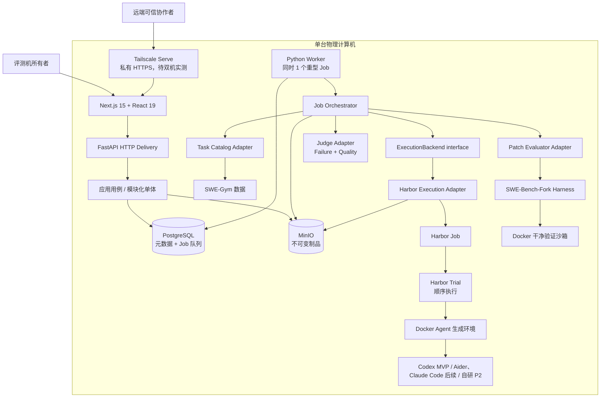
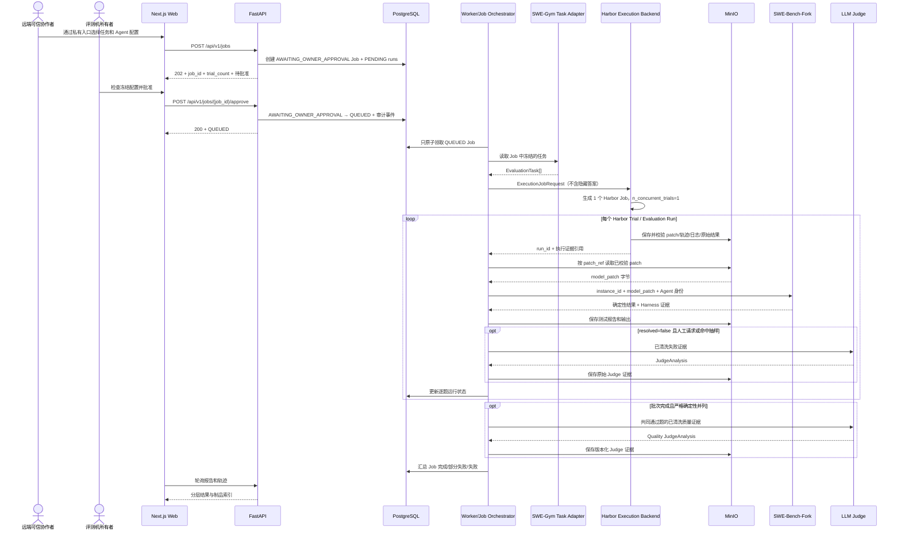

# AI Coding Agent 评测平台总架构

> 文档状态：总体方案已确认，细节持续讨论；尚无业务代码
> 最后更新：2026-09-05
> 权威范围：本文件只维护系统全局组成、依赖方向、已确认决定、规划文件树、风险和待讨论队列。字段级契约由第 1 节列出的专题文档维护。

## 1. 从哪里开始读

如果把整个系统理解成“给多个 Coding Agent 发同一张卷子，并保留完整阅卷证据”，文档分工如下：

| 想知道什么 | 唯一维护文档 |
|---|---|
| 项目里的词是什么意思 | [`CONTEXT.md`](../../CONTEXT.md) |
| 系统由什么组成、为什么这样分 | 本文 |
| 项目依赖什么、从哪里取得、固定到哪个版本 | [`DEPENDENCIES.md`](../dependencies/DEPENDENCIES.md) |
| 每个模块做什么、输入输出和错误是什么 | [`MODULE_CONTRACTS.md`](./MODULE_CONTRACTS.md) |
| 自研 Agent 或后备进程怎样接题并交 patch | [`RUNNER_PROTOCOL.md`](../interfaces/RUNNER_PROTOCOL.md) |
| AgentExam 怎样调用 Harbor、怎样取得 Trial 结果 | [`HARBOR_EXECUTION.md`](../interfaces/HARBOR_EXECUTION.md) |
| Next.js 怎样调用 FastAPI | [`HTTP_API.md`](../interfaces/HTTP_API.md) |
| PostgreSQL/MinIO 保存什么 | [`DATA_MODEL.md`](./DATA_MODEL.md) |
| SWE-Gym、SWE-Bench-Fork 和各 Agent 的真实接口 | [`FRAMEWORK_INTERFACES.md`](../interfaces/FRAMEWORK_INTERFACES.md) |
| Codex、自研 Agent 的模型凭据归谁以及协作时怎样隔离秘密 | [`CODEX_AUTHENTICATION.md`](../interfaces/CODEX_AUTHENTICATION.md) |
| 协作者怎样从校园网外提交、VPN 会不会冲突、哪些端口不能开放 | [`REMOTE_TEAM_ACCESS.md`](../operations/REMOTE_TEAM_ACCESS.md) |
| 外部事实如何查证 | [`docs/research`](../research/) |
| 每次修改的措施和验证证据 | [`docs/actions`](../actions/) |

状态词：

- **已确认**：用户已经决定，后续实现必须遵守。
- **已核验**：已从上游源码或官方文档查到。
- **候选 v0.x**：已经写成可讨论契约，但尚未实现或最终确认；具体版本以专题文档为准。
- **待确认/待实测**：需要人类决定或真实运行证据。
- **已实现**：代码存在且验证通过；当前没有业务代码，因此不能使用这个标签。

## 2. 项目要做什么

实施先后与产品动线必须分开理解：先用评测机本地脚本跑通“真实 Codex → Harbor → patch → 固定 SWE-Bench-Fork”技术原型，不接 Web、PostgreSQL 或所有者批准页面；该证据通过后，再把同一执行 seam 接入下面的 MVP 产品动线。

一次完整 MVP 使用动线：

1. 可信协作者通过私有远程入口，从已登记列表选择一个或多个固定 Agent 配置、一个或多个 SWE-Gym 任务和一个评测赛道。
2. 平台创建 `AWAITING_OWNER_APPROVAL` Job，并预先冻结 Agent×任务组合对应的逐题评测运行；提交本身不启动真实评测。
3. 评测机所有者检查冻结配置并明确批准后，Job 才进入 PostgreSQL 的 `QUEUED` 队列；拒绝则终止，不交给 Worker。
4. 评测机本地的单机 Worker 一次只领取一个已批准 Job；Execution Backend Adapter 把它转换为一个 Harbor Job，并固定 `n_concurrent_trials=1`。
5. Harbor 把 Agent×任务展开为 Trial，运行真实 Agent、管理 Docker 环境并保存过程事件、原始输出和制品。
6. Adapter 为每个 Trial 校验并返回最终 patch；SWE-Bench-Fork 在新的干净验证环境中独立应用 patch 和执行测试。
7. 页面展示 Job 总进度，并分层展示确定性结果、过程指标、按规则触发的 Failure/Quality Judge 和人工复核。
8. 排行榜按完整的“Agent + 模型提供方 + 模型 + 关键配置”统计，原始证据能从 `job_id` 追溯到每个 `run_id`。

## 3. 已确认决定

| 编号 | 决定 | 直接影响 |
|---|---|---|
| C-01 | 直接使用 SWE-Gym 与配套 SWE-Bench-Fork | 不重写任务语义和判卷核心；固定上游版本并通过 Adapter 调用 |
| C-02 | 只有一台物理计算机 | 不设计多机调度、Kubernetes 或分布式存储 |
| C-03 | 周期约一个月，实际开发力量约 2.5 人 | 优先最小完整闭环，控制并发和功能范围 |
| C-04 | Web 为 Next.js 15 + React 19 | 页面独立，不在前端直接驱动 Docker/Harness |
| C-05 | 后端为 Python + FastAPI，耗时任务由 Python Worker 执行 | 与 Python 版 SWE-Bench-Fork 同语言；HTTP 请求不等待评测完成 |
| C-06 | PostgreSQL 保存元数据并承担平台评测 Job 队列，MinIO 保存制品 | 首版不引入 Redis/Celery；不把 Harbor 本地目录当课程数据库；大日志不塞数据库 |
| C-07 | 单机模块化单体 | 代码按边界分模块，但不拆微服务；Web/API/Worker 为进程角色，不是独立业务微服务 |
| C-08 | Harbor 使用 Docker 运行 Agent；固定 SWE-Bench-Fork 使用独立干净验证环境 | 两阶段隔离；最终判卷不能受 Agent 工作区或 Harbor reward 影响 |
| C-09 | 全程证据可追溯 | patch、轨迹、原始输出、测试、Judge 和人工复核都关联同一 `run_id` |
| C-10 | MVP 只运行项目预先登记并固定版本的知名 Agent 配置 | 不提供自研源码提交/审核接口；未登记配置和任意 shell 命令绝不执行 |
| C-11 | 排行榜单位是 Agent + 模型提供方 + 模型 + 关键配置 | 不同提供方、模型或关键配置分行统计，不能混为同一 Agent 成绩 |
| C-12 | 实施顺序为本地 Codex 技术原型 → Codex 平台 MVP → Aider/Claude Code 扩展 → 自研 Agent | 优先复用 Harbor 已有 Agent；自研 Agent 只保留通用 seam，源码审核、进程包装和模型访问均不进入当前 MVP |
| C-13 | 确定性测试、Judge 分析、人工复核分层保存 | LLM 或人工解释不能覆盖 SWE-Bench-Fork 原始测试事实；Judge 不可用不改变确定性结果 |
| C-14 | 架构、模块、接口、框架事实和行动记录分文档持续维护 | 同一事实只设一个权威来源；实现变化时同任务更新相关文档 |
| C-15 | MVP 只实现闭卷主排行榜（`closed_book`） | 保留 `open_book_experimental` 字段/扩展位置但拒绝创建该赛道 Job；以后实现时统一使用平台 Web 工具并继续严格分榜 |
| C-16 | Harbor 是带验收退出条件的正式 Execution Backend | 版本由依赖事实源固定；隐藏在 Adapter 后；原型失败时替换为轻量 Process Adapter，不改上层业务 |
| C-17 | 一个平台评测 Job 映射一个 Harbor Job，一条评测运行映射一个 Harbor Trial | 平台负责业务排队和长期事实；Harbor 负责 Job 内 Trial 执行 |
| C-18 | 单机同时只执行一个重型平台 Job，Harbor `n_concurrent_trials=1` | Job 中 Trial 顺序执行；不以增加并发换取演示速度 |
| C-19 | 一个 Job 可选择多个 Agent 和多个任务，首版每组合尝试一次 | 创建前展示 Trial 总数；预设规模为演示 1–3 题、快速 5 题、标准 10–20 题，Agent 首版最多约 3 个 |
| C-20 | 正式展示、报告和排行只接受真实执行证据 | Mock 结果必须隔离为 `internal_test`，不能冒充真实 Agent 或进入正式统计 |
| C-21 | 首个真实端到端原型使用 `SWE-Gym/SWE-Gym-Lite` 的 1～3 道真实任务 | 先验证小而真的闭环；不下载完整 2.4K 任务，也不把 Lite 冒充为最终正式题库范围 |
| C-22 | 首个真实原型 Agent 使用 Codex，并先由本地脚本运行 | 优先复用 Harbor 内置 Codex Adapter；先证明真实 patch 与判卷闭环，再接 Web/数据库/批准流程，随后扩展 Aider 与 Claude Code |
| C-23 | 首个 Codex 原型使用评测机所有者本人通过 ChatGPT Pro 登录产生的 `auth.json` | 认证政策已经确认；凭据只由执行节点临时注入，不得共享、提交或持久化；容器内运行仍待实测 |
| C-24 | 当前只有用户这一台笔电是正式真实评测节点 | 协作者可开发并远端提交；只有机器所有者批准后，本机 Worker 才能触发真实 Codex Trial；协作者不得取得所有者凭据 |
| C-25 | P2 自研 Agent 接入时只允许 DeepSeek 或 Kimi，并各自形成独立 Agent Configuration | 这是未来扩展约束，不是 MVP 实现项；同一源码切换提供方必须产生独立配置与运行证据 |
| C-26 | 协作者提交正式真实 Job 后必须等待评测机所有者批准 | 新 Job 初始为 `AWAITING_OWNER_APPROVAL`；只有所有者批准才能进入 `QUEUED`，Worker 不能领取待批准 Job |
| C-27 | 协作者使用平台时，评测机和本机平台必须在线 | 当前不增加云端常驻控制面或第二执行节点；评测机离线时私有远程入口不可用，恢复在线后继续接收请求 |
| C-28 | P2 自研 Agent 的首个接入版本只支持 Python 固定进程 Interface | 当前只保留 `ExecutionBackend` 扩展 seam，不实现 manifest、源码审核或 wrapper；进入 P2 后仍不接受任意 shell 命令 |
| C-29 | Judge 分为 Failure Judge 与 Quality Judge 两种用途 | Failure 只对人工请求或抽样失败运行做诊断且不计分；Quality 只在同一评测条件、逐题确定性结果完全相同、存在共同通过题且清洗证据齐备时打破并列 |
| C-30 | Judge 输入清洗属于现有 Judge Implementation 的职责 | 输入须裁剪、脱敏、去重、限量并保留证据引用；不新增独立顶层 Module，不把完整混杂轨迹/日志/代码或隐藏答案直接交给模型 |
| C-31 | P2 自研 Agent 的 DeepSeek/Kimi Key 只由评测机所有者在本机可信秘密配置中管理 | 当前 MVP 不实现该访问路径；未来真实 Key 仍不得进入被测 Agent 容器、HTTP、PostgreSQL、MinIO、命令行、日志或轨迹 |
| C-32 | 平台只有 `collaborator` 与 `owner` 两种人员角色 | 不开放公共注册；所有者本机建立/恢复账号并邀请协作者，同时兼任管理员和人工复核者；私有网络身份不替代应用登录 |
| C-33 | Quality Judge 使用匿名、双次反序的补丁两两比较 | 四个维度为切题且最小、可读/可维护、健壮性、副作用风险；两次结论不一致则该对保持并列；多 Agent 按胜 1、平 0.5、负 0 循环聚合 |
| C-34 | 过程指标第一版只展示，不参与排名 | 工具调用、token、耗时缺失时标记未知，不能写成 0；当前不建立效率分 |
| C-35 | PostgreSQL 保存标准任务字段，MinIO 保存内容哈希固定的原始任务 JSON | 原始快照用于复现和审计；Agent 可见视图仍排除隐藏测试与参考答案 |
| C-36 | 取消不强杀当前 Trial，崩溃不自动续跑/重试 | 待批准/排队 Job 可直接取消；执行中只停止后续 Trial，当前 Trial 至多到冻结超时；中断记基础设施错误，所有者另建新尝试 |
| C-37 | 核心结果长期保留，大型原始制品默认 30 天后可清理 | 只有所有者可通过本地维护入口清理；当前不新增定时服务，删除后保留哈希、大小、产生时间与删除审计 |
| C-38 | 第一版只接受文本 patch，并采用分级大小限制 | 超过 256 KiB 警告但继续；超过 1 MiB 以 `PATCH_TOO_LARGE` 作为无效输出且不截断；单原始制品 50 MiB、单运行原始制品合计 200 MiB |
| C-39 | 远端私有入口采用 Tailscale Serve，FlClash 优先保持系统代理开启、TUN 关闭 | 不申请校园网入站端口、不用 Funnel；只暴露 Web，应用登录与 tailnet 身份分层；VPN 开/关均须双机验收 |

## 4. 总体架构



边界规则：

- 私有远程入口只把 Next.js Web 暴露给获准成员；FastAPI 绑定本机回环地址并由 Web 同源转发。PostgreSQL、MinIO、Docker、Worker 和宿主凭据路径不得成为远程入口。
- 应用只识别 `collaborator` 与唯一 `owner` 两种角色；不开公共注册。网络成员身份只决定能否到达 Web，应用会话仍决定提交、批准、清理和复核权限。
- Web 只走 HTTP API，不直连 PostgreSQL、MinIO 或 Docker。
- FastAPI 负责短请求、校验和查询，不亲自等待 Agent/Harness。
- Job Submission 只创建 `AWAITING_OWNER_APPROVAL` Job；Owner Approval 以可信会话中的所有者身份批准或拒绝。只有批准事务写成 `QUEUED` 后，Worker 才能领取。
- Worker 只在正式评测机本地运行，原子领取 `QUEUED` Job，再调用一个深的 Job Orchestrator；Job 内的逐题运行由 Harbor Trial 顺序执行。
- Orchestrator 只依赖小型 `ExecutionBackend` interface，不直接理解 Harbor `JobConfig`、Trial 目录或异常。
- Harbor 负责 Agent 环境，不替代 PostgreSQL 业务队列、MinIO 长期制品、SWE-Bench-Fork 判卷、Judge 或人工复核。
- Web、公开 Job 请求、FastAPI、PostgreSQL 和 MinIO 不接收 `auth.json`、DeepSeek/Kimi Key 内容或真实宿主路径；只保存非秘密的认证类型和逻辑配置身份。执行节点仅在运行时从本机秘密配置解析凭据引用。Codex 的 `auth.json` 使用方式与自研 Agent 的受控模型访问方式不同，完整约束见 [`CODEX_AUTHENTICATION.md`](../interfaces/CODEX_AUTHENTICATION.md)。
- 闭卷 Agent 生成沙箱只允许平台登记的模型访问路径及其必需端点，并禁用 Web 搜索/抓取工具；MVP 不创建开卷运行，未来开卷只允许平台统一 Web 工具。验证沙箱候选为断网干净环境。2026-09-05 已验证本机 Docker Desktop 内部代理可以经 FlClash 完成通用容器 HTTPS，但也证实容器可经 `host.docker.internal` 触达宿主 FlClash；所以该配置只是连通能力，不是防绕过边界。Harbor Trial 的显式代理注入、受控模型访问白名单、宿主/公网直连阻断和工具公平性仍待原型确认，动态事实见 [`LOCAL_DOCKER_ENVIRONMENT.md`](../operations/LOCAL_DOCKER_ENVIRONMENT.md)。

## 5. 一次运行的输入输出



图中没有画出 `auth.json`，因为它不是 Job 输入或业务制品：只有执行节点能从本机秘密配置中解析它，并在受控 Codex Trial 的最小生命周期内临时使用。远端协作者只提交冻结的公开评测选择，批准接口也不能读取或返回凭据。

关键输入输出的字段、错误和保密边界不在本文重复，分别见：

- 内部模块：[`MODULE_CONTRACTS.md`](./MODULE_CONTRACTS.md)
- Runner 进程：[`RUNNER_PROTOCOL.md`](../interfaces/RUNNER_PROTOCOL.md)
- Harbor 执行：[`HARBOR_EXECUTION.md`](../interfaces/HARBOR_EXECUTION.md)
- HTTP：[`HTTP_API.md`](../interfaces/HTTP_API.md)
- 依赖来源、固定版本与恢复方式：[`DEPENDENCIES.md`](../dependencies/DEPENDENCIES.md)
- 上游框架/CLI：[`FRAMEWORK_INTERFACES.md`](../interfaces/FRAMEWORK_INTERFACES.md)

## 6. 运行结果怎样理解

| 层 | 回答的问题 | 是否为最终测试事实 |
|---|---|---:|
| Execution Backend 结果 | Agent 是否正常运行、产生了什么 patch/轨迹 | ❌ |
| 确定性验证 | patch 是否应用、规定测试是否通过、`resolved` 是否为真 | ✅ |
| 过程指标 | 调用了哪些可观察工具、耗时/token/资源怎样 | ❌ |
| Failure Judge | 被人工请求或抽样的失败运行可能为什么失败 | ❌，不参与排名 |
| Quality Judge | 严格确定性并列时，合格补丁的质量比较结果 | ❌，只作为并列次序 |
| 人工复核 | 所有者是否确认/作废 Judge 分析 | ❌，但属于审计事实；Quality 只能作废并恢复并列，不能人工指定赢家 |

必须区分：

- Agent 正常结束但没有修好：运行可以 `COMPLETED`，`resolved=false`。
- Agent/Harness/存储链路没能形成可信结果：运行 `FAILED`，`resolved` 应为空，而不是伪造 false。
- Quality Judge 只有在数据集/版本、题目集合、赛道、Harness、尝试数和限制一致，候选者逐题 `resolved` 向量完全相同且存在共同通过题时才运行；共同通过题的补丁匿名两两比较“切题且最小、可读/可维护、健壮性、副作用风险”，交换 A/B 顺序运行两次，只有两次一致才产生胜负，否则该对保持并列。多 Agent 按胜 1、平 0.5、负 0 循环聚合。
- Failure Judge 只按人工请求或固定抽样策略运行；两种 Judge 的输入都必须在现有 Judge Implementation 内先清洗，不能直接读取完整混杂轨迹。
- 工具调用次数、token、耗时是只展示的过程指标，不参与正确性排名。Aider 当前没有官方结构化工具事件流，因此缺失值显示“不支持/未知”，不能写 0。

评测赛道也必须区分：

- **闭卷主排行榜（`closed_book`）**：Agent 使用题目、仓库和本地工具做题；只保留模型服务所需网络，不开放一般 Web 查询。
- **开卷实验榜（`open_book_experimental`）**：MVP 只保留字段与扩展位置，不接受创建该赛道 Job；以后启用时统一使用平台提供的 Web 工具，并保存工具与访问证据。
- 未来两条赛道仍使用同一个 SWE-Bench-Fork 结果作为正确性事实；同一 Agent 配置跨赛道的成绩不能合并。

## 7. 为什么选择这个架构

### 7.1 模块化单体，而不是微服务

- 一台机器、一个月、2.5 人不值得承担服务发现、跨服务鉴权、网络重试和分布式一致性。
- 模块仍通过 ports 隔离；以后真有多机需要，可以优先把 Worker 边界外移。
- Web、API、Worker 是不同进程职责，但共享一个后端领域/应用代码库，不把它们误称为三套微服务。

### 7.2 PostgreSQL 管平台 Job 队列，而不是让 Harbor 代替业务数据库

- PostgreSQL 已经是题目要求，可信用户、审核、排队、取消、报告和长期状态必须有业务事实源。
- Harbor Job 目录是执行产物，不负责课程用户、权限和长期查询；PostgreSQL 只领取平台 Job，不逐条与 Harbor 抢调度权。
- 候选使用短事务和 `FOR UPDATE SKIP LOCKED`，并额外保证只有一个重型 Job 活跃；精确 SQL 和崩溃恢复要通过双 Worker 实测。

### 7.3 深的 Execution Backend，而不是把 Harbor 类型传播到全项目

- Harbor 已经处理多种 Agent、Docker 环境、Job/Trial 和轨迹；重复自研会增加一个月项目的风险。
- `HarborExecutionAdapter` 把差异翻译成一个项目 interface；Job Orchestrator 永远只理解“批次进去，逐题 patch/证据出来”。
- Harbor 原型若失败，只新增后备 `ProcessExecutionAdapter`；调用方、数据库和 HTTP 不跟着重写。

### 7.4 两阶段沙箱

- Agent 生成环境允许修改仓库、运行获准工具，并记录轨迹。
- Patch Evaluator 重新从固定任务环境开始，只应用最终 patch，再执行真实测试。
- 这样 Agent 修改测试、留下缓存或声称“我测试通过”都不能替代最终判卷。

### 7.5 Harbor Job 不是最终判卷

- 固定提交允许 `verifier.disable=true`；Harbor 仍先同步 Agent 日志并收集 artifacts。
- Harbor `TrialResult` 没有标准 `model_patch` 字段，补丁出口必须通过真实原型验收。
- 只有固定 SWE-Bench-Fork 的完整报告能写入 `DeterministicResult.resolved`；Harbor reward 只可作为调试证据或直接禁用。

## 8. 候选项目文件树

以下是规划，不表示路径已经创建。源代码实施时继续遵守：动态语言单文件默认不超过 200 行、每层默认不超过 8 个文件；确需超过先在行动文档说明并取得确认。

```text
E:\9.1agent_exam\
├─ AGENTS.md
│  # Codex 协作、文档唯一事实源、验证和代码架构规则
├─ CONTEXT.md
│  # 项目领域术语唯一事实源；不记录框架和部署细节
├─ framework\
│  # 本地恢复的第三方上游依赖；不进入 AgentExam 主仓库，来源与版本见依赖文档
│  ├─ swe-gym\
│  │  # 固定提交的 SWE-Gym 数据/实验框架源码
│  ├─ swe-bench-fork\
│  │  # 固定提交的 Docker 环境与确定性 Harness
│  └─ harbor\
│     # 未来按依赖文档恢复的 Harbor 固定源码；当前尚未下载
├─ apps\
│  ├─ backend\
│  │  # FastAPI 与 Worker 共享的 Python 模块化单体
│  │  ├─ pyproject.toml
│  │  │  # Python 依赖、测试、格式和命令入口
│  │  ├─ prototype_codex_harbor_e2e.py
│  │  │  # M0 临时入口：本机单题 Codex→Harbor→patch→固定 Fork；不接 Web/数据库且不得写正式排行
│  │  ├─ src\eval_platform\
│  │  │  ├─ domain\
│  │  │  │  # 纯领域规则，不依赖框架/数据库/Docker
│  │  │  │  ├─ task.py       # EvaluationTask 与 Agent 可见/验证视图边界
│  │  │  │  ├─ agent.py      # AgentConfiguration 与配置指纹规则
│  │  │  │  ├─ job.py        # EvaluationJob、组合规模和 Job 状态规则
│  │  │  │  ├─ run.py        # EvaluationRun：逐 Trial 状态和合法迁移
│  │  │  │  └─ result.py     # 确定性、Judge、人工复核的分层结果
│  │  │  ├─ application\
│  │  │  │  # 用例层，只依赖 domain 与 ports
│  │  │  │  ├─ ports\
│  │  │  │  │  # 外部能力的小接口；Adapter 的替换 seam
│  │  │  │  │  ├─ task_source.py  # Task Catalog port
│  │  │  │  │  ├─ execution.py    # 深 ExecutionBackend port；隐藏 Harbor 类型
│  │  │  │  │  ├─ evaluator.py    # Patch Evaluator port
│  │  │  │  │  ├─ repositories.py # PostgreSQL Repository ports
│  │  │  │  │  ├─ artifacts.py    # MinIO Artifact Store port
│  │  │  │  │  └─ judge.py        # Failure/Quality Judge 共用 port；触发与语义分开
│  │  │  │  ├─ submit_job.py  # 校验矩阵并创建待所有者批准 Job + PENDING runs
│  │  │  │  ├─ approve_job.py # 所有者批准/拒绝待审 Job；批准后才进入 QUEUED
│  │  │  │  ├─ execute_job.py # 深模块：Harbor 执行、逐题判卷和 Job 汇总
│  │  │  │  └─ review_run.py  # 人工抽检与版本化复核流程
│  │  │  ├─ adapters\
│  │  │  │  # 把真实上游接口翻译为 application ports
│  │  │  │  ├─ tasks\swe_gym.py
│  │  │  │  │  # Adapter：SWE-Gym 字段 → EvaluationTask
│  │  │  │  ├─ agents\
│  │  │  │  │  # MVP 只转换项目预登记知名 Agent；自研提交 manifest 属于 P2
│  │  │  │  │  ├─ registry.py # 已登记配置 → Harbor AgentConfig；不接收任意命令
│  │  │  │  │  └─ manifest.py # P2 延后：静态解析 Python 自研 Agent manifest；审核前不执行代码
│  │  │  │  ├─ execution\
│  │  │  │  │  ├─ harbor\
│  │  │  │  │  │  # HarborExecutionAdapter 内部实现；外部只见 ExecutionBackend
│  │  │  │  │  │  ├─ adapter.py       # Job 生命周期与项目结果汇总
│  │  │  │  │  │  ├─ config_mapper.py # 项目 Job → Harbor JobConfig
│  │  │  │  │  │  ├─ result_mapper.py # TrialResult/异常 → ExecutionTrialResult
│  │  │  │  │  │  └─ artifacts.py     # patch/ATIF/原始结果校验和导入
│  │  │  │  │  └─ process.py
│  │  │  │  │     # 后备 Adapter：只在 Harbor 原型未过门槛时实现统一进程协议
│  │  │  │  ├─ evaluation\swe_bench.py
│  │  │  │  │  # Adapter：prediction JSONL → 固定 Fork CLI → 规范化结果
│  │  │  │  ├─ persistence\postgres.py
│  │  │  │  │  # Repository Adapter：状态事务、领取、查询和审计事件
│  │  │  │  ├─ artifacts\minio.py
│  │  │  │  │  # Artifact Adapter：不可变写入、校验和与流式读取
│  │  │  │  └─ judge\llm_judge.py
│  │  │  │     # 现有 Judge Adapter：输入清洗、双用途 prompt、结构化输出与原始响应
│  │  │  ├─ delivery\http\
│  │  │  │  # FastAPI 交付层；只做 schema、状态码和用例调用
│  │  │  │  ├─ app.py         # Composition Root：组装 ports/adapters 和生命周期
│  │  │  │  └─ routes\
│  │  │  │     ├─ tasks.py    # Task API
│  │  │  │     ├─ agents.py   # Agent Configuration API
│  │  │  │     ├─ jobs.py      # Job 创建、所有者批准/拒绝、列表、详情和取消 API
│  │  │  │     ├─ runs.py      # Job 内逐题运行只读 API
│  │  │  │     ├─ artifacts.py # Trajectory/Artifact API
│  │  │  │     ├─ reviews.py  # Human Review API
│  │  │  │     └─ reports.py  # Report/Leaderboard API
│  │  │  └─ worker\main.py
│  │  │     # 单机 Worker Shell：领取、心跳、停止和调用 Orchestrator
│  │  └─ tests\
│  │     ├─ unit\         # 领域状态和应用分支的快速测试
│  │     ├─ contract\     # Fake/真实 Adapter 共用的契约测试
│  │     └─ integration\  # PostgreSQL、MinIO、Docker、Harness 集成测试
│  └─ web\
│     # Next.js 15 + React 19 展示应用
│     ├─ package.json      # 固定前端依赖与命令
│     ├─ next.config.ts    # Next.js 构建配置；候选同源转发到回环 FastAPI
│     └─ src\
│        ├─ app\
│        │  # App Router 页面/布局，不直接实现后端业务
│        │  ├─ layout.tsx       # 全站布局和导航
│        │  ├─ page.tsx         # Job 概览
│        │  ├─ tasks\           # 任务浏览与选择
│        │  ├─ jobs\            # 发起 Job、待所有者批准队列、总进度和组合结果
│        │  ├─ runs\            # 运行、轨迹和证据详情
│        │  ├─ leaderboard\     # Agent 配置排行
│        │  └─ reviews\         # 人工抽检工作台
│        ├─ features\
│        │  # 与路由解耦的视图模型和交互
│        │  ├─ tasks\
│        │  ├─ jobs\
│        │  ├─ runs\
│        │  ├─ leaderboard\
│        │  └─ reviews\
│        └─ lib\
│           ├─ api-client.ts # 唯一 FastAPI 客户端
│           └─ contracts.ts  # 从 OpenAPI 生成/同步的前端类型
├─ infra\
│  # 单机部署和无秘密配置
│  ├─ compose.yaml         # Web/API/PostgreSQL/MinIO；Worker 载体待实测
│  ├─ .env.example        # 配置名和说明，不含秘密值
│  └─ containers\
│     ├─ backend.Dockerfile # FastAPI 镜像
│     ├─ worker.Dockerfile  # Worker 镜像候选
│     └─ web.Dockerfile     # Next.js 镜像
├─ tests\e2e\
│  # 从创建 Job 到逐题报告展示的单机端到端测试
└─ docs\
   ├─ dependencies\
   │  └─ DEPENDENCIES.md       # 依赖来源、固定版本、恢复方式与入库策略的唯一事实源
   ├─ architecture\
   │  ├─ ARCHITECTURE.md      # 本总架构/规划树
   │  ├─ MODULE_CONTRACTS.md  # 内部模块输入输出
   │  └─ DATA_MODEL.md        # PostgreSQL/MinIO
   ├─ interfaces\
   │  ├─ HARBOR_EXECUTION.md      # ExecutionBackend 与 Harbor Job/Trial 映射
   │  ├─ CODEX_AUTHENTICATION.md  # Codex/自研 Agent 模型凭据所有权和秘密边界的唯一事实源
   │  ├─ RUNNER_PROTOCOL.md       # 自研 Agent/后备进程协议
   │  ├─ HTTP_API.md              # Web/API 契约
   │  └─ FRAMEWORK_INTERFACES.md  # 真实上游接口映射
   ├─ research\  # 官方资料和相似项目的查证记录
   ├─ operations\
   │  ├─ LOCAL_DOCKER_ENVIRONMENT.md # 本机 Docker/WSL 的已测环境事实
   │  └─ REMOTE_TEAM_ACCESS.md       # 私有远程入口、校园网/VPN共存和最小暴露面
   ├─ actions\   # 每次修改的行动和验证记录
   └─ adr\       # 仅记录难以逆转且已作出的架构决定
```

## 9. 设计模式关系

| 模式 | 参与路径 | 角色关系 | 目的 |
|---|---|---|---|
| Adapter | `ports/execution.py` + `adapters/execution/harbor/**` + `adapters/execution/process.py` | `ExecutionBackend` 定义小 interface；Harbor 为主 Adapter，Process 为验收失败时的替代 Adapter | Harbor 复杂性只集中在一个 seam，替换不波及业务 |
| Factory/Registry | `adapters/agents/registry.py` + P2 `adapters/agents/manifest.py` | MVP Registry 只转换项目预登记的知名 Agent；P2 才解析自研 manifest，且不执行代码 | 避免任意命令执行和 Orchestrator 条件分支 |
| Repository | `ports/repositories.py` + `adapters/persistence/postgres.py` | 应用层依赖持久化接口；PostgreSQL 实现事务和领取 | 测试可用 Fake，SQL 不散落 |
| State | `domain/job.py` + `domain/run.py` + PostgreSQL 状态约束 | 统一规定允许的 Job/运行迁移；API/Worker/数据库复用 | 防止各层对状态各自解释 |
| Command | `application/submit_job.py` + `application/approve_job.py` | 提交命令只冻结请求；批准命令只作所有者决定并排队；两者都不执行 Harbor | 权限决定和重型执行之间有明确 seam，Worker 无法绕过批准 |
| Composition Root | `delivery/http/app.py` | 唯一位置组装 ports 与生产 Adapters | 依赖构造不散落在业务逻辑 |

暂不引入装饰器、事件总线、CQRS、微服务或 Kubernetes。若未来出现真实变化点，再通过 ADR 和行动文档讨论。

## 10. 当前风险和控制

| 风险 | 影响 | 当前控制 |
|---|---|---|
| SWE-Gym 是数据、环境和多仓库材料，不是单一应用包 | 初学者容易寻找不存在的一键接口 | [`DEPENDENCIES.md`](../dependencies/DEPENDENCIES.md) 固定来源与版本；[`FRAMEWORK_INTERFACES.md`](../interfaces/FRAMEWORK_INTERFACES.md) 固定真实数据/Harness seam |
| Windows + Docker Desktop 与上游 Linux 代码差异 | Fork 使用 Linux `resource`、Docker 等能力 | Worker 运行载体先做 gold patch 最小实验，不先宣称跑通 |
| 任务镜像占磁盘、构建慢 | 一次加载大题库不可行 | 首月只登记少量任务，显式缓存策略和磁盘证据 |
| 云端 Agent 必须联网，而公开题目的原 PR 也可能在线 | 闭卷可能被运行时查答案，开卷工具能力也可能不等价 | 闭卷仅放行平台登记的模型访问路径及必需端点并禁用 Web 工具；开卷单列实验榜并记录网络/工具配置，精确代理待实测 |
| 不可信仓库和 Agent 代码 | 主机与凭据泄漏 | 固定登记 Agent、双沙箱、最小挂载、秘密脱敏，不接受任意仓库执行；自研 Agent 不取得真实模型 Key |
| Codex 个人登录凭据进入临时 Trial、日志、轨迹或制品 | 个人账号被盗用，且评测证据不再适合共享 | 执行节点最小临时注入；日志脱敏；明确排除 `auth.json`、`$CODEX_HOME` 和秘密目录；成功、失败、超时路径都销毁容器与可写层 |
| Harbor `TrialResult` 没有标准 `model_patch` | 无法把 Agent 结果交给固定 Fork | 原型必须在清理前提取并校验 patch artifact；缺失即失败，不猜补丁 |
| Harbor 接口升级或 Job 目录格式变化 | Adapter 漂移、历史不可复现 | 固定完整 commit；原始 config/result 入 MinIO；升级重跑契约测试 |
| 多 Agent×多任务导致 Job 很长 | 笔电运行数小时且磁盘增长 | 创建前显示 Trial 数；预设小批量；并发 1；耗时只按真实历史估计 |
| Aider 无结构化工具事件 | 过程指标不能完全同口径 | 缺失标为“不支持/未知”，不伪造 0 |
| Codex/Claude/Aider 外部接口和许可会更新 | Adapter 漂移、费用或认证变化 | 固定版本、官方核验、四层测试、历史配置不覆盖 |
| LLM Judge 随机、有偏或输入过载 | 归因/并列次序不稳定 | 只在已确认条件触发；Quality 匿名且反序运行两次，结论不一致就保持该对并列；输入先裁剪脱敏去重限量并保存版本化证据 |
| 范围仍偏大 | 一个月可能闭环不足 | Mock 只测软件分支；交付闭环优先一条真实任务 + 一个真实 Agent + 固定 Fork，再扩展 Agent |
| 大日志或异常 patch 吃满本机磁盘 | MinIO 写满并影响后续 Trial | 文本 patch 256 KiB 警告/1 MiB 拒绝；单原始制品 50 MiB、单运行原始制品 200 MiB；大型原始制品 30 天后仅所有者可清理 |
| 校园网 CGNAT/防火墙不允许入站端口 | 协作者无法通过公网地址稳定访问评测机 | 不做路由器端口映射；使用只需出站连接的 Tailscale Serve，入口只到 Web，并实测直连/中继 |
| 现有外网 VPN 与私有覆盖网络冲突 | Tailscale 地址或流量被全隧道、kill switch、防火墙拦截 | 不启用 Tailscale exit node；优先让现有 VPN 排除 Tailscale 应用/`100.64.0.0/10`，用 `tailscale netcheck/status` 双机实测；不兼容才评估 Cloudflare Tunnel |
| 远端成员越权批准或直接触发 Worker | 消耗所有者账号、费用和本机资源 | 网络准入不代替应用授权；只有所有者角色能批准，Job 审计记录决定者和时间，Worker 仅领取 `QUEUED` |

## 11. 当前验证策略

实现阶段按以下门槛推进：

1. **本机门槛**：Docker/WSL 环境事实见 [`LOCAL_DOCKER_ENVIRONMENT.md`](../operations/LOCAL_DOCKER_ENVIRONMENT.md)；真实任务继续并发 1。
2. **Harbor 门槛**：从固定 revision 的 `SWE-Gym/SWE-Gym-Lite` 选择 1～3 道真实任务运行 Trial，验证 patch、轨迹、资源/网络和清理；未通过则触发后备 Adapter 决策。
3. **框架门槛**：同一 SWE-Gym 任务由固定 Fork 验证 gold、空和错误 patch；Harbor reward 不参与结论。
4. **真实 Agent 门槛**：首先由评测机本地脚本让真实 Codex 完成 Issue→Harbor→patch→固定 Fork 的 E2E，不接 Web/数据库；通过后才组装 Codex 平台 MVP，Aider/Claude Code 随后扩展。
5. **隔离门槛**：验证 CPU/内存/PID/超时/网络/挂载/清理和秘密不泄漏；M0 首次真实 Codex Trial 前后检查容器、可写层、日志、轨迹和受控本机证据目录，M1 接入后再检查 PostgreSQL/MinIO，均不得出现凭据内容或真实秘密路径。
6. **持久化门槛**：双 Worker 不重复领取同一 Job，单机不同时执行两个重型 Job；任务原始 JSON 可按内容哈希复查；核心制品长期保存，大型原始制品按 30 天资格清理且删除审计不丢失。
7. **产品门槛**：不开放注册；协作者只能提交/查看，唯一所有者能邀请/恢复账号、批准、清理和复核。远端创建 Job 后只能看到 `AWAITING_OWNER_APPROVAL`，批准后才进入 `QUEUED`。
8. **赛道门槛**：MVP 只允许 `closed_book`，`open_book_experimental` 请求明确拒绝；保留字段不能造成跨赛道混分，`internal_test` 不进入正式排行。
9. **远程接入门槛**：在评测机 VPN 开启和关闭两种情况下做双机测试；确认获准成员只能访问 Web，同源 API 可用，非成员以及 PostgreSQL、MinIO、Docker/Worker 端口不可达；记录连接是 direct 还是 relay。
10. **Judge 门槛**：用固定样例验证 Failure/Quality 触发、匿名双次反序比较、循环积分、输入清洗、证据引用以及 Judge 失败/被所有者作废后保持并列。
11. **取消与限额门槛**：执行中取消不再开始后续 Trial，当前 Trial 至多到冻结超时；崩溃不自动重跑；文本 patch 和原始制品按已确认阈值产生警告、拒绝或显式截断标记。
12. **P2 自研 Agent 门槛（当前不实施）**：未来实现 Python 进程 Interface 时拒绝任意 shell/提供方/秘密输入；DeepSeek/Kimi 真实 Key 不进入被测容器，并验证受控访问不能绕过网络策略。

每次实际实现前使用 `action-document`；实际检查结果必须写回行动文档，不把“计划测试”描述成“已经通过”。

## 12. 下一轮技术核验队列

本轮需要用户拍板的产品问题已经回答。下面按实施影响排序查技术事实；若验证结果要求改变产品行为，再回到用户确认：

1. 固定 Codex CLI 项目版本、模型 ID 和端点白名单，并实测 Harbor 容器内 ChatGPT 登录 Token 刷新、日志脱敏及成功/失败/超时清理路径。
2. 读取并固定 `SWE-Gym/SWE-Gym-Lite` 的不可变 revision、真实 split 和 1～3 个具体任务；不让用户猜字段。
3. 用本地脚本裁决 Harbor/Worker 载体、补丁提取、资源限制和固定 Fork E2E；通过前不搭 Web/数据库流程。
4. 在不增加公共注册和额外角色的前提下，核验密码哈希、会话、邀请与本机恢复的最小技术实现；若必须新增顶层 Module 或数据库表，先说明现有边界为何不足并取得确认。
5. 在真实 Trial 中测量 patch、日志和原始制品规模；默认阈值先按 C-37/C-38，实现证据表明需要调整时再请求确认。
6. 完成校园网 + FlClash 开启/关闭下的 Tailscale 双机共存测试，失败时才评估 Cloudflare Tunnel + Access。
7. Codex MVP 通过后固定 Aider/Claude Code 的版本、认证和 Harbor 配置；自研 manifest、Python/DeepSeek/Kimi 受控访问只留在 P2 backlog。

## 13. 变更记录

- 2026-09-01：创建初版，记录单机、SWE-Gym/SWE-Bench-Fork、双沙箱和候选文件树。
- 2026-09-01：确认固定登记 Agent、排行榜按完整 Agent 配置、四类 Adapter 目标和 Claude Code 黑盒接入边界。
- 2026-09-01：用户接受单机模块化单体总体方案；确认 FastAPI、Python Worker、PostgreSQL 队列和不引入首版微服务/Redis/Celery。
- 2026-09-01：重构为清晰总览；把模块、Runner、HTTP、数据和真实上游接口拆为各自唯一事实源，并更新规划文件树和文档导航。
- 2026-09-02：确认闭卷主排行榜和开卷实验榜；两者使用相同确定性判卷，但按赛道、网络和工具配置严格分开。
- 2026-09-02：新增依赖唯一事实源；确认本地 `framework/` 不进入 AgentExam 主仓库，公开接口证据改用固定提交链接。
- 2026-09-03：确认 PostgreSQL 平台 Job 队列 + Harbor Execution Backend + 固定 SWE-Bench-Fork 判卷；一个 Job 可含多 Agent×多任务，单机 Trial 并发固定 1，Mock 仅限内部测试，并记录 Harbor 原型退出条件。
- 2026-09-04：确认首个真实原型使用 `SWE-Gym/SWE-Gym-Lite` 的 1～3 道任务；revision、split 和具体实例仍须读取真实元数据后固定。
- 2026-09-04：确认 Codex 为首个真实原型 Agent；认证采用评测机所有者的 ChatGPT Pro `auth.json`，当前仅该笔电作为正式真实评测节点；CLI 项目版本、模型、端点和容器运行仍待固定或实测。
- 2026-09-04：确认个人凭据不得共享、进入业务请求、数据库或制品；Kimi/DeepSeek 只作为独立 Agent Configuration，不得在 Trial 内静默回退。
- 2026-09-04：工作区由含中文路径迁移至 `E:\9.1agent_exam`；项目内容、Git 状态和远程仓库保持不变。
- 2026-09-05：确认远端协作者提交的正式真实 Job 必须先处于 `AWAITING_OWNER_APPROVAL`，只有评测机所有者批准才能进入 `QUEUED`；当前单机平台只在评测机在线时可用，并新增校园网/VPN私有接入候选与验证门槛。
- 2026-09-05：确认 Failure/Quality Judge 的严格触发、清洗和非覆盖规则；首版自研 Agent 固定为 Python 进程 Interface，仅允许 DeepSeek/Kimi 独立配置，真实 Key 只由评测机可信配置持有；安全访问复用现有 Implementation，不新增顶层业务 Module。
- 2026-09-05：实施范围改为本地 Codex 技术原型 → Codex 平台 MVP → Aider/Claude Code → P2 自研 Agent；确认两角色邀请制、Quality 匿名双次反序比较、过程指标只展示、闭卷 MVP、任务双层存储、手动重试、制品保留与大小限制。
