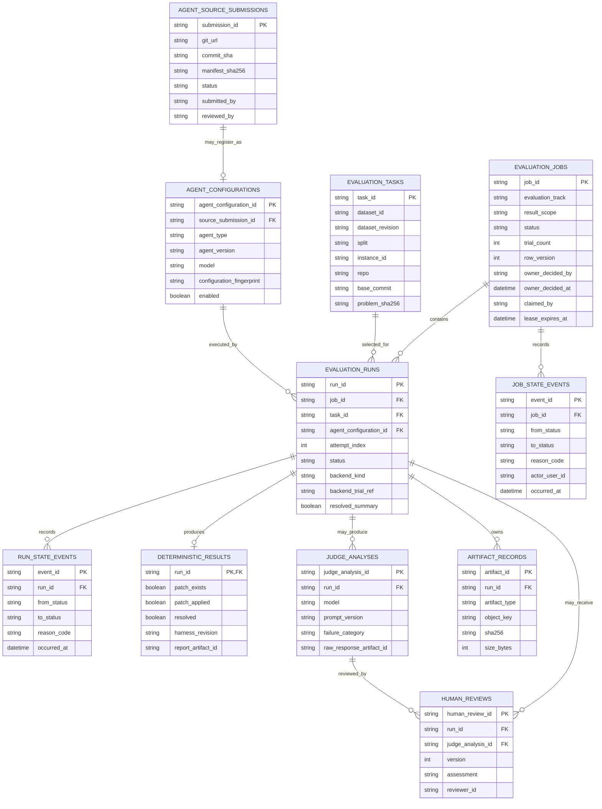
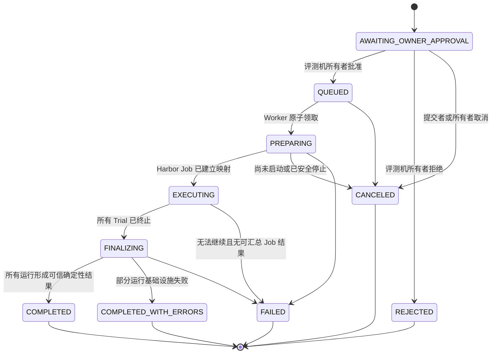
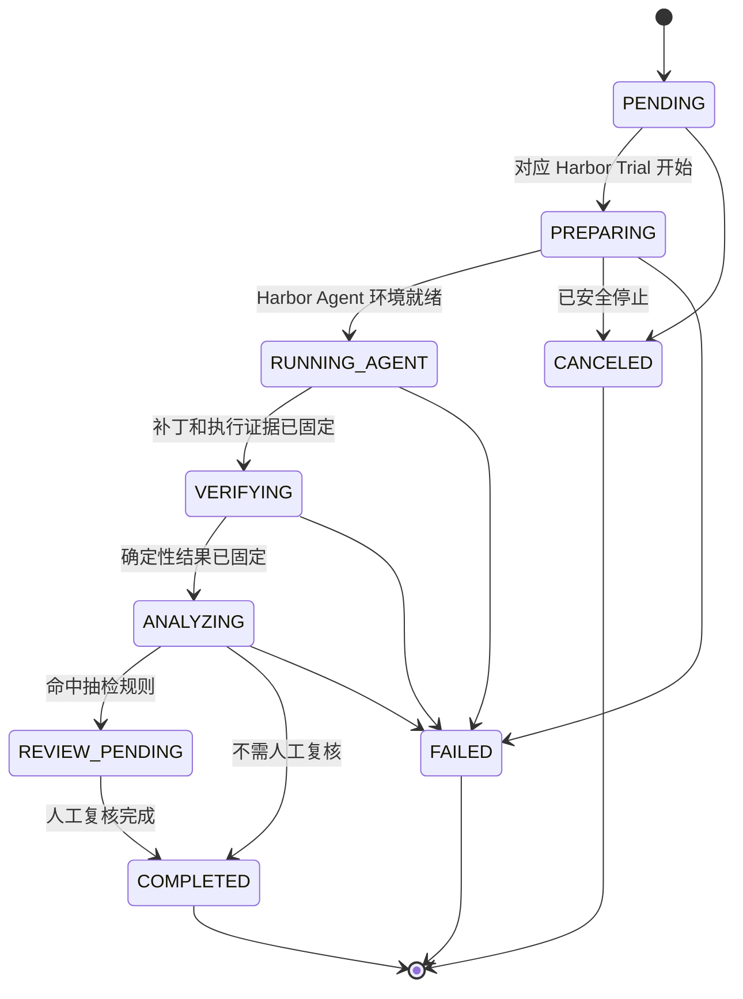
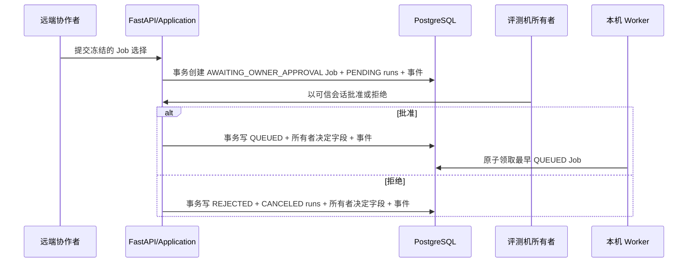
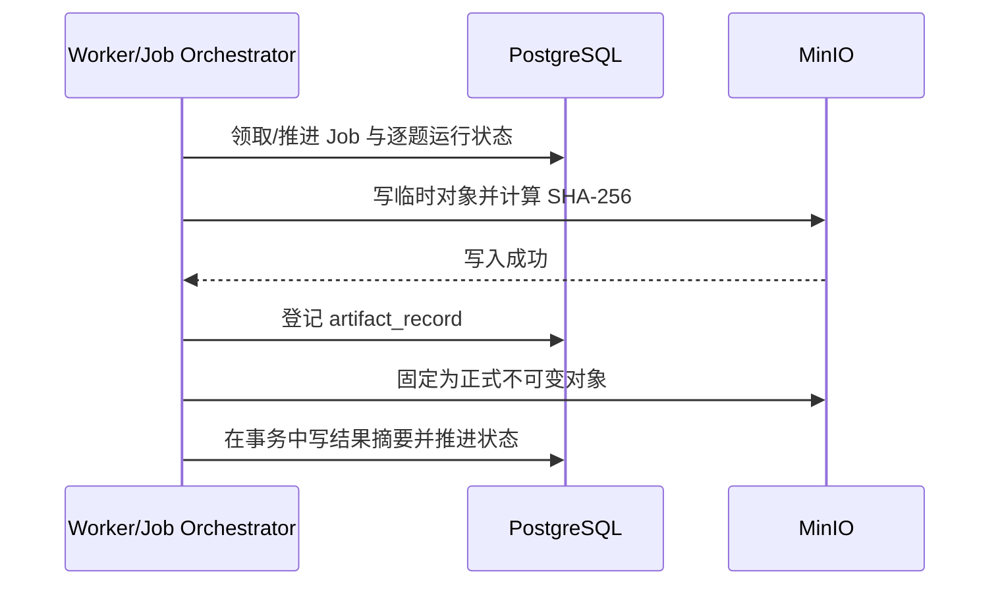

# 数据模型与制品布局

> 文档状态：Job/Run 架构已确认；字段契约 v0.3，尚未实现
>
> 最后更新：2026-09-05
> 权威范围：本文件维护 PostgreSQL 实体、运行状态持久化、队列领取规则和 MinIO 对象布局。领域词义见 [`CONTEXT.md`](../../CONTEXT.md)，模块输入输出见 [`MODULE_CONTRACTS.md`](./MODULE_CONTRACTS.md)。

## 1. 给初学者的解释

系统产生两种数据：

- PostgreSQL 像“目录和登记簿”：保存能查询、筛选、关联的短数据，例如某次运行是谁、什么状态、是否通过。
- MinIO 像“证据文件柜”：保存补丁、长日志、JSONL 轨迹和 Judge 原始响应等文件。

数据库只保存文件柜中的“档案号、大小和校验和”，不把所有大文件塞进表里。

## 2. 数据边界

| 数据 | PostgreSQL | MinIO | 原因 |
|---|---:|---:|---|
| 任务身份、仓库、固定提交、Issue 摘要 | ✅ | 可选原始任务快照 | 需要筛选和关联 |
| gold patch、`test_patch`、隐藏测试 | 仅受限验证引用 | 可选受限制品 | 不得通过普通 API/Runner 泄漏 |
| Agent 配置身份、版本、模型、配置指纹 | ✅ | 可选配置快照 | 排行榜与复现需要 |
| Agent 源码提交与审核状态 | ✅ | 可选审核附件 | 审核前不得进入执行链路 |
| Job/运行状态、所有者批准/拒绝、时间、限制、Worker 租约 | ✅ | ❌ | Job 需要先审计所有者决定再事务领取，运行需要逐题追溯 |
| 最终 patch | 元数据/摘要 | ✅ | 文件证据，不可覆盖 |
| 原始 stdout/stderr、轨迹 JSONL | 索引/汇总 | ✅ | 体积大、适合流式读写 |
| Harness 报告摘要 | ✅ | ✅ 原始报告/测试输出 | 查询与原始证据都需要 |
| Judge 分类摘要 | ✅ | ✅ 原始请求/响应 | 保留模型证据与可查询分类 |
| 人工复核结论 | ✅ | 可选附件 | 需要版本化和审计 |

## 3. 实体关系



## 4. 表级契约

字段是候选 v0.3 的最小集合；实现迁移文件前仍要确定数据库类型、索引名和长度限制。

### 4.1 `evaluation_tasks`

用途：登记可评测的固定 SWE-Gym 任务身份。

| 字段 | 约束/含义 |
|---|---|
| `task_id` | 主键；由数据集 ID、固定 revision、split、instance 生成或映射为不透明 ID |
| `dataset_id` | 例如已登记的 SWE-Gym Hugging Face 数据集 ID |
| `dataset_revision` | 固定 revision/校验值；禁止用会漂移的 `latest` 进入正式运行 |
| `split` | 上游真实 split |
| `instance_id` | 上游任务 ID；与 dataset/revision/split 组成唯一约束 |
| `repo` / `base_commit` | 仓库和固定代码基线 |
| `problem_statement` | Issue 原文；若体积证明过大可改存受控制品，但首版可直接保存 |
| `problem_sha256` | 防止同 ID 内容漂移 |
| `validation_ref` | 只供 Evaluator 解析上游测试字段的受限引用；普通 API 不返回 |
| `created_at` | 登记时间 |

不直接允许 Web 修改任务内容；任务同步是项目组的受控维护动作。

### 4.2 `agent_configurations`

用途：登记排行榜和 Execution Backend 使用的完整可复现身份。

| 字段 | 约束/含义 |
|---|---|
| `agent_configuration_id` | 主键，不透明稳定 ID |
| `source_submission_id` | 可空外键；自研 Agent 来自哪条已批准源码提交，内置 Agent 可空 |
| `display_name` | 面向页面的名称，不参与唯一性判断 |
| `agent_type` | `custom`、`codex`、`aider`、`claude_code`；执行方式另由受控 Adapter 映射 |
| `agent_version` | 精确 Agent/CLI/代码 revision |
| `model` | 精确模型身份；若无则明确 `none` |
| `public_options` | JSONB；只含 Adapter schema 允许且可公开的行为配置 |
| `limit_profile_id` | 默认限制模板 |
| `configuration_fingerprint` | 规范化配置的 SHA-256；唯一约束候选 |
| `enabled` | 是否允许创建新运行；禁用不删除历史 |
| `created_at` / `disabled_at` | 审计时间 |

秘密、宿主机路径和任意启动命令不能存入 `public_options`。具体启动模板属于受控部署配置，并且同样要版本化。

### 4.3 `agent_source_submissions`

用途：保存可信用户提交的固定 Agent 源码及管理员审核结果。提交记录不是可执行配置。

| 字段 | 约束/含义 |
|---|---|
| `submission_id` | 主键，不透明 ID |
| `git_url` | 规范化仓库 URL；只允许管理员策略支持的协议/来源 |
| `commit_sha` | 完整不可变 commit；禁止分支名、tag 或 `latest` |
| `manifest_path` | 首版固定仓库根 `agent-exam.yaml` |
| `manifest_sha256` | 同一 commit 中 manifest 内容哈希 |
| `status` | `PENDING_REVIEW`、`APPROVED`、`REJECTED`、`WITHDRAWN` |
| `submitted_by` / `submitted_at` | 来自可信会话，不由正文伪造 |
| `reviewed_by` / `reviewed_at` | 管理员会话与时间；待审核时为空 |
| `review_notes` | 安全说明；不得写秘密 |

审核前不得执行源码、构建镜像或生成 AgentConfiguration。审核通过也不覆盖原提交；另建配置并通过 `source_submission_id` 关联。

### 4.4 `evaluation_jobs`

用途：用户一次提交的批次主记录，也是首版 PostgreSQL 重型工作队列。

| 字段 | 约束/含义 |
|---|---|
| `job_id` | 主键；批次、Job 事件和组合查询的追溯主线 |
| `evaluation_track` | `closed_book` 或 `open_book_experimental`；Job 内不可切换 |
| `result_scope` | `official`、`experimental` 或 `internal_test`；Mock 只能是 `internal_test` |
| `limit_profile_id` / `limit_snapshot` | 已登记限制模板和创建时快照 |
| `network_policy_id` / `network_policy_snapshot` | 实际网络规则的 ID 与不可变快照 |
| `tool_profile_id` / `tool_profile_snapshot` | 实际工具集合、版本和关键限制 |
| `harbor_revision` / `swe_gym_revision` / `swe_bench_fork_revision` | 本 Job 冻结的框架提交/数据版本 |
| `trial_count` | 创建事务中生成的运行总数；等于去重任务数×去重 Agent 数×尝试数 |
| `status` | 见第 5 节 Job 状态机 |
| `row_version` | 乐观并发控制；每次更新递增 |
| `owner_decided_by` / `owner_decided_at` | 评测机所有者的可信会话身份和最终决定时间；待批准时为空，不由请求正文填写 |
| `owner_decision_reason` | 可选安全说明；不得包含凭据、Token 或宿主秘密路径 |
| `claimed_by` / `claimed_at` | 当前 Worker 身份和领取时间 |
| `heartbeat_at` / `lease_expires_at` | Worker 存活与恢复判断 |
| `failure_code` / `failure_summary` | Job 级平台失败；部分 Trial 失败仍可保留完成证据 |
| `created_by` | 来自可信会话的用户身份 |
| `created_at` / `started_at` / `finished_at` | 生命周期时间 |
| `idempotency_key_hash` | 创建请求幂等；不保存原始敏感 header |

首版在同一事务创建 `AWAITING_OWNER_APPROVAL` Job 及全部 Agent×任务运行，避免待审记录已可见但组合缺失。批准事务只允许把状态推进到 `QUEUED` 并追加事件，不能修改已冻结组合；拒绝事务把 Job 改为 `REJECTED`，并把其全部 `PENDING` 运行改为 `CANCELED`。Job 的进度计数从运行状态查询或受控同步得出，不能由前端任意写入。

### 4.5 `evaluation_runs`

用途：保存一个 Job 内，一个 Agent×一个任务×一次尝试的逐题事实；它不是独立 PostgreSQL 队列项。

| 字段 | 约束/含义 |
|---|---|
| `run_id` | 主键；所有制品和子记录的追溯主线 |
| `job_id` | 必需外键；所属平台评测 Job |
| `task_id` / `agent_configuration_id` | 外键；创建后不可更换 |
| `attempt_index` | 首版固定 `1`；`(job_id, task_id, agent_configuration_id, attempt_index)` 唯一 |
| `task_snapshot` / `agent_snapshot` | JSONB 公开快照；确保历史报告不随展示名修改而变化 |
| `execution_contract_version` | Execution Backend interface 版本；后备进程另记录 Runner 协议版本 |
| `backend_kind` / `backend_revision` | 首版 `harbor` 与固定 commit；内部测试可为 `mock` |
| `backend_job_ref` / `backend_trial_ref` | Harbor Job/Trial 审计引用；不能替代项目 ID |
| `status` | 见第 5 节状态机 |
| `stage` | 可选的安全阶段摘要；不能代替状态历史 |
| `row_version` | 乐观并发控制；每次更新递增 |
| `failure_code` / `failure_summary` | 仅平台失败时填写；不得写入秘密 |
| `resolved_summary` | 只在确定性结果产生后镜像其布尔值；允许 `null` |
| `created_at` / `started_at` / `finished_at` | 生命周期时间 |

`resolved_summary` 是为了列表查询的受控冗余，权威值仍在 `deterministic_results.resolved`。写入必须在同一事务同步，不能各自更新。

### 4.6 `job_state_events`

用途：追加式记录 Job 从远端提交、所有者决定、排队、领取、执行、汇总到结束的状态变化。

字段：`event_id`、`job_id`、`sequence`、`from_status`、`to_status`、`reason_code`、安全说明、可选 `actor_user_id`、可选 `worker_id`、`occurred_at`。所有者批准/拒绝事件写 `actor_user_id`；Worker 生命周期事件写 `worker_id`。`(job_id, sequence)` 唯一。

### 4.7 `run_state_events`

用途：追加式记录每次状态变化，解决“现在是什么”和“怎样走到这里”两个问题。

字段：`event_id`、`run_id`、`sequence`、`from_status`、`to_status`、`reason_code`、安全说明、`worker_id`、`occurred_at`。`(run_id, sequence)` 唯一。

不变量：已经写入的状态事件不修改、不删除；错误更正通过新事件说明，当前状态由受控事务推进。

### 4.8 `deterministic_results`

用途：每次运行最多一条最终 SWE-Bench-Fork 判定摘要。

| 字段 | 来源 |
|---|---|
| `patch_exists` | Execution Backend patch 是否存在/非空 |
| `patch_successfully_applied` | Harness 报告 |
| `resolved` | Harness 报告；唯一确定性通过事实 |
| `tests_status_summary` | 从 `FAIL_TO_PASS`/`PASS_TO_PASS` 结果生成的可查询 JSONB 摘要 |
| `harness_revision` | 固定 SWE-Bench-Fork commit |
| `report_artifact_id` | 原始 `report.json` 制品 |
| `test_output_artifact_id` | 原始测试输出制品 |
| `duration_ms` | Harness 观察的验证耗时 |
| `created_at` | 结果落库时间 |

若 Harness 因基础设施错误没有形成可信结果，不创建伪造的 `resolved=false`；运行进入 `FAILED` 并保存错误制品。

### 4.9 `judge_analyses`

用途：保存可能多次执行的 LLM 失败归因。多条记录允许 Prompt/模型升级后保留旧证据。

字段：`judge_analysis_id`、`run_id`、`schema_version`、`model`、`prompt_version`、`failure_category`、解释、证据引用列表、`input_artifact_id`、`raw_response_artifact_id`、`created_at`。

不变量：Judge 不拥有 `resolved` 字段；结构化解析失败也保存原始响应和失败状态，不能丢弃证据。

### 4.10 `human_reviews`

用途：保存人工对证据和 Judge 分析的确认、修正或补充。

字段：`human_review_id`、`run_id`、可选 `judge_analysis_id`、`version`、`assessment`、可选修正分类、备注、`reviewer_id`、`created_at`。`(run_id, version)` 唯一。

旧版本不覆盖；API 返回最高版本作为当前视图，同时允许查看历史。

### 4.11 `artifact_records`

用途：把 PostgreSQL 记录与 MinIO 对象可靠关联。

| 字段 | 约束/含义 |
|---|---|
| `artifact_id` | 主键；创建对象键前生成 |
| `run_id` | 所属运行；任务级公共制品若未来需要应另建边界，不伪造 run |
| `artifact_type` | 受控枚举，见第 7 节 |
| `object_key` | MinIO 对象键；唯一 |
| `original_filename` | 仅展示，必须去路径化和清理 |
| `content_type` | 受控 MIME type |
| `size_bytes` / `sha256` | 完整性校验 |
| `redaction_status` | `not_required`、`redacted`、`blocked` |
| `created_at` | 写入完成时间 |

数据库记录只在对象成功写入并校验后标记可读；失败的半成品通过临时键清理，不能出现在正常报告中。

## 5. Job 与运行状态机

### 5.1 评测 Job



`AWAITING_OWNER_APPROVAL` 不属于可执行队列，不能被 Worker 领取。`REJECTED` 是所有者作出的终态，不等同于平台失败；对应的 `PENDING` 运行在同一决定事务中改为 `CANCELED`，且不产生真实执行证据。`COMPLETED` 只表示重型执行和确定性判卷均已结束；其中的运行仍可以处于 `REVIEW_PENDING`，人工复核进度单独展示，不能因此长期占住单机重型队列。`COMPLETED_WITH_ERRORS` 允许保留已经完成的 Trial 证据，同时显式告诉用户有部分运行没有形成可信结果；它不能伪装成全部完成。

### 5.2 逐题评测运行



状态规则：

- 只有列出的有向边允许执行；不允许 `COMPLETED → RUNNING_AGENT` 之类回退。
- Agent 正常产生空补丁或错误补丁，但 Harness 正常完成时，运行最终可为 `COMPLETED` 且 `resolved=false`。
- `FAILED` 表示平台链路没能形成可信最终结果，不是“题没做对”的同义词。
- 重跑创建新 Job 和新 `run_id`，通过 `rerun_of_job_id` / `rerun_of_run_id`（候选字段）关联旧记录，不覆盖历史。
- `review_status` 是 API 视图，可由当前状态与最高版本人工复核派生，不单独维护第二套冲突状态。
- Harbor `TrialResult`、reward 或异常不会直接改数据库状态；必须先经 Execution Backend 错误/结果映射。

## 6. PostgreSQL 队列领取

首版不引入 Redis/Celery，也不把每条运行单独排队。候选流程：

1. Worker 在短事务中选择最早的 `QUEUED` `evaluation_jobs` 记录，并使用 PostgreSQL 行锁跳过已锁记录。
2. 同一事务确认当前不存在其他活跃重型 Job，把选中 Job 改为 `PREPARING`，填写租约并追加 Job 状态事件。
3. 提交事务后才创建 Harbor Job 和执行 Trial，绝不在耗时 Docker/Agent 工作期间持有数据库锁。
4. Worker 定期更新心跳和租约，但每次更新检查 `row_version` 和 `claimed_by`。
5. 租约过期不自动宣判失败或直接重跑；恢复器先检查容器/制品，写明确状态事件后再决定失败或重新排队。

所有者批准与 Worker 领取是两个事务：批准只做 `AWAITING_OWNER_APPROVAL → QUEUED`，不创建 Harbor Job；Worker 查询条件只包含 `status = 'QUEUED'`。实现候选使用 `SELECT ... FOR UPDATE SKIP LOCKED`，并用 PostgreSQL 可验证约束或全局租约确保活跃重型 Job 不超过 1。精确 SQL、隔离级别、租约时长和崩溃后 Harbor Job 恢复方式必须通过双 Worker 集成测试后固定。

## 7. MinIO 制品

### 7.1 Bucket 和对象键

候选使用一个私有 bucket：`evaluation-artifacts`。

对象键：

```text
jobs/{job_id}/runs/{run_id}/{artifact_id}/{safe_filename}
```

例：

```text
jobs/job_01J.../runs/run_01J.../art_01J.../patch.diff
jobs/job_01J.../runs/run_01J.../art_02J.../trajectory.jsonl
jobs/job_01J.../runs/run_01J.../art_03J.../test-output.txt
```

使用 `artifact_id` 避免同名覆盖；`safe_filename` 只用于人类识别，不参与寻址。对象键中不包含 Agent prompt、仓库绝对路径、用户名或秘密。

### 7.2 制品类型

| `artifact_type` | 内容 | 默认可展示性 |
|---|---|---|
| `execution_patch` | Execution Backend 返回并校验的最终统一 patch | 可展示，仍需文本安全处理 |
| `trajectory_normalized` | 脱敏 JSONL 轨迹 | 可展示/分页 |
| `agent_stdout_raw` | 上游原始 stdout | 受限，先脱敏 |
| `agent_stderr_raw` | 上游原始 stderr | 受限，先脱敏 |
| `execution_result` | 规范化 `ExecutionTrialResult` | 可展示摘要 |
| `harbor_job_config` | 脱敏后的 Harbor Job 配置/锁定输入 | 受限审计 |
| `harbor_trial_result` | 脱敏后的 Harbor Trial 原始结果 | 受限审计 |
| `harbor_artifact_manifest` | Harbor artifact 收集状态 | 受限审计；必需 patch 失败会阻止判卷 |
| `harness_report` | SWE-Bench-Fork `report.json` | 可展示 |
| `test_output` | 测试输出 | 可展示，限制大小 |
| `judge_input` | Judge 实际输入证据 | 受限审计 |
| `judge_response_raw` | LLM 原始响应 | 受限审计 |
| `review_attachment` | 人工复核附件 | 权限待确认 |

### 7.3 不可变和一致性

- 正式对象不覆盖；同一 `artifact_id` 二次写入必须失败。
- 写入完成后计算 SHA-256 和大小，再在 PostgreSQL 事务中登记可读记录。
- 读取时可按风险抽样或总是校验大小/校验和；具体成本策略待实测。
- MinIO 写入成功但数据库失败时产生孤儿对象；后台清理只删除超过安全时间且数据库无引用的临时/孤儿对象。
- PostgreSQL 记录存在但对象缺失时，API 返回显式制品错误，不能返回空内容冒充成功。

## 8. 索引和约束候选

- `evaluation_tasks(dataset_id, dataset_revision, split, instance_id)` 唯一。
- `agent_source_submissions(git_url, commit_sha)` 唯一候选；审核状态另建索引。
- `agent_configurations(configuration_fingerprint)` 唯一。
- `evaluation_jobs(status, created_at)`：Worker 领取；活跃重型 Job 数必须受约束为 1。
- `evaluation_runs(job_id, task_id, agent_configuration_id, attempt_index)` 唯一。
- `evaluation_runs(agent_configuration_id, task_id, finished_at)`：与 Job 的赛道/策略联表生成报告和排行榜。
- `job_state_events(job_id, sequence)` 唯一。
- `run_state_events(run_id, sequence)` 唯一。
- `judge_analyses(run_id, created_at)`。
- `human_reviews(run_id, version)` 唯一。
- `artifact_records(run_id, artifact_type, created_at)`；`object_key` 唯一。

索引必须由真实查询和 `EXPLAIN` 验证；本文不要求把所有字段都建索引。

## 9. 数据写入顺序

### 9.1 远端提交与所有者决定



### 9.2 执行制品与结果



精确的临时对象命名和“先登记还是先固定”要在 MinIO Adapter 实现时选择一种可补偿流程；无论选择哪种，报告只能引用同时存在于数据库和 MinIO 的已完成对象。

## 10. 数据验证

实现后至少验证：

1. 同一任务版本和 Agent 配置可重复定位，配置修改会产生新指纹/新记录。
2. 一个 Job 的 Agent×任务矩阵生成正确数量且无重复的运行；首版 `attempt_index=1`。
3. 两个 Worker 并发时，同一 Job 只有一个领取成功，而且全局最多一个重型 Job 活跃。
4. 非法 Job/运行状态迁移、错误 `row_version` 和错误 Worker 租约更新被拒绝。
5. `resolved=false`、运行 `FAILED`、Job `COMPLETED_WITH_ERRORS` 的查询/统计分开。
6. 不同 Agent 配置在排行榜中分开聚合；闭卷/开卷、不同网络/工具配置以及 `internal_test` 不得混分。
7. 制品覆盖被拒绝；对象键、大小和 SHA-256 可核对；Harbor 必需 patch 收集失败不能进入 Evaluator。
8. MinIO 或 PostgreSQL 任一侧故障不会让 API 返回一份假完整报告。
9. 普通 Task/Job/Run API 无法读取 gold patch、隐藏测试、秘密和未脱敏日志。
10. 未审核 Agent 源码提交不能创建 Agent 配置或 Job；审核事件可追溯。
11. Judge 和人工复核新增记录不修改确定性结果和旧版本证据。
12. 创建 Job 后状态必为 `AWAITING_OWNER_APPROVAL`；提交者不能批准；所有者批准/拒绝并发时只有一个决定成功，决定者和时间可审计。
13. Worker 对 `AWAITING_OWNER_APPROVAL` 和 `REJECTED` 的 Job 永远领取不到；只有批准产生的 `QUEUED` Job 可以进入 `PREPARING`。

## 11. 待确认/待实测

1. PostgreSQL/MinIO 的具体版本；本机 Docker 磁盘现状见环境事实源。
2. 任务 Issue 原文直接存 PostgreSQL，还是连同原始任务快照作为受控制品。
3. Job 租约时长、心跳间隔、Harbor Job 恢复策略和是否首版实现自动恢复。
4. 轨迹、原始日志、Judge 输入/响应的保留期限和删除权限。
5. 是否允许二进制 patch 及单制品大小上限。
6. 已确认只允许可信用户，且只有评测机所有者能批准正式真实 Job；登录实现、所有者身份绑定/恢复及其他角色仍待设计。
7. 开卷实验榜的 `tool_profile` 采用平台统一 Web 工具还是各 Agent 原生工具。
8. Docker Desktop 下怎样强制模型端点白名单、怎样证明容器没有绕过代理。

## 12. 变更记录

- 2026-09-01：创建候选 v0.1；定义 8 张核心表、运行状态、PostgreSQL 队列领取、MinIO 对象键、不可变制品和验证规则。
- 2026-09-02：在运行记录中冻结评测赛道、网络策略和工具配置，支持闭卷主榜与开卷实验榜严格分组。
- 2026-09-03：新增 Agent 源码提交、平台评测 Job 和 Job 状态事件；PostgreSQL 只领取 Job，逐题运行映射 Harbor Trial，并新增 Harbor 制品和 `internal_test` 隔离规则。
- 2026-09-05：新增 `AWAITING_OWNER_APPROVAL` 与 `REJECTED`、所有者决定审计字段和事务；Worker 只领取经所有者批准后形成的 `QUEUED` Job。
