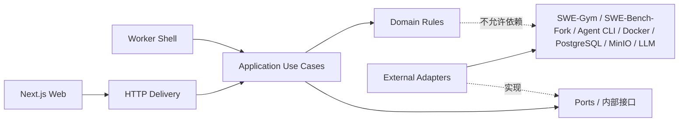

# 模块职责与输入输出契约

> 文档状态：候选 v0.1，讨论中，尚未实现  
> 最后更新：2026-09-01  
> 权威范围：本文件只维护项目内部模块的职责、输入、输出、错误、不变量和依赖。全局组成见 [`ARCHITECTURE.md`](./ARCHITECTURE.md)，字段级边界见 [`RUNNER_PROTOCOL.md`](../interfaces/RUNNER_PROTOCOL.md)、[`HTTP_API.md`](../interfaces/HTTP_API.md) 和 [`DATA_MODEL.md`](./DATA_MODEL.md)。

## 1. 先用小白能懂的话解释

一个“模块”可以理解成一个只开一个窗口的部门。调用者只需要知道：

1. 应该交给窗口什么材料（输入）；
2. 窗口会交回什么结果（输出）；
3. 哪些情况算业务上没成功，哪些情况是系统坏了（错误）；
4. 窗口永远不能破坏什么规则（不变量）。

例如 Agent Runner 只负责“让 Agent 工作并拿回补丁”，不负责判断补丁对不对；Patch Evaluator 只负责“用测试判补丁”，不负责评价 Agent 是否积极。这样职责不会互相污染。

## 2. 状态和命名规则

- **已确认**：用户已经决定的项目规则。
- **已核验**：从上游源码或官方文档查到的事实。
- **候选 v0.1**：本项目拟采用、等待继续讨论的内部契约。
- **待确认/待实测**：需要业务决定或真实运行证据。
- 本文中的类型名是为了讨论边界的概念名，不等于已经存在的 Python 类。
- 领域词义以 [`CONTEXT.md`](../../CONTEXT.md) 为唯一事实源，本文不重新定义同义词。

## 3. 模块依赖方向

硬规则：

- `domain` 不依赖 FastAPI、PostgreSQL、Docker、MinIO、SWE-Gym 或任何 Agent CLI。
- `application` 只依赖领域对象和小型 ports，不直接拼 CLI 命令或 SQL。
- `adapters` 可以依赖外部工具，但外部类型不能向内泄漏到所有模块。
- Web 不直接操作 Docker、数据库或 MinIO；Worker 不绕过状态机直接改运行状态。
- 模块之间不得循环依赖。

## 4. 公共输入输出对象

下表是模块之间传递的最小概念对象。字段的存储映射见 [`DATA_MODEL.md`](./DATA_MODEL.md)。

| 对象 | 必需内容 | 明确不包含 | 主要生产者 → 消费者 |
|---|---|---|---|
| `EvaluationTask` | `instance_id`、数据集身份/版本、`repo`、`base_commit`、`problem_statement`、验证引用 | 不向 Agent 暴露 gold `patch`、`test_patch`、隐藏测试答案 | Task Catalog → Orchestrator、Runner、Evaluator |
| `AgentConfiguration` | 登记 ID、Agent 类型/版本、模型、关键配置、Adapter 类型、配置指纹 | 明文 API key、临时登录 token | Agent Registry → Run Submission、Runner |
| `EvaluationPolicy` | `evaluation_track`（`closed_book`/`open_book_experimental`）、已登记网络策略、已登记工具配置及其版本 | 按模型国别猜测的能力、用户任意代理/网址配置 | Run Submission → Orchestrator、Sandbox、Runner、Reporting |
| `RunLimits` | 墙钟超时、CPU、内存、PID、输出大小、Agent 特有限制 | 用户可随意提交的宿主机权限 | Run Submission → Orchestrator、Sandbox、Runner |
| `RunRequest` | `run_id`、任务、Agent 配置、评测策略、限制、协议版本 | 判分答案和 gold patch | Orchestrator → Agent Runner |
| `AgentRunResult` | 终止原因、退出状态、补丁引用、轨迹引用、原始输出引用、资源汇总 | “补丁是否修好”的结论 | Agent Runner → Orchestrator |
| `EvaluationRequest` | `run_id`、`instance_id`、`model_patch`、可追溯的 Agent 身份 | Agent 的自然语言自评 | Orchestrator → Patch Evaluator |
| `DeterministicResult` | `resolved`、补丁应用情况、测试分类、Harness 报告/日志引用、基础设施错误 | LLM 主观评分 | Patch Evaluator → Orchestrator、Reporting、Judge |
| `TraceEvent` | 时间、序号、事件类型、来源、公开载荷、原始事件引用 | 思维链、秘密、未脱敏环境变量 | Adapter/Recorder → Artifact Store、Reporting |
| `JudgeRequest` | 已裁剪的任务、补丁、确定性结果、允许的轨迹摘要、Prompt 版本 | 凭据、隐藏答案、无关宿主信息 | Orchestrator → Failure Judge |
| `JudgeAnalysis` | 分类、解释、证据引用、模型/Prompt 版本、原始响应引用 | 对 `resolved` 的覆盖权 | Failure Judge → Review、Reporting |
| `HumanReviewRecord` | 运行、复核结论、对 Judge 的确认/修正、备注、复核者、时间 | 对原始制品的覆写 | Review → Run Repository |
| `ArtifactRef` | 对象键、类型、大小、SHA-256、内容类型、创建时间 | 制品正文 | Artifact Store → 其他所有模块 |

## 5. 模块总表

| 模块 | 大致做什么 | 主要输入 | 主要输出 | 不负责 |
|---|---|---|---|---|
| HTTP Delivery | 把浏览器请求翻译为应用用例 | HTTP 请求 | HTTP 响应/错误 | 运行 Agent、写 SQL |
| Task Catalog | 从固定 SWE-Gym 数据取得任务 | 数据集版本 + `instance_id` | `EvaluationTask` | 运行或判题 |
| Agent Registry | 只提供已审核 Agent 配置 | 配置 ID/筛选条件 | `AgentConfiguration` | 下载任意仓库 |
| Run Submission | 校验并创建排队运行 | 任务 ID + Agent 配置 ID + 允许限制 | `run_id` + 初始状态 | 执行评测 |
| Run Repository | 保存、领取、推进和查询运行 | 运行/状态命令 | 持久化结果/查询视图 | 保存大制品正文 |
| Run Orchestrator | 编排一次完整评测 | 已领取的运行 | 完整运行结果 | 实现具体 CLI/存储 |
| Agent Runner | 调用正确 Adapter 生成补丁 | `RunRequest` | `AgentRunResult` | 判断补丁正确性 |
| Sandbox Controller | 创建和清理受限环境 | 沙箱规格 + 执行请求 | 进程结果 + 资源数据 | 理解 Agent 语义 |
| Patch Evaluator | 调用 SWE-Bench-Fork 判卷 | `EvaluationRequest` | `DeterministicResult` | LLM 评分 |
| Trajectory Recorder | 规范化并保存可公开过程证据 | 原始 CLI/进程事件 | JSONL 轨迹引用 + 汇总 | 保存思维链或秘密 |
| Artifact Store | 保存不可变文件证据 | 字节流 + 元数据 | `ArtifactRef` | 决定运行状态 |
| Failure Judge | 对失败证据分类解释 | `JudgeRequest` | `JudgeAnalysis` | 修改确定性事实 |
| Human Review | 领取抽检并保存人工结论 | 待复核运行 + 人工输入 | `HumanReviewRecord` | 重跑 Agent |
| Reporting | 组合只读报告和排行榜 | 查询条件 | 报告/排行视图 | 改写原始结果 |
| Worker Shell | 原子领取运行并调用 Orchestrator | Worker 身份 + 轮询配置 | 心跳/执行结果 | 包含业务判定规则 |

## 6. 逐模块契约

### 6.1 HTTP Delivery

| 项目 | 候选 v0.1 契约 |
|---|---|
| 调用方 | Next.js Web；首版不允许 Web 直接访问存储 |
| 输入 | 经过版本化的 HTTP 请求、路径参数和查询参数 |
| 输出 | 稳定的 JSON 成功响应，或统一 `ApiError` |
| 错误 | 请求格式错误、资源不存在、状态冲突、服务暂不可用 |
| 不变量 | 只调用 application 用例；不执行 Agent、不拼 SQL、不返回 MinIO 密钥 |
| 依赖 | Run Submission、Review、Reporting 等应用入口 |
| 验证 | OpenAPI schema 检查；请求/响应契约测试；错误码测试 |

详细端点只在 [`HTTP_API.md`](../interfaces/HTTP_API.md) 维护。

### 6.2 Task Catalog

| 项目 | 候选 v0.1 契约 |
|---|---|
| 调用方 | Run Submission、Run Orchestrator、Reporting |
| 输入 | `dataset_id`、`dataset_revision`、`split`、`instance_id` |
| 输出 | 规范化 `EvaluationTask`，以及仅供 Evaluator 使用的验证引用 |
| 错误 | 数据集不存在、任务不存在、字段缺失、固定版本校验不一致 |
| 不变量 | 同一数据集版本和任务 ID 必须返回相同任务；Agent 可见视图不得包含 gold patch/测试答案 |
| 依赖 | SWE-Gym 数据；SWE-Bench-Fork 的任务字段约定 |
| 验证 | 用固定样例检查字段映射；测试秘密字段不会进入 Runner 输入 |

### 6.3 Agent Registry

| 项目 | 候选 v0.1 契约 |
|---|---|
| 调用方 | Run Submission、Agent Runner、Reporting |
| 输入 | 登记配置 ID，或只读筛选条件 |
| 输出 | 固定版本的 `AgentConfiguration`；可展示列表 |
| 错误 | 未登记、已禁用、版本/镜像不存在、配置指纹不匹配 |
| 不变量 | 只返回项目组审核的允许列表；Agent + 模型 + 关键配置共同构成排行榜身份 |
| 依赖 | PostgreSQL 配置记录；项目内 Adapter Factory |
| 验证 | 未登记命令不能运行；相同配置生成相同指纹；秘密不进入查询结果 |

### 6.4 Run Submission

| 项目 | 候选 v0.1 契约 |
|---|---|
| 调用方 | HTTP Delivery |
| 输入 | `task_id`、`agent_configuration_id`、`evaluation_track`，以及受白名单约束的 `RunLimits` |
| 输出 | 新 `run_id`、`QUEUED` 状态、创建时间 |
| 错误 | 任务/Agent 不存在、配置禁用、限制越界、重复幂等键冲突 |
| 不变量 | 创建时冻结任务版本、Agent 配置指纹、协议版本、限制、网络策略和工具配置；闭卷/开卷不可在运行中切换；不接收任意 shell 命令 |
| 依赖 | Task Catalog、Agent Registry、Run Repository |
| 验证 | 合法请求入队；越权限制被拒绝；重复幂等请求不产生两个运行 |

### 6.5 Run Repository

| 项目 | 候选 v0.1 契约 |
|---|---|
| 调用方 | Run Submission、Worker Shell、Orchestrator、Review、Reporting |
| 输入 | 创建、原子领取、合法状态迁移、附加结果、查询命令 |
| 输出 | 当前运行、领取结果、版本号或只读查询视图 |
| 错误 | 状态冲突、并发版本冲突、记录不存在、数据库暂不可用 |
| 不变量 | 状态迁移只按 `DATA_MODEL.md`；一个排队运行同一时刻只被一个 Worker 领取；大制品只存引用 |
| 依赖 | PostgreSQL Adapter |
| 验证 | 并发领取测试；非法回退状态测试；事务回滚测试 |

### 6.6 Run Orchestrator

| 项目 | 候选 v0.1 契约 |
|---|---|
| 调用方 | Worker Shell |
| 输入 | 已领取且处于 `PREPARING` 的运行快照 |
| 输出 | 完整的运行汇总，或明确的基础设施失败记录 |
| 错误 | 任务准备、Agent、补丁提取、Evaluator、存储或 Judge 阶段错误；错误必须带阶段和证据引用 |
| 不变量 | 顺序固定为准备 → Agent → 保存证据 → 干净验证 → 分析/复核路由 → 完成；失败补丁等于 `resolved=false`，不等于平台 `FAILED` |
| 依赖 | Task Catalog、Agent Runner、Patch Evaluator、Artifact Store、Failure Judge、Run Repository |
| 验证 | 用 Fake ports 覆盖每个分支；任一步骤失败都不会伪装成完成；重试不覆盖旧制品 |

这是一个“深模块”：对外只有“执行一个运行”，内部隐藏很多步骤和错误恢复，不让调用方参与编排细节。

### 6.7 Agent Runner

| 项目 | 候选 v0.1 契约 |
|---|---|
| 调用方 | Run Orchestrator |
| 输入 | `RunRequest`；Adapter 由已登记配置决定，并接收冻结的 `EvaluationPolicy` |
| 输出 | `AgentRunResult`，其中补丁、轨迹和原始输出均通过 `ArtifactRef` 关联 |
| 错误 | 输入无效、Adapter 不可用、认证缺失、启动失败、超时、非零退出、补丁提取失败、沙箱违规 |
| 不变量 | 不能自己宣判 `resolved`；不能把自然语言回答当补丁；不能运行未登记命令；只向 Agent 暴露本赛道登记的工具 |
| 依赖 | Agent Registry、具体 Agent Adapter、Sandbox Controller、Trajectory Recorder、Artifact Store |
| 验证 | 所有 Adapter 共用同一契约测试；空补丁与进程失败分开；真实 CLI 分层冒烟测试 |

进程边界见 [`RUNNER_PROTOCOL.md`](../interfaces/RUNNER_PROTOCOL.md)，真实 CLI 映射见 [`FRAMEWORK_INTERFACES.md`](../interfaces/FRAMEWORK_INTERFACES.md)。

### 6.8 Sandbox Controller

| 项目 | 候选 v0.1 契约 |
|---|---|
| 调用方 | Agent Runner、Patch Evaluator Adapter |
| 输入 | 固定镜像/工作区、只读/可写挂载、命令标识、秘密引用、CPU/内存/PID/时间限制和已登记网络策略 |
| 输出 | 退出码、终止原因、stdout/stderr 引用、资源统计和清理结果 |
| 错误 | 镜像缺失、容器创建失败、超时、OOM、网络策略失败、清理失败 |
| 不变量 | Agent 生成环境和确定性验证环境分离；秘密不写入镜像/日志；闭卷只放行模型所需端点，开卷按实验策略放行并留证；验证环境从干净任务状态开始 |
| 依赖 | Docker |
| 验证 | 超时/OOM/PID/网络/挂载边界测试；强制终止后无残留容器；秘密脱敏检查 |

### 6.9 Patch Evaluator

| 项目 | 候选 v0.1 契约 |
|---|---|
| 调用方 | Run Orchestrator |
| 输入 | `EvaluationRequest` |
| 输出 | `DeterministicResult` 和 Harness 制品引用 |
| 错误 | prediction 格式错误、镜像构建失败、补丁无法应用、测试超时、Harness 异常 |
| 不变量 | 直接调用固定版本 SWE-Bench-Fork；Agent 生成环境的残留不得进入验证；Judge 不能改写输出 |
| 依赖 | SWE-Bench-Fork、SWE-Gym 数据/环境、Sandbox Controller、Artifact Store |
| 验证 | gold patch、空 patch、错误 patch、不可应用 patch、测试超时五类样例 |

注意：补丁“可应用但测试未通过”是一次正常完成的确定性评测；Harness 无法完成才是基础设施错误。

### 6.10 Trajectory Recorder

| 项目 | 候选 v0.1 契约 |
|---|---|
| 调用方 | 各 Agent Adapter |
| 输入 | Codex/Claude/Aider/自研 Agent 的原始事件，外加统一时间和来源信息 |
| 输出 | 按序 JSONL 轨迹 `ArtifactRef`，以及工具调用数、耗时、token 等可用汇总 |
| 错误 | 事件无法解析、序号断裂、大小超限、写入失败 |
| 不变量 | 保存可观察事件，不要求或保存私密思维链；保留 `raw_type` 以便审计；任何秘密先脱敏 |
| 依赖 | Artifact Store；各 CLI 的官方事件格式 |
| 验证 | 预制事件样本契约测试；坏行容错；脱敏、顺序和汇总一致性检查 |

### 6.11 Artifact Store

| 项目 | 候选 v0.1 契约 |
|---|---|
| 调用方 | Runner、Recorder、Evaluator、Judge、Reporting |
| 输入 | `run_id`、制品类型、文件名、内容流、内容类型 |
| 输出 | 带 SHA-256、大小和对象键的 `ArtifactRef` |
| 错误 | 写入/读取失败、校验和不一致、对象不存在、类型不允许 |
| 不变量 | 制品写入后不可覆盖；重跑创建新 `run_id`；对象键不包含秘密或用户路径 |
| 依赖 | MinIO；PostgreSQL 中的 `artifact_records` 索引 |
| 验证 | 同内容校验、覆盖拒绝、断流、缺失对象和大文件流式测试 |

### 6.12 Failure Judge

| 项目 | 候选 v0.1 契约 |
|---|---|
| 调用方 | Run Orchestrator；只在确定性结果产生后运行 |
| 输入 | `JudgeRequest` |
| 输出 | `JudgeAnalysis` 和原始响应 `ArtifactRef` |
| 错误 | 模型不可用、超时、schema 不合格、证据不足、内容被拒绝 |
| 不变量 | 输出是分析而非测试事实；必须保存模型、Prompt 版本和输入证据引用；不能接收秘密 |
| 依赖 | LLM Provider Adapter、Artifact Store |
| 验证 | 固定证据集上的 schema/分类测试；模型失败不丢失确定性结果；Prompt 版本可追溯 |

### 6.13 Human Review

| 项目 | 候选 v0.1 契约 |
|---|---|
| 调用方 | HTTP Delivery、抽检规则 |
| 输入 | 待复核运行、复核者提交的分类/结论/备注、幂等键 |
| 输出 | `HumanReviewRecord` 和更新后的复核状态 |
| 错误 | 非待复核状态、重复提交冲突、运行不存在、必需证据缺失 |
| 不变量 | 人工记录只能追加或版本化修订，不覆盖确定性结果、Judge 原始响应或旧复核证据 |
| 依赖 | Run Repository、Reporting |
| 验证 | 领取冲突、重复提交、修正 Judge 而不改测试事实、审计字段完整性测试 |

### 6.14 Reporting

| 项目 | 候选 v0.1 契约 |
|---|---|
| 调用方 | HTTP Delivery |
| 输入 | 运行 ID，或排行榜的数据集/Agent 配置/评测赛道/时间筛选 |
| 输出 | 运行详情、证据索引、轨迹分页、排行榜聚合和抽检视图 |
| 错误 | 资源不存在、筛选无效、制品暂不可用 |
| 不变量 | 只读；确定性、过程指标、Judge、人工复核分层展示；不同 Agent 配置不混分；闭卷主榜与开卷实验榜不混分 |
| 依赖 | Run Repository、Artifact Store |
| 验证 | 聚合样例测试；同 Agent 不同模型分行；缺失 Judge 时仍能展示确定性结果 |

### 6.15 Worker Shell

| 项目 | 候选 v0.1 契约 |
|---|---|
| 调用方 | 单机进程管理器/容器启动命令 |
| 输入 | `worker_id`、轮询间隔、允许并发数、优雅停止信号 |
| 输出 | 心跳、领取记录、一次 Orchestrator 调用结果 |
| 错误 | 数据库不可用、失去租约、进程停止 |
| 不变量 | 只负责循环和进程生命周期；业务流程只调用 Orchestrator；首版默认重型运行并发为 1 |
| 依赖 | Run Repository、Run Orchestrator |
| 验证 | 双 Worker 不重复领取；停止时不误报完成；超期租约可由明确恢复流程处理 |

## 7. 必须跨模块保持的规则

1. `run_id` 是所有数据库记录和 MinIO 制品的追溯主线。
2. 每次运行冻结数据集版本、框架提交、Agent 配置指纹、Runner 协议版本和限制。
3. Agent 只看到 Issue 与仓库快照，不看到 gold patch、`test_patch` 或隐藏判分答案。
4. Agent 原始 stdout 不是最终补丁；Adapter 结束后从受控 Git 工作区提取 diff，再交给统一 Runner 输出。
5. 确定性结果、Judge 分析和人工复核是三类不同事实，任何一层不得覆写上一层原始证据。
6. 工具调用次数是过程指标；是否计分仍待确认，当前不能用“调用越多越积极”作为既定规则。
7. 未登记 Agent、未固定版本或携带任意 shell 命令的请求不得进入执行链路。
8. 每次运行冻结 `evaluation_track`、网络策略和工具配置；闭卷与开卷使用相同确定性判卷，但成绩严格分榜。
9. 模型来源国家不能推导网络能力；只以该次运行实际登记并验证的工具和网络策略为准。

## 8. 尚待继续讨论

1. Judge 是否进入总分，还是只做失败归因。
2. 工具调用、token、耗时等过程指标只展示，还是形成单独效率分。
3. 开卷实验榜使用统一的平台 Web 工具，还是各 Agent 原生搜索工具；以及相应的公平性标注。
4. Worker 是宿主机进程还是挂载 Docker Socket 的容器；必须先做本机最小实验。
5. 本地自研 Agent 固定为源码快照、Git commit 还是预构建镜像。
6. HTTP 接口是否需要登录与角色权限；题目当前没有给出明确身份规则。

## 9. 变更记录

- 2026-09-01：创建候选 v0.1；明确公共对象、15 个模块的职责/输入/输出/错误/不变量/依赖/验证，以及跨模块保密和证据规则。
- 2026-09-02：同步闭卷主榜/开卷实验榜决定；新增评测策略对象，并要求 Run、Runner、Sandbox 和 Reporting 冻结赛道、网络及工具配置。
