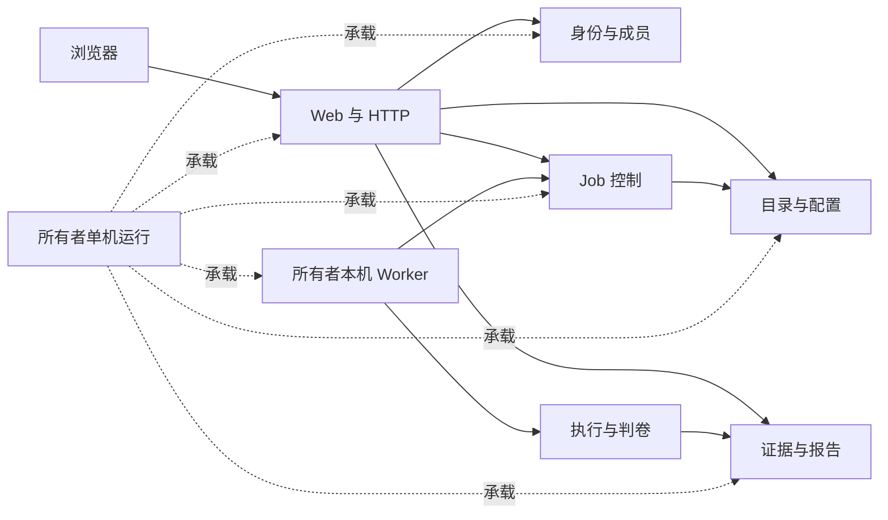

# 当前模块架构索引

> 文档状态：已建立现实代码地图；M1 任务 01–13 的当前实现可定位，M1/MVP 仍未完成。
> 最后核对：2026-09-22（同步核心诊断修复、受控身份与 provider 策略切片的现实状态）。
> 权威范围：本目录维护“每个 Module 当前由哪些 Interface、Implementation 和 Adapter 组成、怎样协作、还缺什么”。

这里的 **Module** 是“用一个相对小的 Interface 隐藏一组实现细节”的职责集合，不等同于一个文件夹、进程或微服务。精确术语见 [`CONTEXT.md`](../../../CONTEXT.md)。

五人课设的 Module DRI、上下游交接、工时基线以及 M1-14/扩展 01–08 的人员分配，统一见[团队分工文档](TEAM_WORK_ALLOCATION.md)。模块文档维护代码职责，分工文档维护人员职责，两者不复制字段或路由事实。

## 1. 文档分工

| 事实 | 唯一维护位置 |
|---|---|
| 系统级拓扑、已确认架构决定、总体风险 | [总架构](../ARCHITECTURE.md) |
| 字段、状态、错误和调用约束 | [模块契约](../MODULE_CONTRACTS.md) |
| 表、索引、状态机和对象键 | [数据模型](../DATA_MODEL.md) |
| HTTP 路径和请求/响应 | [HTTP Interface](../../interfaces/HTTP_API.md) |
| Harbor、固定 Fork、Codex 认证细节 | [Harbor Interface](../../interfaces/HARBOR_EXECUTION.md)、[框架 Interface](../../interfaces/FRAMEWORK_INTERFACES.md)、[认证 Interface](../../interfaces/CODEX_AUTHENTICATION.md) |
| 远程接入和机器动态事实 | [远程接入](../../operations/REMOTE_TEAM_ACCESS.md)、[本机环境](../../operations/LOCAL_DOCKER_ENVIRONMENT.md) |
| 每个职责当前落在哪些代码、依赖谁、实现到哪 | 本目录 |

模块文档只概括相邻事实并链接其权威来源，不复制维护字段表、路由表或外部版本。若模块文档和源码冲突，先查行动记录与现实代码，再在同一任务修正文档。

## 2. 七个当前模块

| Module | 当前主要 Interface | 当前状态 |
|---|---|---|
| [身份与成员](identity-and-membership/ARCHITECTURE.md) | 登录会话、邀请兑换、成员管理；应用内只有 `owner` / `collaborator` | 已实现；长期 PostgreSQL 已部署 |
| [目录与配置](catalog-and-configuration/ARCHITECTURE.md) | 可信预设登记、任务/配置查询、不可变来源校验 | 已实现六道固定题目和一个生产 Codex 配置；测试假身份只在显式 `internal_test` 装配中可用，真实新提供方未实现 |
| [Job 控制](job-control/ARCHITECTURE.md) | 提交、批准、领取、状态推进、取消、恢复 | 已实现；continuous 1–20 已落地，单重型 Job、零自动重试约束保留 |
| [执行与判卷](execution-and-evaluation/ARCHITECTURE.md) | `ExecutionBackend`、`PatchEvaluator`、Worker claim | 固定 Codex → Harbor → Fork 已跑通；T2 最小 Harbor 形态含活体网络替身已实测，S9 Worker 选择已接入并对未就绪代理失败关闭；S10/S11 与双 Harbor Trial 未验证 |
| [证据与报告](evidence-and-reporting/ARCHITECTURE.md) | `ArtifactStore`、报告、轨迹、保留、跨批次比较和排行榜 | 长期 PostgreSQL/AIStor 已部署；比较后端与 Web 页面均已实现 |
| [Web 与 HTTP](web-and-http/ARCHITECTURE.md) | Next.js 页面、同源 `/api/v1`、FastAPI 路由 | 32 个端点已注册；比较页、六题向导、安全头/安全 500 已落地，provider 端到端呈现与远程双机验收未完成 |
| [所有者单机运行](owner-host-runtime/ARCHITECTURE.md) | 进程拓扑、信任区、持久化、手动生命周期、私有远程入口 | P1–P4 已部署验收；备份恢复已明确移出课设范围 |

`Judge` 与 `Human Review` 已移出 M1，因此不伪装成当前第八个模块；未来恢复时仍从[模块契约](../MODULE_CONTRACTS.md)的既有候选契约进入。

## 3. 依赖总览

代码依赖保持：`Web/CLI → delivery → application → domain/ports ← Adapter`。FastAPI、Worker 和维护 CLI 是 delivery 入口；它们不是新的业务微服务。PostgreSQL Repository、MinIO Artifact Store、Harbor Execution Backend 与 SWE-Bench Patch Evaluator 是各 seam 上的 Adapter。

## 4. 状态判读规则

- **当前已实现**：现实代码存在，并有对应历史验证；本轮没有重跑。
- **临时环境已验证**：隔离 PostgreSQL/MinIO 或一次性运行证据通过，不等于长期服务已部署。
- **候选**：可以继续讨论，但没有获得实施授权或没有完成技术门禁。
- **未实现**：文档有位置，现实代码没有对应完整能力。

不要由某一模块已实现推导整个 MVP 完成；当前交接状态以 [`HANDOFF.md`](../../../HANDOFF.md) 为准。
