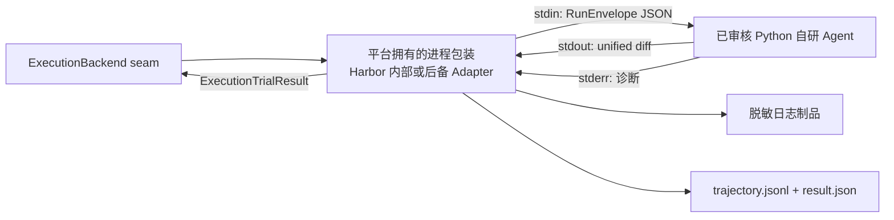
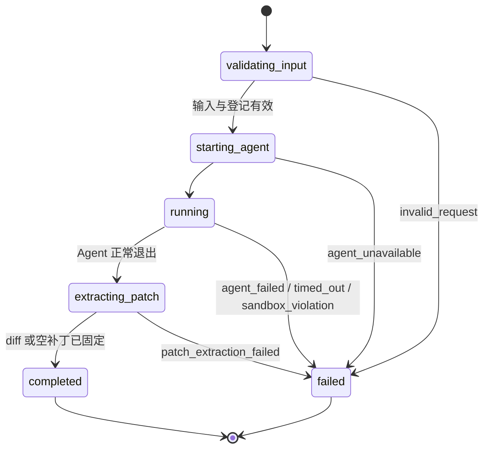

# 自研 Agent / 后备进程 Runner 协议

> 文档状态：P2 自研 Agent 使用本 Interface 已确认；字段契约 v0.1 尚未实现，且不是 Harbor 原生接口或 MVP 前置项
>
> 最后更新：2026-09-05
> 权威范围：本文件只维护自研 Agent 或 Harbor 验收失败时 `ProcessExecutionAdapter` 使用的跨进程协议。正式主路径见 [`HARBOR_EXECUTION.md`](./HARBOR_EXECUTION.md)；真实上游接口见 [`FRAMEWORK_INTERFACES.md`](./FRAMEWORK_INTERFACES.md)。

## 1. 一句话解释

P2 自研 Agent 只支持 Python，并统一使用一种简单进程 Interface：**stdin 输入一份 JSON 任务，stdout 只接收 Git 补丁**。平台负责把已审核 Python 模块包装进 Harbor；提交者不编写 Harbor 配置或 shell 命令。MVP 只做 Codex；之后的 Aider/Claude Code 继续使用 Harbor 内置 Agent，不经过本文 Interface。

## 2. 协议边界



适用方式：

- 对 P2 自研 Agent：必须实现本文 Interface；平台拥有的包装负责与 Harbor 衔接，自研仓库不直接实现 Harbor `BaseAgent`。
- 对 Codex/Aider/Claude Code：正式主路径复用 Harbor 已有 Agent，不经过本文 stdin/stdout wrapper。
- 对后备实现：若 Harbor 原型未通过门槛，`ProcessExecutionAdapter` 复用同一 Interface，对外仍实现统一 `ExecutionBackend` interface。

## 3. 进程启动约定

| 项目 | 候选 v0.1 |
|---|---|
| 启动形式 | 平台固定为 `python -m <审核后的模块路径>`；模块路径只能来自已批准 manifest，不能附带参数或 shell 字符 |
| Python/依赖 | P2 首版只支持 Python；精确版本和依赖锁格式留待 P2 Harbor 原型固定 |
| 当前工作目录 | 已准备好的任务仓库根目录 |
| stdin | 一个 UTF-8 JSON 对象，读到 EOF；最大尺寸由平台限制 |
| stdout | 只允许 UTF-8 Git unified diff；不得包含 Markdown 围栏、解释或进度日志 |
| stderr | 人类可读诊断；平台完整捕获、脱敏并保存 |
| 环境变量 | `EVAL_JOB_ID`、`EVAL_RUN_ID`、`EVAL_ARTIFACT_DIR`、`EVAL_PROTOCOL_VERSION`；由 wrapper 注入，Agent 不得覆盖 |
| 模型访问 | 自研 Agent 只能使用已登记 DeepSeek/Kimi 配置；可取得受限且可撤销的单次运行访问能力，但不能取得真实提供方 Key |
| secret | DeepSeek/Kimi Key 只由评测机可信实现读取，不进入被测进程的 stdin、环境、命令行、文件、轨迹或制品；具体受控访问部署仍待实测 |
| 超时 | `ProcessExecutionAdapter` 所属 Execution Backend 强制执行；Agent 自报超时不能替代外层限制 |

`stdout` 为空并不自动表示平台错误：它可能表示 Agent 正常结束但没有修改代码。Evaluator 应把空补丁记录为未解决，而不是把它伪装成 Runner 崩溃。

## 4. stdin：`RunEnvelope`

示例只表达字段语义，不代表已经有对应代码：

```json
{
  "protocol_version": "0.1",
  "job_id": "job_01J...",
  "run_id": "01J...",
  "task": {
    "instance_id": "django__django-12345",
    "dataset_id": "SWE-Gym/SWE-Gym",
    "dataset_revision": "fixed-revision",
    "split": "train",
    "repo": "django/django",
    "base_commit": "0123456789abcdef",
    "problem_statement": "Issue 原文"
  },
  "agent": {
    "configuration_id": "team-agent-a-deepseek-fixed",
    "adapter_type": "custom_process",
    "agent_version": "fixed-version",
    "model_provider": "deepseek",
    "model": "fixed-deepseek-model",
    "public_options": {
      "reasoning_effort": "fixed-value"
    }
  },
  "evaluation_policy": {
    "evaluation_track": "closed_book",
    "network_policy_id": "provider-only-v1",
    "tool_profile_id": "no-web-tools-v1"
  },
  "limits": {
    "wall_time_seconds": 1800,
    "cpu_cores": 2,
    "memory_mib": 4096,
    "pids": 256,
    "patch_warning_bytes": 262144,
    "max_patch_bytes": 1048576,
    "max_raw_artifact_bytes": 52428800,
    "max_raw_artifacts_total_bytes": 209715200
  }
}
```

### 4.1 必需字段

| 字段 | 类型 | 生产者 | 约束 |
|---|---|---|---|
| `protocol_version` | string | Job Orchestrator / Process Adapter | 首版固定为 `0.1`；不支持时应拒绝，不静默猜测 |
| `job_id` | string | Job Repository | 所属平台评测 Job；与运行映射一致 |
| `run_id` | string | Run Repository | 全链路追溯 ID；与环境变量一致 |
| `task.instance_id` | string | Task Catalog | 必须能在冻结的数据集版本中唯一定位任务 |
| `task.dataset_id` | string | Task Catalog | Hugging Face 数据集 ID 或项目登记的本地数据集 ID |
| `task.dataset_revision` | string | Task Catalog | 必须冻结到可复查的 revision/校验值，不能只写 `latest` |
| `task.split` | string | Task Catalog | 例如 SWE-Gym 的真实 split；由数据源核验 |
| `task.repo` | string | Task Catalog | 上游仓库身份，用于审计，不允许 Adapter 自行替换 |
| `task.base_commit` | string | Task Catalog | 当前工作区必须与它对应 |
| `task.problem_statement` | string | Task Catalog | Agent 实际收到的 Issue 文本 |
| `agent.configuration_id` | string | Agent Registry | 必须已登记且启用 |
| `agent.adapter_type` | enum | Agent Registry | `custom_process`、`codex`、`aider`、`claude_code` |
| `agent.agent_version` | string | Agent Registry | 固定 Agent/CLI 版本；无法取得时不得进入正式排行 |
| `agent.model_provider` | string | Agent Registry | 固定非秘密提供方身份；P2 自研 Agent 只允许 `deepseek` 或 `kimi` |
| `agent.model` | string | Agent Registry | 固定模型身份；本地 Agent 不使用模型时可采用明确的 `none` |
| `agent.public_options` | object | Agent Registry | 只允许该 Adapter 预先声明的键；不得接受 shell 命令或秘密 |
| `evaluation_policy.evaluation_track` | enum | Job Submission | MVP 只接受 `closed_book`；`open_book_experimental` 只保留字段接缝且运行中不可切换 |
| `evaluation_policy.network_policy_id` | string | Policy Registry | 已登记网络规则；不接受任意代理地址或防火墙命令 |
| `evaluation_policy.tool_profile_id` | string | Policy Registry | 已登记工具集合；Adapter 只能暴露对应工具 |
| `limits.*` | number/string | Job Submission | 来自平台限制模板，用户输入只能在允许范围内选择 |

### 4.2 绝对禁止进入 Agent 输入的内容

- 数据集 gold `patch`；
- `test_patch`；
- `FAIL_TO_PASS`、`PASS_TO_PASS` 的隐藏判分答案或测试清单；
- 其他 Agent 的补丁、Judge 结论或人工复核答案；
- 数据库连接串、MinIO 密钥、模型 API key、宿主机环境变量快照；
- Runner 在宿主机上的任意可执行命令或 Docker Socket。

这些内容可以由 Patch Evaluator 在独立验证阶段使用，但不能泄漏给被测 Agent。

### 4.3 评测赛道与两层联网控制

| 赛道 | 工具层 | 网络层 | 排行 |
|---|---|---|---|
| `closed_book` | 禁用 Web 搜索、抓取、浏览器及未登记联网工具 | 只放行模型调用所需端点；其余一般外网拒绝 | 核心主排行榜 |
| `open_book_experimental` | MVP 禁用；未来只开放平台统一 Web 工具并记录实际工具/版本 | 未来按实验网络策略放行并保存访问证据 | 未来独立实验榜 |

工具层和网络层缺一不可：关闭 WebSearch 不代表 Agent 不能用 shell 执行 `curl`；容器能访问模型供应商，也不代表必须允许它访问 GitHub。宿主机代理是否能用不能靠猜，必须在 Docker/WSL 环境实际验证。

MVP 只运行闭卷。未来开卷使用与闭卷相同的 patch 提取和 SWE-Bench-Fork 确定性判卷，只允许平台统一 Web 工具，不允许各 Agent 自带不同原生搜索能力；两条赛道必须冻结 `network_policy_id` 和 `tool_profile_id` 并严格分榜。“国产/国外”不是接口能力字段。

## 5. stdout：补丁输出

### 5.1 格式

- UTF-8 文本；
- Git unified diff；
- 允许多文件和删除文件；拒绝二进制 patch；
- 抽取后的文本 diff 超过 256 KiB 时记录警告，超过 1 MiB 时以 `PATCH_TOO_LARGE` 判为无效输出；patch 绝不截断；
- 不允许 Markdown 的 ```` ```diff ```` 围栏；
- 不允许前后解释文字；
- 允许 0 字节，表示“正常结束但没有补丁”。

示例：

```diff
diff --git a/example.py b/example.py
index 1111111..2222222 100644
--- a/example.py
+++ b/example.py
@@ -1 +1 @@
-old_value = 1
+new_value = 2
```

### 5.2 为什么不直接信任 Agent 最后一段回答

第三方 Agent 的最终文字可能包含解释、代码块，甚至没有完整列出它已经写入工作区的文件。因此专用 Adapter 的统一提取流程应是：

1. 运行前确认仓库对应固定 `base_commit`，并记录初始工作区状态；
2. Agent 退出后读取 `git status --porcelain`；
3. 对允许范围内的未跟踪文件执行 intent-to-add，使新文件进入 diff，但不提交；
4. 从固定基线提取可审计的文本 unified diff；检测到二进制变更时以 `BINARY_PATCH_NOT_ALLOWED` 拒绝；
5. 拒绝 `.git`、秘密路径、超大文件和越界路径；
6. 把原始 diff 保存为 patch 制品，并把完全相同的字节写到 Runner stdout；
7. 最终正确性仍由干净 SWE-Bench-Fork 验证环境判断。

精确 Git 命令和跨平台路径行为必须在实现行动文档中通过测试固定；这里不把未经测试的命令拼装写成“已实现”。

## 6. stderr：诊断输出

stderr 只用于诊断，不能作为补丁或得分输入。必须：

- 捕获并保存为原始日志制品；单个 stdout/stderr/轨迹原始制品最多 50 MiB，每运行原始制品合计最多 200 MiB；
- 在入库前脱敏 API key、Authorization header、连接串和临时 token；
- 日志超限时按固定策略截断，正文写可见标记，并记录 `truncated=true` 与原始总量；不得截断 patch；
- 保留上游 CLI 原始退出码和 Adapter 错误分类；
- 前端默认不直接展示可能含秘密的原始 stderr，只展示安全摘要。

## 7. 退出码和终止原因

以下是本项目 Adapter wrapper 的候选退出码，不是第三方 CLI 的原生退出码：

| Runner 退出码 | `result.json` 终止原因 | 含义 |
|---:|---|---|
| `0` | `completed` | Adapter 正常完成；stdout 可以是有效 diff 或空 |
| `2` | `invalid_request` | stdin、协议版本或登记配置无效 |
| `10` | `agent_unavailable` | CLI/镜像/模型/认证不可用，Agent 未正常开始 |
| `11` | `agent_failed` | 上游 Agent 非零退出或报告执行失败 |
| `12` | `timed_out` | 外层限制到期并终止进程树 |
| `13` | `patch_extraction_failed` | Agent 可能运行过，但无法安全生成统一 diff |
| `14` | `sandbox_violation` | 触发网络、挂载、路径或资源策略拒绝 |
| `20` | `adapter_internal_error` | Adapter 自身未预期错误 |

上游退出码必须另存为 `upstream_exit_code`，不能直接冒充统一 Runner 退出码。例如 Claude Code 的特定退出码、Aider 的退出码和 Codex 事件失败都先由各自 Adapter 解释，再映射到本表。

`PATCH_TOO_LARGE` 和 `BINARY_PATCH_NOT_ALLOWED` 使用退出码 `13` 的协议类别，并在 `result.json.error_code` 中保留精确原因；两者是无效 Agent 输出，不是基础设施故障，也不会进入 Harness。

## 8. 旁路制品目录

`EVAL_ARTIFACT_DIR` 指向本次运行专用、Runner 可写而其他运行不可见的目录。候选文件：

```text
<EVAL_ARTIFACT_DIR>/
├─ trajectory.jsonl
│  # 规范化可观察事件；不包含私密思维链
├─ upstream.stdout.log
│  # 第三方 CLI 原始 stdout；Codex/Claude 的 JSONL 在这里保真保存
├─ upstream.stderr.log
│  # 第三方 CLI 原始 stderr；入库前经过秘密扫描/脱敏
├─ result.json
│  # Adapter 终止原因、上游退出码、耗时、版本和制品摘要
└─ patch.diff
   # 与 Runner stdout 字节一致的最终补丁副本
```

自研 Agent 若直接实现协议，可以不生成 `upstream.*`；但 `trajectory.jsonl`、`result.json` 和 `patch.diff` 仍必须由 wrapper 补齐。

## 9. `result.json`

```json
{
  "protocol_version": "0.1",
  "job_id": "job_01J...",
  "run_id": "01J...",
  "evaluation_track": "closed_book",
  "network_policy_id": "provider-only-v1",
  "tool_profile_id": "no-web-tools-v1",
  "termination_reason": "completed",
  "error_code": null,
  "runner_exit_code": 0,
  "upstream_exit_code": 0,
  "started_at": "2026-09-01T10:00:00Z",
  "finished_at": "2026-09-01T10:03:20Z",
  "duration_ms": 200000,
  "patch_bytes": 1234,
  "patch_sha256": "hex-value",
  "trajectory_events": 42,
  "tool_calls": 8,
  "usage": {
    "input_tokens": 1000,
    "output_tokens": 200,
    "reported_by": "upstream"
  },
  "warnings": []
}
```

规则：

- 上游未提供的字段写 `null` 或省略，不能估算后伪装成官方数据；
- `tool_calls` 只统计可观察并成功解析的调用，不能推断隐藏内部动作；
- token 口径随供应商不同，必须带 `reported_by`，排行榜不能默认横向等价；
- `patch_sha256` 必须与 `patch.diff` 和 stdout 的实际字节一致。
- patch 只能完整保存或明确拒绝，不能把截断后的内容当作 Agent 输出；原始日志截断必须在制品元数据和正文中同时可见。

## 10. `trajectory.jsonl`

每行一个事件：

```json
{"sequence":1,"occurred_at":"2026-09-01T10:00:01Z","source":"codex","type":"lifecycle","raw_type":"thread.started","payload":{"session_id":"safe-id"},"redactions":[]}
```

候选公共字段：

| 字段 | 含义 |
|---|---|
| `sequence` | 从 1 开始的本运行严格递增序号 |
| `occurred_at` | 平台观察到事件的 UTC 时间；上游时间可另存 |
| `source` | `runner`、`codex`、`aider`、`claude_code`、`custom_process`、`sandbox` |
| `type` | `lifecycle`、`agent_message`、`tool_call`、`tool_result`、`command`、`file_change`、`usage`、`warning`、`error` |
| `raw_type` | 上游原事件类型；没有则为 `null` |
| `payload` | 允许公开的结构化载荷；字段随 `type` 变化 |
| `redactions` | 本事件移除过哪些敏感类别，不保存原秘密 |

明确不采集：模型隐藏思维链、系统密钥、完整环境变量、宿主机无关文件内容。平台只评估可观察行动和结果。

## 11. 一次调用的状态解释



Runner 的 `completed` 只表示“运行流程正常拿到了一个补丁结果”，不表示题目解决。只有 Patch Evaluator 能生成 `resolved=true/false`。

## 12. Process Adapter 验收清单

每个使用本文协议的自研 Agent wrapper 和 `ProcessExecutionAdapter` 都必须通过同一组契约测试：

1. 能读取合法 stdin，并拒绝未知协议版本和额外危险选项。
2. stdout 只有 diff；上游聊天和日志没有混入。
3. 修改、创建、删除文件均能出现在 patch 中；空修改得到 0 字节 patch。
4. 上游非零退出、外层超时、认证缺失、补丁提取失败映射正确。
5. 原始 stdout/stderr、规范化轨迹、结果摘要和 patch 可由同一 `run_id` 追溯。
6. 轨迹事件按序、可解析、脱敏；工具调用统计能由 JSONL 重算。
7. Agent 看不到 gold patch、隐藏测试和其他运行制品。
8. 运行结束后没有遗留 Agent 子进程；沙箱清理失败会显式记录。
9. patch 在干净工作区能够进入 SWE-Bench-Fork；是否通过测试另行判定。
10. MVP 闭卷配置不会暴露 Web 工具且一般外网不可达；`open_book_experimental` 被拒绝。未来开卷只经平台统一 Web 工具，结果不与闭卷混分。
11. 超过 256 KiB 的 patch 产生警告；超过 1 MiB 和二进制 patch 分别明确拒绝且永不截断。单原始制品 50 MiB、每运行原始制品总额 200 MiB 的边界和截断标记可验证。
12. P2 非 Python、自定义 shell、未登记提供方或自带 Base URL/代理声明在执行前被拒绝；DeepSeek/Kimi 真实 Key 不出现在被测进程环境、文件、日志、轨迹或制品中。

## 13. 兼容性和版本升级

- `protocol_version` 使用主版本/次版本语义；不兼容字段变化提升主版本。
- Adapter 必须记录自身版本、上游 CLI 版本和配置指纹。
- 新字段默认只能追加为可选字段；旧 Runner 不认识的危险行为字段必须拒绝。
- P2 自研 Agent/wrapper 升级先更新登记版本与 manifest，再跑契约测试，最后才能更新 Agent Configuration。

## 14. 待技术核验

1. stdin 最大字节数；patch 上限已固定为 256 KiB 警告、1 MiB 拒绝且不截断。
2. 各真实 Agent 的 token 与工具事件能否稳定映射；这些过程指标仅展示，不参与排序，缺失保持未知。
3. Windows 宿主 + Linux 容器下新文件纳入 diff 和路径安全检查的精确实现。
4. P2 自研 Agent 的宿主进程/可信侧车、单次运行能力签发撤销和 `provider-only-v1` 防绕过；不阻塞 MVP，且不得把 DeepSeek/Kimi Key 注入被测进程。
5. 50 MiB 单原始制品与 200 MiB 每运行总额在 stdout/stderr/轨迹组合下的优先级和边界测试；核心结果不得丢失。

## 15. 变更记录

- 2026-09-01：创建候选 v0.1；确定 JSON stdin、纯 patch stdout、诊断 stderr、旁路制品、统一错误映射、轨迹事件和防泄漏规则。
- 2026-09-02：加入闭卷/开卷评测赛道、网络策略和工具配置；明确工具层与网络层双重治理和严格分榜。
- 2026-09-03：正式主路径改为 Harbor Execution Backend；本文收窄为自研 Agent/后备 Process Adapter 协议，并加入 `job_id` 追溯。
- 2026-09-05：确认首版自研 Agent 只支持 Python 并统一使用本文进程 Interface；平台包装进 Harbor，不接收任意 shell；自研配置只允许 DeepSeek/Kimi，真实提供方 Key 不进入被测进程。
- 2026-09-05：把自研 Agent 明确降为 P2；MVP 只运行闭卷 Codex，未来开卷只用平台统一 Web 工具；固定 patch/日志/每运行制品大小边界和明确拒绝/截断语义。
