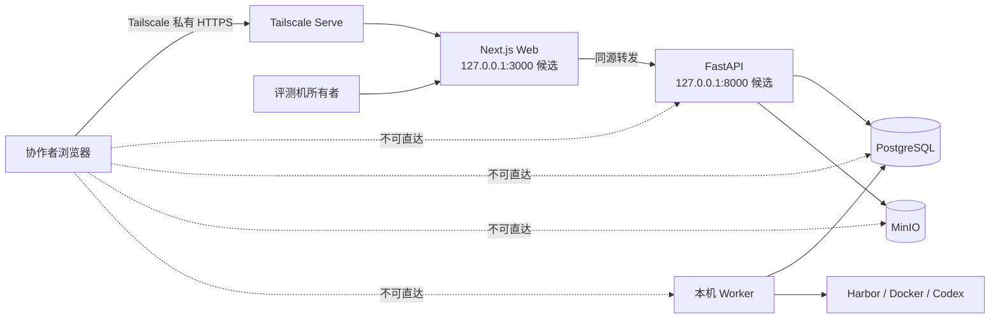

# 远端协作者接入评测机

> 文档状态：两类角色、所有者在线批准与私有网络原则已确认；Tailscale 为实施方案，尚未安装和双机实测
>
> 最后更新：2026-09-05
>
> 权威范围：本文件只维护远端协作者怎样到达单机平台、校园网/VPN共存、最小网络暴露面、配置和诊断步骤。Job 权限与状态见 [`HTTP_API.md`](../interfaces/HTTP_API.md) 和 [`DATA_MODEL.md`](../architecture/DATA_MODEL.md)；Codex 与自研 Agent 的模型凭据边界见 [`CODEX_AUTHENTICATION.md`](../interfaces/CODEX_AUTHENTICATION.md)。

## 1. 先说结论

推荐路径是：**不用校园网公网 IP，不做路由器端口映射；所有人加入一个受控的 Tailscale 私有网络，只把评测机上的 Web 页面通过 HTTPS 分享给获准成员。**

协作者打开页面并提交后，平台只创建 `AWAITING_OWNER_APPROVAL` Job。评测机所有者在页面检查任务、Agent、赛道和 Trial 数，明确批准后才变为 `QUEUED`。本机 Worker 只领取 `QUEUED`，所以“能连到页面”和“能花费所有者资源运行真实 Codex”是两件事。



示例端口 `3000`/`8000` 是当前规划值，不表示服务已经实现或启动。

## 2. 为什么校园网下推荐这样做

- 校园网常见 NAT、运营商级 NAT（CGNAT）或入站防火墙；公网 IP 和路由器端口转发往往不在学生控制范围内。
- Tailscale 先尝试设备直连；直连不成时可以使用加密中继。这样通常不需要学校或路由器给评测机开放入站端口。
- 中继可能比直连慢，但远端链路主要传页面、JSON 和按需下载的结果。Docker、Codex、Harbor 与 SWE-Bench-Fork 的重型流量仍在评测机本地，不会搬到协作者电脑执行。
- 不采用 Tailscale Funnel；Funnel 是公网暴露，与“只给项目组成员”的目标不符。

## 3. 启用前的安全前置条件

应用角色已经固定，但登录技术尚未实现，因此分两阶段：

1. **连通性实验阶段**：只用无秘密测试页，或只允许所有者自己的第二台设备访问；不要让协作者连接带真实 Job 批准能力的页面。
2. **正式协作阶段**：评测机本地引导已经建立唯一 `owner`，由其在应用内邀请 `collaborator`；没有公开注册，也不依赖邮件服务。应用能识别这两类登录用户后，协作者才使用真实提交页面。

Tailscale 成员身份只负责网络准入，不能代替应用层授权。即使协作者是 tailnet 成员，`POST /jobs/{id}/approve` 也必须返回 `403 OWNER_APPROVAL_REQUIRED`。账户、密码哈希、邀请和会话的具体落点要先核实现有代码；如果需要新增顶层模块、接口或表，另行说明并确认。

## 4. 采用的实施配置：Tailscale Serve

### 4.1 评测机所有者配置

1. 从 Tailscale 官方渠道在 Windows 评测机安装客户端，以项目使用的管理账户登录并创建 tailnet。
2. 给评测机取稳定名称，例如 `agentexam-host`。不要把它配置成 exit node（出口节点），也不要开启 subnet router（子网路由器）。
3. 只邀请具体的项目成员账户；不要使用公开邀请链接。成员离组后从 tailnet 删除其用户和设备。
4. 平台实现后，让 Next.js 只监听 `127.0.0.1:3000`，FastAPI 只监听 `127.0.0.1:8000`；由 Next.js 同源转发 `/api/v1/**` 到 FastAPI。PostgreSQL 和 MinIO 只留在本机/Docker 私网。
5. 先确认本机页面能打开，再在普通 PowerShell 中执行当前 CLI 语法：

```powershell
tailscale serve --bg localhost:3000
tailscale serve status
```

`serve status` 会显示仅 tailnet 可访问的 `https://<设备名>.<tailnet名>.ts.net` 地址。停止分享时执行：

```powershell
tailscale serve off
```

`--bg` 会保存 Serve 配置并在 Tailscale 重启后恢复，但本机 Web/API/数据库没有启动时，URL 仍然不可用。

### 4.2 Tailnet 最小访问策略候选

Tailscale 当前建议新配置使用 `grants`。下面只是需要替换邮箱并在管理后台验证的模板；不要原样粘贴：

```jsonc
{
  "groups": {
    "group:agentexam-submitters": [
      "owner@example.edu",
      "teammate-a@example.edu",
      "teammate-b@example.edu"
    ]
  },
  "tagOwners": {
    "tag:agentexam-host": ["autogroup:admin"]
  },
  "grants": [
    {
      "src": ["group:agentexam-submitters"],
      "dst": ["tag:agentexam-host"],
      "ip": ["tcp:443"]
    }
  ]
}
```

给评测机分配 `tag:agentexam-host` 后，这条候选规则只允许列出的成员访问该设备的 HTTPS 端口 443。若 tailnet 还承载其他个人设备，不应保留默认的全成员互通规则，否则这条窄规则不会撤销更宽的授权；Tailscale 多条 grant 的权限是相加的。

最终策略必须在 tailnet 管理页面校验通过，并用一个获准账户和一个未获准账户做正反测试。所有者身份仍由 AgentExam 应用自己的登录和角色绑定决定，不从设备标签推断。

### 4.3 协作者配置

1. 在自己的电脑安装 Tailscale，用被邀请的准确账户登录。
2. 确认客户端显示已连接到项目 tailnet。
3. 先执行 `tailscale ping agentexam-host`，再打开所有者提供的 `https://...ts.net` 地址。
4. 在 AgentExam 页面使用自己的应用账户登录、创建 Job；提交成功应看到 `AWAITING_OWNER_APPROVAL`，而不是 `QUEUED`。
5. 协作者不安装、复制或填写所有者的 Codex `auth.json`、DeepSeek/Kimi Key，也不需要直连 Docker、PostgreSQL 或 MinIO。

队友的“账号名字”分两层：Tailscale grant 需要他们实际用于加入 tailnet 的准确账户标识（通常是邮箱）；AgentExam 需要所有者创建/邀请的应用账户名。两者可以对应，但不能互相替代，也不能只凭一个显示昵称授予权限。

## 5. FlClash 会不会影响

用户当前使用的是 **FlClash**，并已确认 Windows 上“虚拟网卡（TUN）”当前关闭。这是与 Tailscale 冲突较少的推荐基线；仍要实测系统代理能否满足 Codex/Docker 的外网访问。FlClash 是基于 Mihomo/ClashMeta 的代理客户端；两条流量用途不同：

- 既有 VPN：让评测机上的 Codex/模型请求访问外网。
- Tailscale：让协作者的浏览器访问评测机私有 Web。

Tailscale 默认只接管 tailnet 地址流量，其余互联网流量仍可交给 FlClash；但 FlClash 的 TUN 会建立另一张虚拟网卡并自动改路由/DNS，可能先截获 Tailscale 流量。Tailscale IPv4 使用 `100.64.0.0/10`，IPv6 使用 `fd7a:115c:a1e0::/48`。

### 5.1 推荐配置：FlClash 只开系统代理

当前已确认 TUN 关闭。如果 Codex、Docker 和其他必需程序在此状态下仍能通过 FlClash 上网，就保持这套最稳的组合：

1. Tailscale 不启用 exit node。
2. FlClash 开启“系统代理”，关闭“虚拟网卡”。
3. 在 FlClash“设置 → 网络”中的“排除域名”保留原条目，并追加 `tailscale serve status` 显示的**完整主机名**，例如 `agentexam-host.<你的tailnet>.ts.net`；需要覆盖本 tailnet 的其他设备时再用 `*.<你的tailnet>.ts.net`。使用精确 tailnet 后缀比笼统放过全部 `*.ts.net` 更小。该项目源码明确说明“排除域名”只在系统代理启用时生效。
4. 重启 FlClash 运行状态，再执行第 6 节的三条 Tailscale 检查命令。

这样浏览器访问指定 tailnet 地址时不交给代理节点，而 Codex 的普通外网请求仍可按 FlClash 规则代理。

### 5.2 必须开启 FlClash TUN 时

仅添加 Clash 的 `DIRECT` 规则不够：规则虽然选择直连，TUN 的系统路由仍可能先抢走 `100.x` 流量。Mihomo 提供 `route-exclude-address` 和 `exclude-interface`；应在 FlClash 的自定义覆写中，把以下项目**合并进现有 `tun` 段**，不要覆盖订阅的完整配置：

```yaml
tun:
  route-exclude-address:
    - 100.64.0.0/10
    - fd7a:115c:a1e0::/48
  exclude-interface:
    - Tailscale
```

`exclude-interface` 的值必须与 Windows 实际网卡名一致。先在 PowerShell 查询：

```powershell
Get-NetAdapter | Where-Object { $_.Name -match 'Tailscale' -or $_.InterfaceDescription -match 'Tailscale' } | Select-Object Name, InterfaceDescription, Status
```

若 FlClash 使用 fake-ip/DNS 劫持，还应把 `+.ts.net` 追加到现有 `dns.fake-ip-filter`，并让 tailnet 域名使用 Tailscale 本机 DNS `100.100.100.100`。这是对现有 DNS 映射的追加，不得删除订阅原有 nameserver：

```yaml
dns:
  fake-ip-filter:
    - +.ts.net
  nameserver-policy:
    "+.ts.net": 100.100.100.100
```

FlClash 不同版本的基本设置会重新生成 TUN 配置，而且其桌面代码对“路由模式/路由地址”有自己的转换逻辑。因此保存后必须打开“当前运行配置”的预览/导出结果，确认最终配置中：

- `route-exclude-address` 不是空数组，且包含两个 Tailscale 网段；
- `exclude-interface` 使用实际 Tailscale 网卡名；
- `fake-ip-filter` 和 `nameserver-policy` 保留原条目并包含 `+.ts.net`；
- FlClash 请求日志没有把 `100.x` 或 `*.ts.net` 发往代理节点。

如果最终运行配置把这些字段清空或直接删掉，说明该 FlClash 版本/覆写方式没有真正应用配置；不要只看编辑框就宣称成功。此时优先退回第 5.1 节的系统代理方案。若 Codex 又必须依赖 TUN，才进入第 8 节评估 Cloudflare Tunnel + Access。

### 5.3 Docker/Codex 另行验证

2026-09-05 已完成**通用 Docker 容器代理通路**验证：Docker Desktop 系统代理、内部代理、新 Docker CLI 容器的自动代理变量、无凭据 OpenAI HTTPS 和固定摘要镜像拉取均已形成证据，唯一事实源见 [`LOCAL_DOCKER_ENVIRONMENT.md`](./LOCAL_DOCKER_ENVIRONMENT.md)。FlClash 继续保持系统代理开启、TUN 与 Allow LAN 关闭；没有为校园网开放代理端口。

这不等于 Harbor/Codex Trial 已跑通。Harbor 动态创建的 Trial 仍须由执行节点把已登记代理配置映射到 `AgentConfig.env`，并用真实容器检查结果；普通用户不能提交代理地址。实测还发现容器可以通过 Docker Desktop 的宿主转发访问本机 FlClash，因此闭卷策略必须额外阻断宿主入口和任意直连，只允许平台登记的受控模型访问路径及其必需端点。Tailscale 双机连通也仍须单独验收，不能由本次出站代理结果替代。

## 6. 校园网与连接速度怎样判断

双方都运行：

```powershell
tailscale netcheck
tailscale status
```

协作者再运行：

```powershell
tailscale ping agentexam-host
```

解释：

- `direct`：两台设备已直接连接，延迟通常较低。
- `relay` / `DERP`：校园网、VPN 或双方 NAT 让直连失败，流量经中继；仍可使用，但大制品下载更慢。
- `netcheck` 中 UDP 不可用或地址映射随目标变化，通常更容易落到中继。
- Tailscale ping 成功但网页失败：检查本机 Web 是否在 `127.0.0.1:3000`、`tailscale serve status`、应用日志和 tailnet grant。
- FlClash 停止时可用、启动后失败：若开启 TUN，先检查最终运行配置中的路由排除；若只开系统代理，检查 `*.ts.net` 是否在“排除域名”。
- 两种状态都失败：先只分享无秘密测试页，排除 AgentExam 本身尚未启动；不要因此开放校园网路由器端口。

中继不影响端到端加密，但会影响时延和吞吐。MVP 不为追求 `direct` 而申请学校开放入站端口；页面/JSON可用即可，真实速度写入双机实测记录。评测机必须开 FlClash 才能访问外网并不妨碍这一架构：优先保持系统代理开启、TUN 关闭；若将来必须开 TUN，再按第 5.2 节排除 Tailscale 路由并重做双机测试。

## 7. 网络暴露面

| 对象 | 远端是否可达 | 控制 |
|---|---:|---|
| Next.js Web HTTPS | ✅，仅获准 tailnet 成员 | Tailscale grant + AgentExam 登录 |
| FastAPI | ❌ 直接访问；✅ 仅经 Web 同源路径 | 绑定 `127.0.0.1`，不单独 Serve |
| PostgreSQL `5432` | ❌ | 仅 Docker 私网/本机，禁止 Serve 和端口映射到 tailnet |
| MinIO API/Console | ❌ | 仅后端访问；制品由受权 HTTP interface 流式返回 |
| Docker daemon/socket | ❌ | 只由本机受控进程使用 |
| Worker/Harbor | ❌ | 无远端监听；只轮询本机 PostgreSQL 中的 `QUEUED` |
| Codex `auth.json`、DeepSeek/Kimi Key/秘密目录 | ❌ | 只由执行节点可信配置使用；P2 自研 Agent 不取得真实 Key；不进远端 HTTP、数据库、制品或 Git |

## 8. 备选：什么时候才评估 Cloudflare Tunnel

只有满足下面任一条件，才把 Cloudflare Tunnel + Access 提到下一轮确认：

- 既有 VPN 无法排除 Tailscale，且 userspace networking 也不适用；
- 学校网络或设备政策禁止安装第二个 VPN 型客户端；
- 团队明确需要浏览器访问而不安装 Tailscale 客户端。

Cloudflare Tunnel 也由评测机主动向外建立连接，通常不需要公网 IP 或入站端口；但它增加域名、Cloudflare 账户、Access 身份策略和外部云依赖，配置错误还可能把页面暴露得更广。因此它是后备，不是当前默认，更不能在未配置 Access 时公开真实平台。

## 9. 双机验收清单

1. 评测机 VPN 关闭：获准协作者能打开 HTTPS 页面，未获准账户不能访问。
2. 评测机 VPN 开启：重复同一测试，记录 `direct` 或 `relay`、延迟和 `netcheck` 关键结果。
3. 远端提交后，Job 只处于 `AWAITING_OWNER_APPROVAL`；Worker 日志没有领取记录。
4. 协作者调用批准/拒绝接口得到 `403`；评测机所有者批准后 Job 才为 `QUEUED`。
5. 所有者拒绝后 Job 为 `REJECTED`，其 `PENDING` runs 为 `CANCELED`，Worker 永不领取。
6. 远端扫描/连接 FastAPI 原始端口、PostgreSQL、MinIO、Docker 和 Worker 均失败。
7. 评测机 Web 或 Tailscale 停止后远端不可用；恢复后已有数据库状态仍存在。
8. 没有公开注册；协作者不能管理成员/配置、清理制品或人工复核；唯一所有者可在本机恢复身份且无需邮件服务。
9. 执行中取消后不再启动新 Trial，当前 Trial 最多运行到冻结超时；断网、VPN切换、Worker/Harbor 中断不会自动重试旧 Job。
10. M1 首次真实 Codex Trial 前后按认证文档检查 HTTP、数据库、MinIO、被测容器、日志和轨迹均无不应出现的凭据正文或真实秘密路径；P2 自研 Agent 另行确认没有 DeepSeek/Kimi Key，不阻塞 MVP。

## 10. 官方依据

- [Tailscale Serve 当前命令和后台恢复行为](https://tailscale.com/docs/reference/tailscale-cli/serve)
- [Tailscale Serve 示例：把 localhost:3000 私下分享给 tailnet](https://tailscale.com/docs/reference/examples/serve)
- [Tailscale 与其他 VPN 共存、分流地址段和 userspace networking](https://tailscale.com/docs/reference/faq/other-vpns)
- [Tailscale 直连、Peer Relay、DERP 与 `netcheck`](https://tailscale.com/docs/reference/device-connectivity)
- [Tailscale grants 示例与端口限制](https://tailscale.com/docs/reference/examples/grants)
- [FlClash 官方仓库与当前设置名称](https://github.com/chen08209/FlClash)
- [FlClash 中文界面字段：虚拟网卡、排除域名、路由模式](https://github.com/chen08209/FlClash/blob/main/arb/intl_zh_CN.arb)
- [Mihomo TUN 的 `route-exclude-address` / `exclude-interface`](https://wiki.metacubex.one/config/inbound/tun/)
- [Cloudflare Tunnel 的出站连接模型](https://developers.cloudflare.com/cloudflare-one/networks/connectors/cloudflare-tunnel/)
